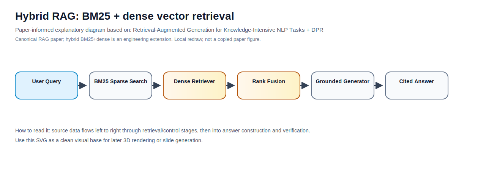
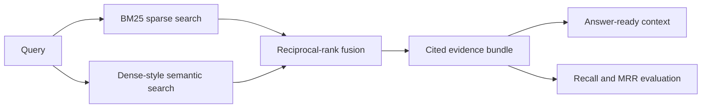

# Hybrid RAG (BM25 + dense-style hybrid retrieval)

Hybrid retrieval is the production default for many RAG systems: combine sparse lexical search for exact terms with dense semantic search for meaning, then fuse the rankings before generation.

This folder is a self-contained cookbook project for building and testing **BM25 + dense-style hybrid retrieval** over PDFs, scanned OCR, webpages, tables, figures, and tool outputs. It is designed to be copied into a new GitHub repository and run without API keys or external services.



Source basis: [Retrieval-Augmented Generation for Knowledge-Intensive NLP Tasks](https://arxiv.org/abs/2005.11401) and [DPR](https://arxiv.org/abs/2004.04906). The SVG is a local redraw/synthesis for study and presentation, not a copied paper figure.

## End-to-End RAG Responsibility

This project is explicitly about **conceptualization and responsibility for end-to-end RAG pipelines**, not only retrieval code. The owner of a production RAG system is responsible for the full path from source data to answer quality:

1. Document ingestion: PDFs, scanned OCR, webpages, tables, figures, and tool/API outputs.
2. Chunking strategy: source-aware chunk sizes, page/section metadata, parent-child context, and table/figure preservation.
3. Indexing: sparse BM25, dense vectors, metadata filters, version fields, ACLs, and content hashes.
4. Retrieval evaluation: recall@k, MRR, qrels, failure analysis, and query coverage.
5. Response quality: grounded answers, citations, abstention behavior, freshness, and security review.

Hybrid RAG is only one component. The production responsibility is to make the entire pipeline observable, testable, auditable, and safe.

## What You Will Build



## Why Hybrid RAG

Dense retrieval is good at paraphrases, but it can miss exact identifiers such as policy numbers, SKUs, page labels, error codes, and API versions. BM25 is strong for exact terms, but it can miss semantically equivalent wording. Hybrid RAG uses both signals and fuses them so the retriever is harder to fool.

Use this method when your corpus includes:

- PDFs with page numbers, clauses, table headers, and exact document labels.
- Scanned files where OCR text may preserve awkward but important tokens.
- Webpages with product versions, canonical URLs, and freshness metadata.
- Tables where exact row labels or units matter.
- Tool/API outputs that contain dynamic identifiers.

## Repository Tour

```text
01-hybrid-rag/
|-- assets/
|   |-- architecture.mmd
|   |-- paper_diagram.svg
|   `-- pipeline.mmd
|-- data/
|   |-- corpus.jsonl
|   |-- queries.jsonl
|   `-- qrels.jsonl
|-- docs/
|   |-- vendor_onboarding_policy.pdf
|   |-- scanned_policy_ocr.txt
|   |-- webpage_snapshot.html
|   |-- product_table.csv
|   `-- api_tool_response.json
|-- examples/
|   |-- sample_policy.pdf
|   |-- scanned_page_ocr.txt
|   |-- sample_webpage.html
|   |-- sample_table.csv
|   |-- tool_response.json
|   `-- run_example.py
|-- utils/
|   `-- cookbook_core.py
|-- 1-explore-data.py
|-- 2-build-index.py
|-- 3-retrieve.py
|-- 4-run-method.py
|-- 5-evaluate.py
|-- bm25_hybrid.py
|-- validate_project.py
|-- architecture.mmd
|-- ARCHITECTURE.md
|-- COMPLETE_UNDERSTAND.md
|-- implementation_notes.md
`-- sources.md
```

## Quick Start

No package installation is required. The tutorial uses only the Python standard library.

```bash
python 1-explore-data.py
python 2-build-index.py
python 3-retrieve.py
python 4-run-method.py --query "Where does vendor onboarding require security review?"
python 5-evaluate.py
```

Single-command demo:

```bash
python bm25_hybrid.py --query "What do the current API docs say about rollback in version 3.0?"
```

Project validation:

```bash
python validate_project.py
```

## The Five-Step Cookbook

| Step | File | Purpose |
|---:|---|---|
| 1 | [`1-explore-data.py`](1-explore-data.py) | Inspect the mixed-source corpus and fixtures. |
| 2 | [`2-build-index.py`](2-build-index.py) | Build a local teaching index with BM25 and TF-IDF weights. |
| 3 | [`3-retrieve.py`](3-retrieve.py) | Compare BM25, dense-style retrieval, and reciprocal-rank fusion. |
| 4 | [`4-run-method.py`](4-run-method.py) | Run the Hybrid RAG control flow for a user query. |
| 5 | [`5-evaluate.py`](5-evaluate.py) | Compute recall@k and MRR on the local qrels. |

## Example Data Gallery

| Type | Fixture | Why it matters |
|---|---|---|
| PDF | [`examples/sample_policy.pdf`](examples/sample_policy.pdf) | Tests page-aware and clause-style retrieval. |
| Scanned/OCR | [`examples/scanned_page_ocr.txt`](examples/scanned_page_ocr.txt) | Simulates OCR noise and confidence metadata. |
| Webpage | [`examples/sample_webpage.html`](examples/sample_webpage.html) | Carries canonical URL, version, hash, and freshness fields. |
| Table | [`examples/sample_table.csv`](examples/sample_table.csv) | Preserves exact SKUs, values, and units. |
| Tool/API | [`examples/tool_response.json`](examples/tool_response.json) | Represents dynamic state that static documents cannot answer. |

The normalized retrieval corpus lives in [`data/corpus.jsonl`](data/corpus.jsonl). The evaluation set lives in [`data/queries.jsonl`](data/queries.jsonl) and [`data/qrels.jsonl`](data/qrels.jsonl).

## Enterprise Corpus Pack

The corpus includes additional enterprise-like documents described in [data/README.md](data/README.md):

- Vendor Atlas `MSA-2026` liability-cap contract text.
- `INC-2026-05` cache invalidation incident postmortem.
- Production access-control matrix for EU Support.
- SOC2 `CC6.2` quarterly access-review control excerpt.
- Procurement addendum `PR-14` for high-risk vendor escalation.
- Enterprise data-retention webpage with canonical URL and version metadata.

These examples are intentionally mixed: exact identifiers reward BM25, while questions about owners, retention, approval flows, and remediation require semantic matching.

## Architecture Assets

- [`architecture.mmd`](architecture.mmd): left-to-right Mermaid architecture for rendering or conversion into a 3D visual.
- [`assets/architecture.mmd`](assets/architecture.mmd): duplicate architecture asset for pipelines that read from `assets/`.
- [`assets/paper_diagram.svg`](assets/paper_diagram.svg): paper-informed explanatory SVG.
- [`assets/pipeline.mmd`](assets/pipeline.mmd): compact pipeline diagram.

## Production Mapping

| Local teaching component | Production replacement |
|---|---|
| Local JSONL corpus | Object storage, database exports, website crawler, document connectors |
| Tiny BM25 scorer | OpenSearch, Elasticsearch, Azure AI Search, Vespa, Lucene |
| TF-IDF dense-style scorer | BGE, Jina, OpenAI, Cohere, Voyage, or SentenceTransformers embeddings |
| Local rank fusion | Reciprocal-rank fusion, weighted fusion, or managed hybrid search |
| JSON trace output | Observability logs, retrieval traces, evaluation dashboards |
| Local qrels | Human-reviewed golden set and production failure mining |

## Quality Gates

This project is GitHub-ready when these pass:

```bash
python validate_project.py
python examples/run_example.py
```

The included GitHub Actions workflow runs the same validation on Python 3.11.

## Design Notes

- Keep source IDs stable. Citations and evaluation depend on them.
- Preserve source type, page number, URL, version, content hash, and ACL metadata.
- Treat webpage and PDF text as untrusted input. Retrieved text should never override system instructions.
- Rebuild `data/local_index.json` locally; it is generated and ignored by git.
- Use hybrid retrieval as a baseline before adding reranking, parent-child expansion, compression, or agent loops.

## Related Files

- [RESPONSIBILITY.md](RESPONSIBILITY.md): explicit end-to-end RAG ownership model.
- [ARCHITECTURE.md](ARCHITECTURE.md): deeper production architecture.
- [COMPLETE_UNDERSTAND.md](COMPLETE_UNDERSTAND.md): conceptual guide.
- [implementation_notes.md](implementation_notes.md): engineering notes.
- [sources.md](sources.md): source list and reliability notes.

## License

MIT. See the repository-level [LICENSE](../../LICENSE).

## Enterprise Hybrid RAG Commands

Run these from this folder to test Hybrid RAG on the enterprise corpus:

```bash
python 4-run-method.py --query "What is the liability cap in MSA-2026 for Vendor Atlas?"
python 4-run-method.py --query "Which incident involved cache invalidation and who owns remediation?"
python 4-run-method.py --query "Who must approve EU Support read-only production database access?"
python 4-run-method.py --query "Which SOC2 control requires quarterly access review evidence?"
python 4-run-method.py --query "How long are enterprise customer audit logs retained by default?"
python 4-run-method.py --query "When must Procurement escalate a high-risk vendor before purchase order approval?"
python 5-evaluate.py
python validate_project.py
```
