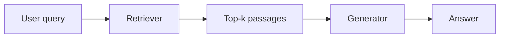
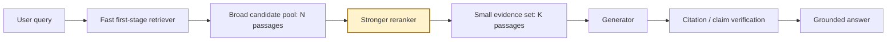
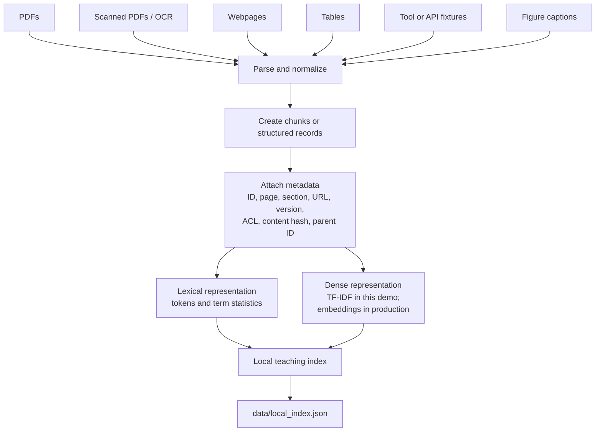
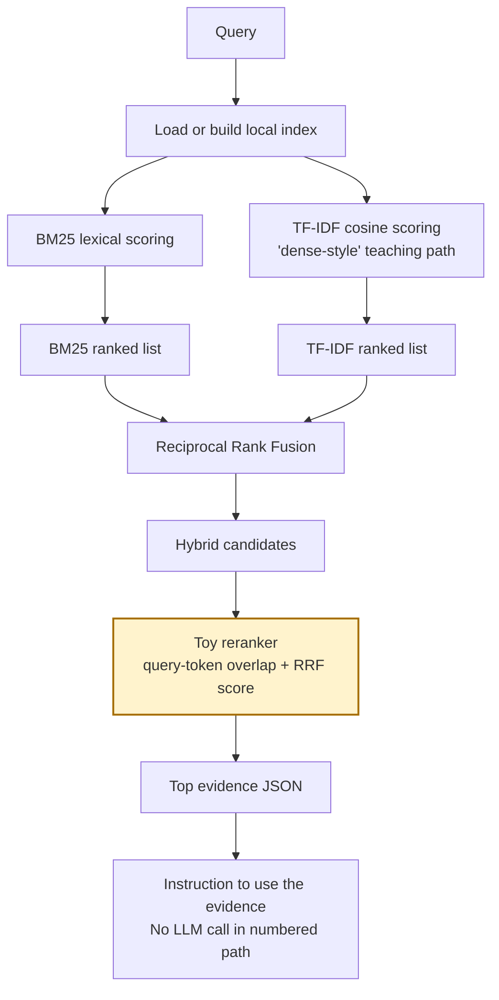
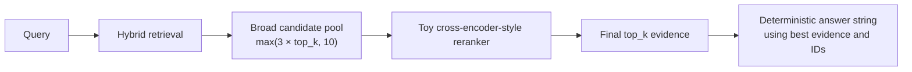
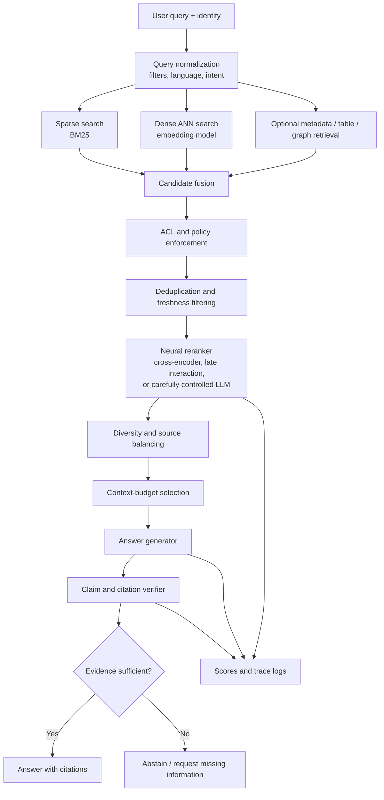
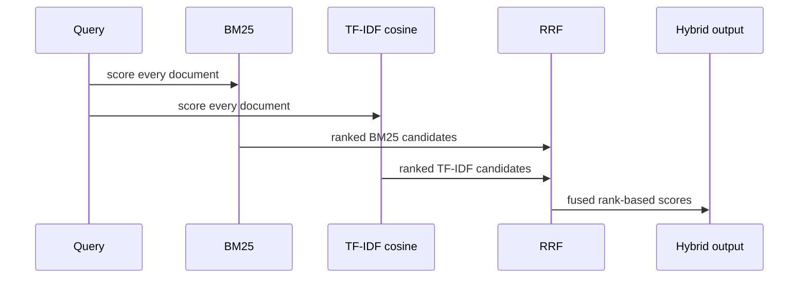
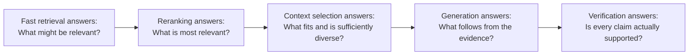

# Reranked RAG — Retrieve Broadly, Rank Precisely

> A fully local, standard-library teaching implementation of **two-stage retrieval**:
>
> 1. retrieve candidate passages with lexical and dense-style retrieval;
> 2. rerank the candidates with a stronger query–passage scoring stage;
> 3. keep only the best evidence for answer generation.

This subrepository is designed as a **pedagogical, inspectable implementation** of reranked Retrieval-Augmented Generation (RAG). It contains small scripts, mixed-source example data, local retrieval utilities, evaluation fixtures, and two runnable demonstrations.

The code deliberately avoids external APIs, neural models, vector databases, and framework abstractions. Every stage returns readable JSON so that the ranking process can be inspected rather than hidden behind a library.

---

## Table of contents

1. [What problem does reranked RAG solve?](#what-problem-does-reranked-rag-solve)
2. [The core idea](#the-core-idea)
3. [Architecture](#architecture)
4. [What this repository actually implements](#what-this-repository-actually-implements)
5. [Step-by-step execution](#step-by-step-execution)
6. [How the scores are computed](#how-the-scores-are-computed)
7. [Repository structure](#repository-structure)
8. [Quick start](#quick-start)
9. [Understanding the output](#understanding-the-output)
10. [Evaluation](#evaluation)
11. [The two runnable implementations](#the-two-runnable-implementations)
12. [Teaching implementation versus production implementation](#teaching-implementation-versus-production-implementation)
13. [Where reranked RAG is used most](#where-reranked-rag-is-used-most)
14. [When reranking helps—and when it does not](#when-reranking-helpsand-when-it-does-not)
15. [How to adapt this folder to a real project](#how-to-adapt-this-folder-to-a-real-project)
16. [Production design recommendations](#production-design-recommendations)
17. [Common failure modes](#common-failure-modes)
18. [Debugging checklist](#debugging-checklist)
19. [Security considerations](#security-considerations)
20. [References](#references)

---

## What problem does reranked RAG solve?

A first-stage retriever must search a large corpus quickly. It is therefore usually optimized for **candidate recall**:

> “Can the retriever place at least one relevant passage somewhere in the candidate set?”

This is different from the requirement of the generator:

> “Are the first few passages precise, directly relevant, non-duplicated, current, and safe enough to place inside the limited context window?”

A fast retriever can find the correct passage but still rank several weaker passages above it. Those weaker passages then consume context tokens, dilute the evidence, and can encourage unsupported answers.

Reranked RAG separates these two objectives:

- the **retriever** searches broadly and cheaply;
- the **reranker** performs a more expensive, query-specific comparison over a much smaller candidate pool;
- the **context builder** sends only the strongest evidence to the generator.

### Standard RAG



### Reranked RAG



Usually, \(N\) is substantially larger than \(K\). For example:

```text
retrieve 50–100 candidates → rerank them → keep 5–10 passages
```

The exact values must be tuned on a labeled evaluation set.

---

## The core idea

For a query \(q\) and corpus \(D\):

1. A fast retriever produces a candidate set:

\[
C_N(q) = \operatorname{Retrieve}(q, D, N)
\]

2. A reranker computes a stronger relevance score for each query–document pair:

\[
s_{\text{rerank}}(q,d), \qquad d \in C_N(q)
\]

3. Candidates are sorted by the reranker score:

\[
\pi(q) = \operatorname{sort}_{d \in C_N(q)}
\left(s_{\text{rerank}}(q,d)\right)
\]

4. Only the best \(K\) passages are placed in the evidence context:

\[
E_K(q) = \pi(q)_{1:K}
\]

5. A generator answers using \(E_K(q)\), ideally with citations and a no-answer path.

The reranker **cannot recover a document that the first-stage retriever never found**. First-stage Recall@N therefore remains a hard upper bound on reranking performance.

---

# Architecture

## 1. Index-time architecture

The index-time path prepares source-grounded records before any user query arrives.



In this repository, `2-build-index.py` stores:

- the normalized documents;
- tokenized document text;
- inverse document frequency values;
- average document length;
- a note identifying the index as a teaching artifact.

The indexed text is assembled from:

```text
title + body text + scalar metadata values
```

This means fields such as page numbers, versions, section names, and Boolean freshness flags may influence retrieval.

---

## 2. Query-time architecture implemented by the numbered tutorial



The reranking logic is located in:

```text
utils/cookbook_core.py::rerank
```

The method runner is:

```text
4-run-method.py
```

---

## 3. Query-time architecture of the standalone demo

The standalone `reranked_rag.py` follows the intended retrieve-many/rerank-few pattern more directly.



For the `reranked` branch, the standalone implementation performs:

```python
candidates = hybrid_retrieve(
    query,
    docs,
    top_k=max(top_k * 3, 10),
)
evidence = rerank(query, candidates, top_k)
```

This is closer to the canonical two-stage pattern because the reranker receives more candidates than are finally returned.

---

## 4. Recommended production architecture



A production system should enforce access control **before evidence becomes visible to the reranker or generator**.

---

# What this repository actually implements

This folder contains two related teaching paths.

## A. Numbered cookbook path

```text
1-explore-data.py
2-build-index.py
3-retrieve.py
4-run-method.py
5-evaluate.py
```

It uses:

```text
data/corpus.jsonl
data/queries.jsonl
data/qrels.jsonl
utils/cookbook_core.py
```

Its method is:

```text
BM25 retrieval
    +
TF-IDF cosine retrieval
    ↓
Reciprocal Rank Fusion
    ↓
token-overlap reranking
    ↓
ranked evidence JSON
```

## B. Standalone method path

```text
reranked_rag.py
examples/sample_corpus.json
```

It contains a self-contained implementation and exposes:

```bash
python reranked_rag.py --explain
python reranked_rag.py --query "..." --top-k 5
```

It also contains code branches used by other RAG teaching folders, but this folder configures it with:

```python
METHOD = {
    "name": "Reranked RAG",
    "key": "reranked",
    "mode": "inference",
}
```

---

# Step-by-step execution

## Stage 1 — Explore the corpus

Run:

```bash
python 1-explore-data.py
```

This loads `data/corpus.jsonl` and reports:

- document count;
- source-type counts;
- available example files;
- the first normalized record.

The current corpus contains six source records:

| ID | Source type | Purpose |
|---|---|---|
| `pdf_policy_text` | PDF | Vendor security-review policy |
| `scanned_pdf_ocr` | Scanned PDF/OCR | Invoice approval and review status |
| `web_current_docs` | Webpage | Current API version and rollback |
| `table_warranty_reserve` | Table | Warranty reserve values |
| `tool_order_status` | Tool/API | Live-style order status |
| `figure_latency_caption` | Figure | API latency caption |

This stage matters because retrieval failures often begin as ingestion failures:

- missing pages;
- lost headings;
- flattened tables;
- broken OCR;
- stale webpage versions;
- inconsistent IDs;
- absent access-control metadata.

---

## Stage 2 — Build the local index

Run:

```bash
python 2-build-index.py
```

The script calls:

```text
utils.cookbook_core.build_index()
```

and writes:

```text
data/local_index.json
```

The local index contains:

```json
{
  "documents": "...",
  "tokenized": "...",
  "idf": "...",
  "avg_doc_len": "...",
  "notes": "Local teaching index built from data/corpus.jsonl."
}
```

### Important terminology

The repository calls the second retrieval signal **dense-style retrieval**, but it does **not** use neural embeddings.

It uses:

```text
TF-IDF vectors + cosine similarity
```

This keeps the mathematics visible and avoids external dependencies. In production, this component would normally be replaced with a real embedding model and an approximate-nearest-neighbor index.

---

## Stage 3 — Run first-stage retrieval

Run:

```bash
python 3-retrieve.py
```

The script uses the fixed example query:

```text
Where does vendor onboarding require security review?
```

It computes three ranked outputs:

1. `bm25`
2. `dense`
3. `hybrid`

### Retrieval flow



The first-stage retrieval exists to maximize the chance that the relevant evidence enters the candidate pool.

---

## Stage 4 — Rerank the candidates

Run:

```bash
python 4-run-method.py \
  --query "Where does vendor onboarding require security review?" \
  --top-k 5
```

The script calls:

```python
run_method("02-reranked-rag", query, top_k=top_k)
```

The current numbered path:

1. loads or builds the local index;
2. runs BM25;
3. runs TF-IDF cosine retrieval;
4. combines both rankings with RRF;
5. takes the hybrid result list;
6. reranks each candidate using query-token overlap;
7. returns the final evidence rows.

### Toy reranking score

For each candidate:

```text
rerank score
    =
number of unique query tokens found in candidate title + snippet
    +
RRF hybrid score
```

In simplified notation:

\[
s_{\text{toy}}(q,d)
=
\left|
T(q) \cap T(\text{title}(d) + \text{snippet}(d))
\right|
+
s_{\text{RRF}}(d)
\]

where \(T(x)\) is the tokenizer output converted to a set.

The candidate is then labeled:

```json
"stage": "toy_cross_encoder_rerank"
```

### What this scorer can demonstrate

It demonstrates:

- a separate second-stage scoring pass;
- query–candidate pair scoring;
- score replacement;
- reranking after retrieval;
- top-k evidence selection;
- traceable JSON output.

### What this scorer cannot demonstrate

It is **not** a trained cross-encoder. It cannot reliably model:

- paraphrases;
- entailment;
- negation;
- multilingual semantic matching;
- domain-specific relevance;
- long-range relationships;
- subtle version conflicts;
- instruction or claim support.

The phrase `cross-encoder-style` refers to its **place in the pipeline**, not to its model architecture.

---

## Stage 5 — Evaluate retrieval quality

Run:

```bash
python 5-evaluate.py
```

The evaluation uses:

```text
data/queries.jsonl
data/qrels.jsonl
```

The current evaluation set contains four queries with known relevant document IDs.

The script computes:

- `recall_at_k`
- `mrr`
- per-query retrieved IDs;
- relevant IDs;
- hit status;
- reciprocal rank.

With the current tiny fixture and `top_k=3`, the implementation produces:

```text
Recall@3 = 1.0000
MRR      = 1.0000
```

These values only prove that the small hand-built examples are internally consistent. They are **not evidence of production retrieval quality**.

A realistic evaluation should contain:

- many more queries;
- difficult negatives;
- paraphrases;
- ambiguous questions;
- stale/current document conflicts;
- no-answer questions;
- duplicate passages;
- multiple languages;
- representative document lengths;
- train/dev/test separation.

---

# How the scores are computed

## 1. BM25

BM25 rewards query-term matches while correcting for document length and term frequency saturation.

The implementation uses:

```text
k1 = 1.5
b  = 0.75
```

For query term \(t\) and document \(d\):

\[
\operatorname{BM25}(q,d)
=
\sum_{t \in q}
\operatorname{IDF}(t)
\cdot
\frac{
f(t,d)(k_1+1)
}{
f(t,d)+k_1
\left(
1-b+b\frac{|d|}{\operatorname{avgdl}}
\right)
}
\]

BM25 is especially useful when exact words, IDs, product names, policy phrases, error messages, or version numbers matter.

---

## 2. TF-IDF cosine similarity

The teaching “dense-style” path represents the query and document as weighted term vectors.

\[
\operatorname{TFIDF}(t,d)
=
\operatorname{TF}(t,d)\operatorname{IDF}(t)
\]

The similarity is:

\[
\cos(q,d)
=
\frac{
\vec{q}\cdot\vec{d}
}{
\|\vec{q}\|\|\vec{d}\|
}
\]

Unlike a neural embedding model, TF-IDF cannot infer that two different phrases have similar meanings unless they share useful terms.

---

## 3. Reciprocal Rank Fusion

The two retrieval lists can have incomparable raw score scales. Reciprocal Rank Fusion uses only rank positions:

\[
s_{\text{RRF}}(d)
=
\sum_{r \in R}
\frac{1}{k+\operatorname{rank}_r(d)}
\]

This repository uses:

```text
k = 60
```

A document receives a higher fused score when it appears near the top of one or both ranked lists.

RRF is useful because it does not require BM25 and dense scores to be calibrated onto the same numerical scale.

---

## 4. Toy reranking

The numbered path adds lexical query overlap to the RRF score:

\[
s_{\text{toy}}(q,d)
=
|\operatorname{set}(q)\cap\operatorname{set}(d)|
+
s_{\text{RRF}}(d)
\]

Because RRF scores are small—typically around a few hundredths in this tiny example—the integer token-overlap term dominates the final order.

For the example vendor query, the current implementation produces approximately:

| Rank | Candidate | Hybrid RRF | Toy rerank |
|---:|---|---:|---:|
| 1 | `pdf_policy_text` | 0.0328 | 4.0328 |
| 2 | `scanned_pdf_ocr` | 0.0323 | 3.0323 |
| 3 | `web_current_docs` | 0.0317 | 0.0317 |

This makes the behavior easy to inspect: the policy PDF contains the most query terms and moves decisively to the top.

---

## 5. Production cross-encoder scoring

A real cross-encoder jointly processes the query and candidate text:

\[
s_{\theta}(q,d)
=
f_{\theta}
\left(
[\mathrm{CLS}]\,q\,[\mathrm{SEP}]\,d\,[\mathrm{SEP}]
\right)
\]

This allows attention between query tokens and document tokens. It is usually more accurate than independent embeddings for final ordering, but more expensive because every query–candidate pair must be evaluated.

A late-interaction model such as ColBERT provides a different speed–quality tradeoff by precomputing document-side representations and retaining token-level interaction.

---

# Repository structure

```text
02-reranked-rag/
├── assets/
│   ├── architecture.mmd
│   └── paper_diagram.svg
├── data/
│   ├── corpus.jsonl
│   ├── queries.jsonl
│   ├── qrels.jsonl
│   └── local_index.json          # generated by 2-build-index.py
├── docs/
├── examples/
│   ├── run_example.py
│   ├── sample_corpus.json
│   ├── sample_policy.pdf
│   ├── scanned_page_ocr.txt
│   ├── sample_webpage.html
│   ├── sample_table.csv
│   └── tool_response.json
├── utils/
│   ├── __init__.py
│   └── cookbook_core.py
├── .env.example
├── .gitignore
├── 1-explore-data.py
├── 2-build-index.py
├── 3-retrieve.py
├── 4-run-method.py
├── 5-evaluate.py
├── reranked_rag.py
├── architecture.mmd
├── ARCHITECTURE.md
├── COMPLETE_UNDERSTAND.md
├── implementation_notes.md
├── sources.md
└── README.md
```

## File responsibilities

| File | Responsibility |
|---|---|
| `1-explore-data.py` | Inspect corpus composition and fixtures |
| `2-build-index.py` | Build and persist the local teaching index |
| `3-retrieve.py` | Show BM25, TF-IDF, and RRF retrieval separately |
| `4-run-method.py` | Execute the method-specific reranking path |
| `5-evaluate.py` | Compute Recall@k and MRR over local qrels |
| `utils/cookbook_core.py` | Shared indexing, retrieval, reranking, and evaluation logic |
| `reranked_rag.py` | Self-contained, broader method demonstration |
| `data/corpus.jsonl` | Normalized records used by the numbered tutorial |
| `examples/sample_corpus.json` | Richer standalone fixture with documents, tools, training examples, and updates |
| `architecture.mmd` | Reusable Mermaid architecture source |
| `assets/paper_diagram.svg` | Local paper-informed method illustration |
| `sources.md` | Primary papers, official documentation, and framework references |

---

# Quick start

## Requirements

- Python 3.10 or newer is recommended.
- No API key is required.
- No third-party Python package is required for the teaching path.

## Run the complete numbered tutorial

From this folder:

```bash
python 1-explore-data.py
python 2-build-index.py
python 3-retrieve.py
python 4-run-method.py \
  --query "Where does vendor onboarding require security review?" \
  --top-k 5
python 5-evaluate.py
```

## Run the example entry point

```bash
python examples/run_example.py
```

This calls `4-run-method.py` with the vendor-onboarding example query.

## Inspect the standalone method

```bash
python reranked_rag.py --explain
```

## Run the standalone method

```bash
python reranked_rag.py \
  --query "Which source best supports the current vendor onboarding security review requirement?" \
  --top-k 5
```

## Use an alternative standalone corpus

```bash
python reranked_rag.py \
  --corpus path/to/your_corpus.json \
  --query "Your question" \
  --top-k 5
```

---

# Understanding the output

The numbered method returns JSON similar to:

```json
{
  "method_key": "02-reranked-rag",
  "query": "Where does vendor onboarding require security review?",
  "steps": [
    "Loaded local mixed corpus from data/corpus.jsonl.",
    "Reranked hybrid candidates with a toy cross-encoder-style overlap scorer."
  ],
  "top_evidence": [
    {
      "id": "pdf_policy_text",
      "title": "Vendor onboarding policy PDF",
      "source_type": "pdf",
      "score": 4.0328,
      "stage": "toy_cross_encoder_rerank",
      "snippet": "Every new vendor must complete a security review...",
      "metadata": {
        "page": 12,
        "section": "Vendor onboarding",
        "version": "2026.04"
      }
    }
  ],
  "answer": "Use the top evidence snippets and citations above. This demo exposes retrieval mechanics rather than calling an LLM."
}
```

Read the fields in this order:

1. `steps` — what the pipeline did;
2. `top_evidence` — what reached the final context set;
3. `score` — the current stage’s score, not a probability;
4. `stage` — which ranking stage produced the score;
5. `metadata` — provenance required for citations, freshness, filtering, and audits;
6. `answer` — a placeholder instruction in the numbered demo.

### Scores are not probabilities

A score of `4.0328` does not mean 403.28% relevance. It is an uncalibrated teaching score.

Do not compare scores from different ranking stages as though they share the same meaning.

---

# Evaluation

## Metrics implemented here

### Recall@k

For each query, Recall@k asks whether at least one labeled relevant document appears in the first \(k\) results.

The current implementation uses a hit-based query average:

\[
\operatorname{Recall@k}
=
\frac{
\text{queries with at least one relevant result in top-k}
}{
\text{number of queries}
}
\]

This is effectively a success-rate style Recall@k for the supplied qrels.

### Mean Reciprocal Rank

For each query:

\[
\operatorname{RR}
=
\frac{1}{\text{rank of first relevant result}}
\]

Then:

\[
\operatorname{MRR}
=
\frac{1}{|Q|}
\sum_{q \in Q}
\operatorname{RR}(q)
\]

MRR is sensitive to whether the first relevant result appears at rank 1, 2, 3, and so on.

## Metrics recommended for a real reranker

Add:

- Recall@N before reranking;
- MRR@K after reranking;
- nDCG@K;
- Precision@K;
- reranker lift over the first-stage baseline;
- percentage of queries improved, unchanged, and harmed;
- citation precision and recall;
- answer faithfulness;
- no-answer precision and recall;
- latency percentiles;
- cost per query;
- score distributions and drift;
- freshness/version accuracy;
- duplicate-context rate.

### Evaluate retrieval and generation separately

A fluent answer can hide weak retrieval. Measure:

```text
candidate recall
reranking quality
context quality
answer groundedness
citation support
```

as separate layers.

---

# The two runnable implementations

## Numbered cookbook path

Entry point:

```text
4-run-method.py
```

Data:

```text
data/corpus.jsonl
```

Shared logic:

```text
utils/cookbook_core.py
```

Primary purpose:

- teach each stage independently;
- expose BM25, TF-IDF, RRF, and reranking;
- evaluate with local qrels.

### Important current behavior

The numbered `run_method` calls:

```python
retrieved = hybrid_retrieve(
    query,
    top_k=top_k,
    candidate_k=max(10, top_k * 2),
)
evidence = rerank(query, retrieved["hybrid"], top_k)
```

Although BM25 and TF-IDF each consider a wider `candidate_k`, the fused `hybrid` list is already truncated to `top_k` before reranking.

Therefore, the numbered path currently demonstrates:

```text
retrieve top_k → reorder those top_k
```

rather than:

```text
retrieve N candidates → rerank → keep smaller K
```

Reranking can change the order, but it cannot introduce an additional candidate that was outside the already-truncated hybrid list.

## Standalone path

Entry point:

```text
reranked_rag.py
```

Data:

```text
examples/sample_corpus.json
```

Primary purpose:

- provide one self-contained executable blueprint;
- demonstrate broad-candidate retrieval;
- return evidence and a deterministic answer trace.

It retrieves:

```text
max(3 × top_k, 10)
```

candidates before reranking to the requested `top_k`.

---

# Teaching implementation versus production implementation

| Component | This repository | Production replacement |
|---|---|---|
| Corpus | Six small local fixtures | Document store, object storage, crawler, databases |
| Parsing | Prebuilt normalized text | PDF parser, OCR, HTML extraction, table parser |
| Sparse retrieval | Local BM25 | OpenSearch, Elasticsearch, Vespa, Lucene, managed search |
| Dense retrieval | TF-IDF cosine | Neural embeddings + ANN vector index |
| Fusion | Reciprocal Rank Fusion | RRF, weighted fusion, or learned fusion |
| Reranker | Unique token overlap | Cross-encoder, late interaction, or controlled LLM reranker |
| Candidate pool | Small local list | Calibrated N based on Recall@N and latency |
| Generator | Placeholder/deterministic string | LLM constrained to selected evidence |
| Verification | Not in numbered path | Claim-level support and citation verification |
| Evaluation | Four queries | Representative labeled benchmark and online monitoring |
| Security | Metadata examples only | Authentication, ACL enforcement, injection defense, audit logs |

---

# Where reranked RAG is used most

Reranking is most useful when the system needs **high precision in the first few evidence positions**.

## 1. Enterprise knowledge assistants

Typical sources:

- internal policies;
- process documentation;
- technical manuals;
- HR and compliance documents;
- product specifications;
- internal wikis.

Why reranking helps:

- many documents use similar vocabulary;
- outdated and current versions may coexist;
- page-level citations matter;
- context windows should not be filled with near-duplicates.

## 2. Customer-support assistants

Typical tasks:

- find the correct troubleshooting procedure;
- combine policy text with live account or order information;
- identify the most relevant product documentation;
- cite the correct support article.

Why reranking helps:

- first-stage retrieval often returns many superficially similar help pages;
- the exact product, version, region, or error code determines relevance.

## 3. Legal, policy, and compliance search

Typical tasks:

- retrieve the controlling clause;
- distinguish current from superseded language;
- preserve document, section, and page provenance;
- support reviewable citations.

Reranking may improve evidence ordering, but it does not replace legal review, source validation, access control, or claim verification.

## 4. Scientific and technical literature

Typical tasks:

- rank passages from papers;
- distinguish methods, results, captions, and appendices;
- prioritize passages that directly answer a technical question;
- reduce irrelevant neighboring chunks.

Long documents often benefit from section-aware chunking and parent–child expansion in addition to reranking.

## 5. Developer documentation and code search

Typical tasks:

- rank API documentation by version;
- prioritize exact error messages;
- distinguish examples from normative behavior;
- connect code identifiers with explanatory text.

BM25 is often valuable for exact identifiers, while a semantic retriever broadens recall and a reranker improves final ordering.

## 6. E-commerce and catalog search

Typical tasks:

- rank products or product passages against detailed intent;
- distinguish near-identical variants;
- combine semantic relevance with structured constraints;
- prioritize current availability or specifications.

Structured filters should normally be applied before or alongside reranking rather than expecting a text model to enforce every hard constraint.

## 7. Multilingual and cross-lingual RAG

A multilingual reranker can improve final ordering when the query and source use different wording or languages. The local token-overlap scorer in this repository is not suitable for this use case.

---

# When reranking helps—and when it does not

## Use reranking when

- the gold passage appears in a broad candidate set but not consistently near rank 1;
- the corpus contains many near-duplicate or semantically similar chunks;
- citations must point to the strongest source;
- only a small context budget is available;
- query and document relevance requires pairwise reasoning;
- hybrid retrieval improves recall but produces noisy ordering;
- stale and current sources are difficult to distinguish;
- first-stage scores from multiple retrievers are not directly comparable.

## Reranking may not help when

- the relevant document is absent from the candidate pool;
- hard metadata filters are missing or incorrectly applied;
- document parsing destroyed the necessary evidence;
- chunks are too large for the reranker;
- chunks are too small to contain an answer;
- the corpus is tiny and exact lookup is sufficient;
- latency requirements do not allow pairwise scoring;
- the first-stage retriever already has validated high top-k precision;
- the chosen reranker is poorly matched to the language or domain.

## Do not use a reranker as a substitute for

- access control;
- freshness/version filtering;
- table execution;
- tool calls;
- citation verification;
- prompt-injection defense;
- missing-document detection;
- human review in high-risk decisions.

---

# How to adapt this folder to a real project

## Step 1 — Replace the fixtures

Replace or regenerate:

```text
data/corpus.jsonl
data/queries.jsonl
data/qrels.jsonl
examples/sample_corpus.json
```

Keep stable IDs and provenance.

A useful record schema is:

```json
{
  "id": "policy-2026-04:p12:s3:c02",
  "title": "Vendor onboarding security review",
  "text": "Every new vendor must complete...",
  "source_type": "pdf",
  "metadata": {
    "source_id": "policy-2026-04",
    "page": 12,
    "section": "Vendor onboarding",
    "version": "2026.04",
    "effective_from": "2026-04-01",
    "is_current": true,
    "canonical_url": null,
    "content_hash": "sha256:...",
    "retrieved_at": "2026-06-01T00:00:00Z",
    "parent_id": "policy-2026-04:p12:s3",
    "acl": ["group:legal"],
    "bbox": [72, 144, 520, 220],
    "ocr_confidence": 0.99
  }
}
```

## Step 2 — Build a labeled evaluation set first

Before selecting models, create queries with:

- expected relevant sources;
- relevance grades where possible;
- no-answer cases;
- hard negatives;
- current/stale variants;
- duplicate and near-duplicate passages;
- realistic user phrasing.

Start small, inspect errors, and expand iteratively.

## Step 3 — Replace TF-IDF with embeddings

Conceptual interface:

```python
query_vector = embedding_model.encode(query)
document_vectors = vector_index.search(query_vector, top_n)
```

Keep BM25 as a complementary signal when exact names, codes, dates, or legal phrases matter.

## Step 4 — Retrieve more candidates than you return

For the numbered path, the following pattern is more faithful to reranked RAG:

```python
final_k = 5
candidate_pool_size = 30

retrieved = hybrid_retrieve(
    query,
    top_k=candidate_pool_size,
    candidate_k=max(60, candidate_pool_size * 2),
)

evidence = rerank(
    query,
    retrieved["hybrid"],
    top_k=final_k,
)
```

Tune the values empirically.

A larger candidate pool can improve the reranker’s opportunity to find the best evidence, but also increases latency and cost.

## Step 5 — Replace the toy reranker

A production reranker should accept query–passage pairs:

```python
pairs = [
    [query, candidate["text"]]
    for candidate in candidates
]

scores = reranker.predict(pairs)
```

Then attach scores, sort, deduplicate, and select evidence under the context budget.

Possible reranker families include:

- cross-encoders;
- late-interaction models;
- sequence-to-sequence relevance models;
- multilingual rerankers;
- domain-fine-tuned rerankers;
- carefully prompted and evaluated LLM rerankers.

## Step 6 — Add batching and truncation policy

Rerankers have input-length limits. Decide whether to:

- truncate passages;
- split long passages;
- score windows;
- score a child chunk and expand to its parent;
- include title and metadata;
- preserve answer-bearing tables and captions.

Do not silently truncate away the relevant sentence.

## Step 7 — Add diversity and deduplication

After reranking, near-identical chunks can still occupy all top positions.

Possible controls:

- one or two chunks per source;
- content-hash deduplication;
- maximal marginal relevance;
- parent-level grouping;
- canonical-URL grouping;
- current-version preference.

## Step 8 — Build evidence context explicitly

Each evidence item should include:

```text
source ID
document title
page or URL
section
version/freshness
passage text
reranker score
```

The generator should be instructed to answer only from that evidence and to abstain when support is insufficient.

## Step 9 — Verify claims and citations

A production path should check whether each factual answer claim is:

- supported;
- contradicted;
- not found.

Verification should use the exact evidence spans selected for generation.

## Step 10 — Monitor the complete funnel


Improving only the final answer metric can hide regressions in retrieval or citation quality.

---

# Production design recommendations

## Candidate pool

Choose candidate-pool size by measuring:

```text
Recall@10
Recall@20
Recall@50
Recall@100
```

Then select the smallest \(N\) that provides sufficient recall without unacceptable reranking cost.

## Reranker batching

Pairwise scoring is often the main additional latency. Use:

- GPU batching;
- dynamic batch sizes;
- asynchronous execution where safe;
- query-result caching;
- model quantization after validation;
- smaller rerankers for low-risk routes;
- larger rerankers only for difficult queries.

## Score calibration

Raw reranker scores are not automatically probabilities.

If a threshold controls abstention or routing, calibrate it on held-out data and monitor drift.

## Metadata handling

Hard constraints should normally be enforced directly:

```text
tenant
ACL
region
language
document type
product
version
effective date
```

Do not rely on semantic relevance scoring to enforce authorization or mandatory business rules.

## Versioning

Version:

- source documents;
- cleaned text;
- chunks;
- embeddings;
- sparse indexes;
- reranker model;
- prompts;
- evaluation sets.

This is necessary to reproduce changes in ranking behavior.

## Observability

Log:

- normalized query;
- applied filters;
- BM25 candidates and scores;
- dense candidates and scores;
- fusion ranks;
- reranker scores;
- selected evidence;
- discarded evidence;
- token counts;
- answer citations;
- verifier results;
- latency by stage.

Avoid logging confidential content unless policy permits it.

---

# Common failure modes

## 1. The relevant document was never retrieved

**Symptom:** reranker confidently orders irrelevant candidates.

**Fix:** improve first-stage retrieval, query formulation, metadata filters, indexing, or corpus coverage.

## 2. The reranker receives too few candidates

**Symptom:** ordering changes but Recall@K cannot improve.

**Fix:** retrieve \(N > K\), rerank all \(N\), and return \(K\).

This distinction applies to the current numbered path.

## 3. The reranker overweights lexical overlap

**Symptom:** passages repeating query words outrank semantically correct paraphrases.

**Fix:** use a trained semantic reranker and include hard negatives during evaluation or fine-tuning.

The toy scorer in this repository intentionally has this limitation.

## 4. Duplicate passages dominate

**Symptom:** all top passages come from the same page or duplicated webpage.

**Fix:** deduplicate by content hash, source, parent, canonical URL, or semantic similarity.

## 5. Stale documents rank highly

**Symptom:** an old version contains more matching words than the current version.

**Fix:** apply version/freshness constraints before reranking or add explicit freshness features.

## 6. Long passages are truncated badly

**Symptom:** the reranker does not see the answer-bearing section.

**Fix:** use section-aware chunks, sliding windows, parent–child retrieval, or long-context rerankers.

## 7. Reranker improves offline ranking but harms answers

**Symptom:** nDCG improves while faithfulness or answer accuracy falls.

**Fix:** inspect context diversity, missing supporting passages, prompt behavior, and citation verification.

## 8. Evaluation leakage

**Symptom:** excellent metrics on synthetic examples but poor real-user performance.

**Fix:** separate documents and queries across train, validation, and test sets; include real query distributions.

---

# Debugging checklist

## Ingestion

- [ ] Does every source have a stable ID?
- [ ] Are page numbers and section headings preserved?
- [ ] Are scanned pages associated with OCR confidence?
- [ ] Are tables represented structurally?
- [ ] Are canonical URLs and crawl timestamps stored?
- [ ] Are stale versions distinguishable?
- [ ] Are access-control fields present?

## First-stage retrieval

- [ ] Does the gold source appear in top 20 or top 50?
- [ ] Do exact IDs and version numbers work?
- [ ] Are BM25 and dense retrieval complementary?
- [ ] Are filters removing valid sources?
- [ ] Are duplicate chunks crowding the candidate pool?

## Reranking

- [ ] Does MRR or nDCG improve over the hybrid baseline?
- [ ] What percentage of queries are harmed?
- [ ] Is the candidate pool larger than the final evidence set?
- [ ] Are passage lengths compatible with the reranker?
- [ ] Are title and metadata included consistently?
- [ ] Are scores stable across model or index versions?

## Generation and verification

- [ ] Does every factual claim have direct support?
- [ ] Are citations attached to the correct sentence?
- [ ] Can the system abstain?
- [ ] Are contradictory sources surfaced?
- [ ] Are unsupported instructions inside retrieved content ignored?

## Operations

- [ ] Is p95 reranking latency acceptable?
- [ ] Is cost per query measured?
- [ ] Are score and query distributions monitored?
- [ ] Can a ranking decision be reproduced from logs?
- [ ] Are confidential sources protected throughout the pipeline?

---

# Security considerations

Retrieved text is untrusted input.

PDFs, OCR output, webpages, and tool responses can contain:

- prompt-injection instructions;
- hidden or white-on-white text;
- poisoned OCR;
- malicious links;
- stale or intentionally misleading content;
- confidential information;
- instructions that conflict with system policy.

Recommended controls:

1. enforce authentication and ACLs before retrieval;
2. separate retrieved content from system instructions;
3. label retrieved text as data, not executable instructions;
4. sanitize or neutralize embedded prompt-like content;
5. validate tool calls against explicit schemas and permissions;
6. preserve provenance for every evidence span;
7. verify citations and claims;
8. support abstention;
9. use human review for high-impact decisions.

Reranking improves ordering. It does not make untrusted content safe.

---

# Related methods in this repository

- [`../01-hybrid-rag/`](../01-hybrid-rag/) — improves first-stage recall by combining retrieval signals.
- [`../14-contextual-compression-rag/`](../14-contextual-compression-rag/) — reduces retrieved passages to query-relevant content.
- [`../20-claim-level-verification-rag/`](../20-claim-level-verification-rag/) — checks whether generated claims are supported.

A strong production pipeline commonly combines:

```text
hybrid retrieval
    +
metadata and ACL filtering
    +
reranking
    +
deduplication / diversity
    +
context budgeting
    +
citation verification
```

---

# References

## Primary research

1. **Nogueira, R. and Cho, K. — “Passage Re-ranking with BERT.”**  
   A foundational demonstration of using BERT as a query–passage reranker.  
   <https://arxiv.org/abs/1901.04085>

2. **Khattab, O. and Zaharia, M. — “ColBERT: Efficient and Effective Passage Search via Contextualized Late Interaction over BERT.”**  
   Introduces late interaction as an efficient alternative to full cross-encoder scoring.  
   <https://arxiv.org/abs/2004.12832>

3. **Lewis, P. et al. — “Retrieval-Augmented Generation for Knowledge-Intensive NLP Tasks.”**  
   Foundational RAG architecture combining retrieval with sequence generation.  
   <https://arxiv.org/abs/2005.11401>

4. **Glass, M. et al. — “Re2G: Retrieve, Rerank, Generate.”**  
   Directly studies a retrieve–rerank–generate architecture.  
   <https://arxiv.org/abs/2207.06300>

5. **Cormack, G. V., Clarke, C. L. A., and Büttcher, S. — “Reciprocal Rank Fusion Outperforms Condorcet and Individual Rank Learning Methods.”**  
   Source for Reciprocal Rank Fusion.  
   <https://doi.org/10.1145/1571941.1572114>

## Official and framework documentation

- [Sentence Transformers — Cross-Encoder documentation](https://www.sbert.net/examples/cross_encoder/applications/README.html)
- [Cohere — Rerank documentation](https://docs.cohere.com/docs/reranking)
- [FlagEmbedding repository](https://github.com/FlagOpen/FlagEmbedding)

## Repository-local documentation

- [`sources.md`](sources.md)
- [`ARCHITECTURE.md`](ARCHITECTURE.md)
- [`COMPLETE_UNDERSTAND.md`](COMPLETE_UNDERSTAND.md)
- [`implementation_notes.md`](implementation_notes.md)
- [`architecture.mmd`](architecture.mmd)
- [`assets/paper_diagram.svg`](assets/paper_diagram.svg)

---

## Final mental model



Reranked RAG is not “a better generator.” It is an **evidence-selection architecture**.

Its value comes from controlling which passages are allowed to influence the model—and from measuring that selection process independently of answer fluency.
