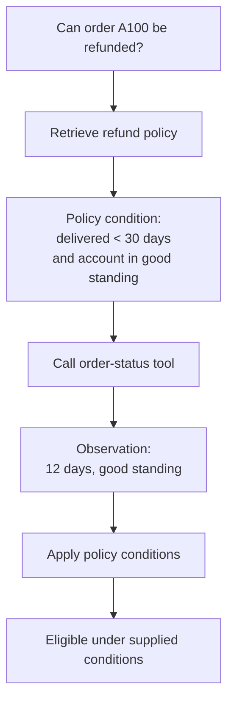
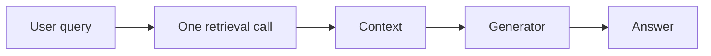
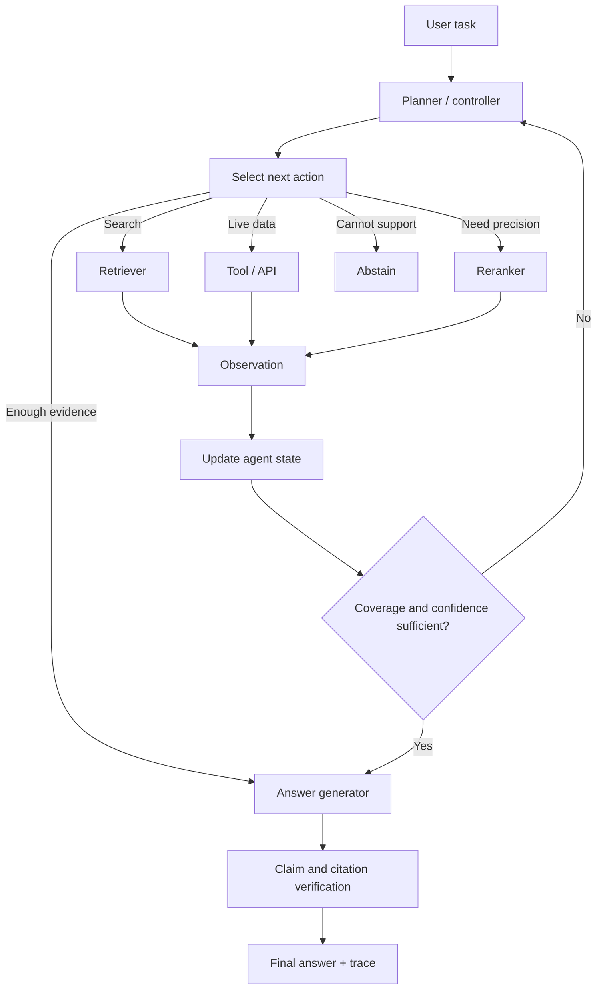
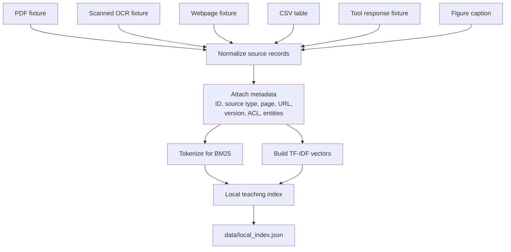
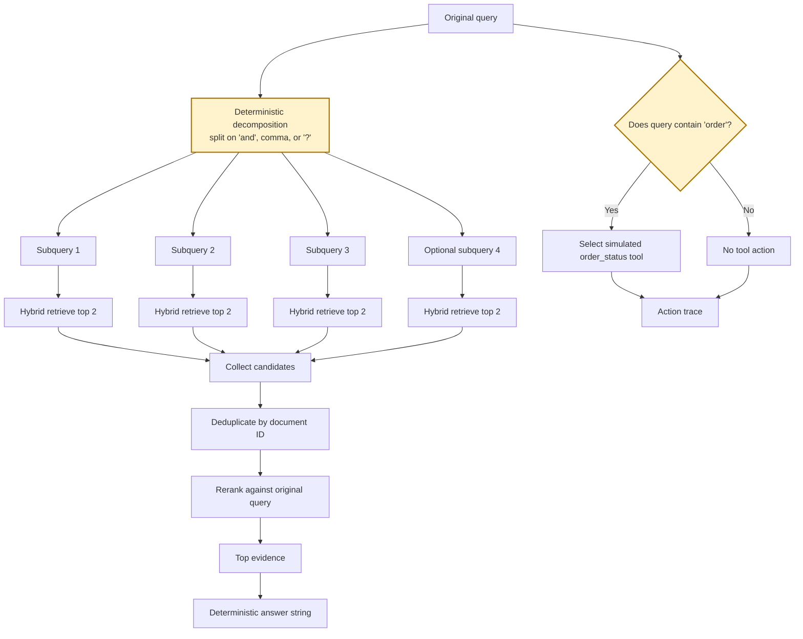
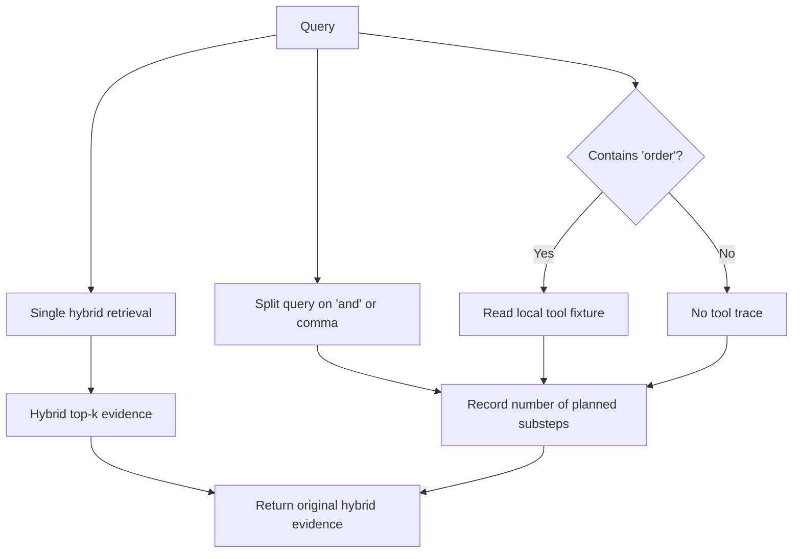
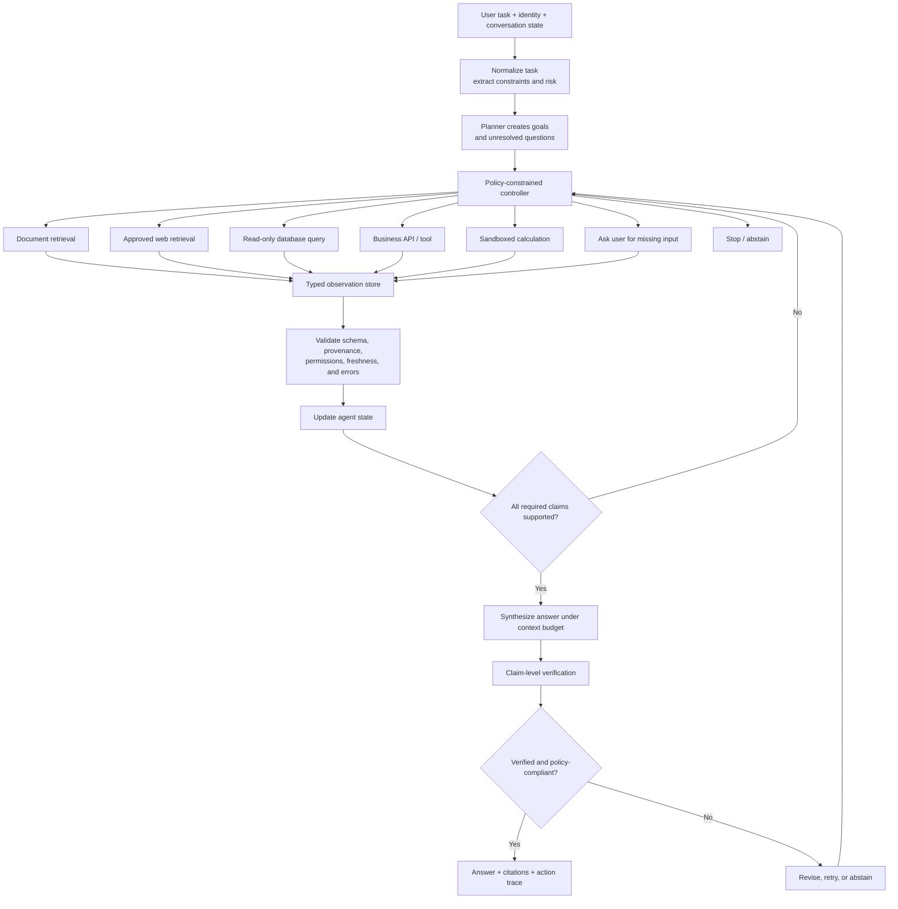
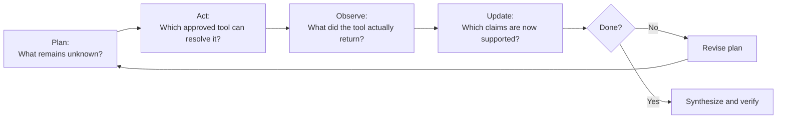

# Agentic RAG — Plan, Retrieve, Use Tools, Observe, and Continue

> A local, standard-library teaching repository for understanding how retrieval changes when a system can **break a task into subgoals**, **choose retrieval or tool actions**, **collect observations**, and **decide what to do next**.

This subrepository presents **Agentic Retrieval-Augmented Generation (Agentic RAG)** as an inspectable control-flow problem rather than a hidden framework abstraction.

It contains:

- a mixed-source local corpus;
- a transparent BM25 + TF-IDF hybrid retriever;
- a deterministic query decomposer;
- a simulated order-status tool;
- a lightweight evidence reranker;
- numbered tutorial scripts;
- a standalone Agentic RAG demonstration;
- a small retrieval evaluation set;
- architecture and implementation notes.

No API key, vector database, hosted language model, or external Python package is required for the teaching path.

---

## Table of contents

1. [What is Agentic RAG?](#what-is-agentic-rag)
2. [Why single-pass RAG is sometimes insufficient](#why-single-pass-rag-is-sometimes-insufficient)
3. [The core agent loop](#the-core-agent-loop)
4. [Architecture](#architecture)
5. [What this subrepository actually implements](#what-this-subrepository-actually-implements)
6. [The two runnable paths](#the-two-runnable-paths)
7. [Exact behavior of the standalone demo](#exact-behavior-of-the-standalone-demo)
8. [Exact behavior of the numbered tutorial](#exact-behavior-of-the-numbered-tutorial)
9. [Repository structure](#repository-structure)
10. [Quick start](#quick-start)
11. [Step-by-step tutorial](#step-by-step-tutorial)
12. [How retrieval works](#how-retrieval-works)
13. [How planning works in this demo](#how-planning-works-in-this-demo)
14. [How tool selection works](#how-tool-selection-works)
15. [How evidence is merged and reranked](#how-evidence-is-merged-and-reranked)
16. [Understanding the output](#understanding-the-output)
17. [Evaluation](#evaluation)
18. [Teaching implementation versus genuine Agentic RAG](#teaching-implementation-versus-genuine-agentic-rag)
19. [A production Agentic RAG design](#a-production-agentic-rag-design)
20. [Agent state and action schemas](#agent-state-and-action-schemas)
21. [Stopping rules and budgets](#stopping-rules-and-budgets)
22. [Where Agentic RAG is used most](#where-agentic-rag-is-used-most)
23. [When to use it—and when not to](#when-to-use-itand-when-not-to)
24. [How to adapt this repository](#how-to-adapt-this-repository)
25. [Evaluation strategy for production agents](#evaluation-strategy-for-production-agents)
26. [Common failure modes](#common-failure-modes)
27. [Security and safety](#security-and-safety)
28. [Debugging checklist](#debugging-checklist)
29. [References](#references)

---

# What is Agentic RAG?

Standard RAG normally follows a fixed pipeline:

```text
query → retrieve once → build context → generate answer
```

Agentic RAG introduces a controller that can choose among multiple actions:

```text
plan → retrieve or call a tool → inspect the observation
     → update the plan → continue or stop
```

The key difference is **control flow**.

The system is no longer limited to one retrieval call chosen in advance. It can respond to intermediate evidence.

For example, consider:

```text
Check the refund policy and order A100 status and explain eligibility.
```

A single static document search is not enough because the task contains two distinct information needs:

1. retrieve the refund policy;
2. obtain the current state of order `A100`.

The policy is relatively static and belongs in a document index. The order status is dynamic and belongs behind an API or tool.

An Agentic RAG system should:

1. recognize both subgoals;
2. retrieve the policy;
3. call the order-status tool;
4. inspect both observations;
5. apply the policy conditions to the live order data;
6. explain the conclusion with provenance.

---

# Why single-pass RAG is sometimes insufficient

Single-pass RAG works well when:

- the user asks one focused question;
- one retrieval query is sufficient;
- all required facts live in indexed documents;
- no intermediate result changes the next action;
- no live system needs to be queried.

It becomes less reliable when the task requires:

- multiple sources;
- multiple retrieval queries;
- follow-up searches based on an earlier result;
- document evidence plus live API data;
- conditional reasoning;
- comparison of versions;
- clarification of ambiguous entities;
- multi-hop traversal;
- verification before answering.

## Example: conditional information need



The tool action is only meaningful after the policy conditions are known. In more complex systems, this relationship may require genuine iterative planning.

---

# The core agent loop

A production Agentic RAG system can be expressed as:

\[
a_t \sim \pi(a_t \mid q, s_t)
\]

where:

- \(q\) is the original task;
- \(s_t\) is the accumulated agent state;
- \(a_t\) is the next selected action;
- \(\pi\) is the controller or policy.

The environment returns an observation:

\[
o_t = \operatorname{Execute}(a_t)
\]

The state is updated:

\[
s_{t+1} = \operatorname{Update}(s_t, a_t, o_t)
\]

The controller then decides whether to continue:

\[
\operatorname{Stop}(q, s_{t+1}) \in \{\text{continue},\text{answer},\text{abstain}\}
\]

A useful utility view is:

\[
U(a_t)
=
\mathbb{E}[\text{information gain}]
-
\lambda_c \cdot \text{cost}
-
\lambda_l \cdot \text{latency}
-
\lambda_r \cdot \text{risk}
\]

The best action is not necessarily the action that retrieves the most text. It is the action that most efficiently reduces uncertainty while respecting permissions, cost, latency, and safety.

---

# Architecture

## 1. Standard RAG versus Agentic RAG

### Standard RAG



### Agentic RAG



The loop is the defining feature:

```text
plan → act → observe → update → decide
```

---

## 2. Index-time architecture in this repository



The numbered tutorial uses `data/corpus.jsonl`.

The standalone demonstration uses `examples/sample_corpus.json`, which separates:

- indexed documents;
- simulated tools;
- training examples;
- future update records.

---

## 3. Standalone demo architecture



### Important limitation

The current standalone demo **selects and executes the simulated tool function**, but the returned tool observation is not added to the final evidence list or used by `answer_from_evidence()`.

Therefore, it demonstrates:

- decomposition;
- repeated retrieval;
- deterministic tool routing;
- candidate merging;
- reranking;
- trace creation.

It does **not yet complete** the full policy-plus-live-data reasoning chain.

---

## 4. Numbered tutorial architecture



The numbered path is an **agentic orchestration scaffold**.

It logs planning and optional tool activity, but it does not:

- retrieve separately for each planned subquery;
- merge those subquery results;
- add the tool observation to `top_evidence`;
- replan after observing evidence;
- evaluate evidence sufficiency;
- loop;
- generate a tool-grounded eligibility decision.

This distinction is important when interpreting its output and metrics.

---

## 5. Recommended production architecture



---

# What this subrepository actually implements

This folder provides two related teaching implementations.

## A. Numbered cookbook path

```text
1-explore-data.py
2-build-index.py
3-retrieve.py
4-run-method.py
5-evaluate.py
```

It uses:

```text
data/corpus.jsonl
data/queries.jsonl
data/qrels.jsonl
utils/cookbook_core.py
```

Its effective control flow is:

```text
single hybrid retrieval
    +
simple query splitting for trace output
    +
optional reading of a local tool fixture
    ↓
original hybrid evidence + explanatory steps
```

## B. Standalone path

```text
agentic_rag.py
examples/sample_corpus.json
```

Its effective control flow is:

```text
decompose query
    ↓
retrieve independently for each subquery
    ↓
optionally select order_status tool
    ↓
deduplicate retrieved documents
    ↓
rerank against original query
    ↓
return evidence and trace
```

The standalone path is the stronger demonstration of multi-step retrieval.

---

# The two runnable paths

| Property | Numbered tutorial | Standalone demo |
|---|---|---|
| Entry point | `4-run-method.py` | `agentic_rag.py` |
| Corpus | `data/corpus.jsonl` | `examples/sample_corpus.json` |
| Decomposes query | Only for step-count logging | Yes |
| Executes retrieval per subquery | No | Yes |
| Maximum subqueries | Not enforced in execution | Four |
| Candidates per subquery | Not applicable | Two |
| Selects tool | Reads fixture if query contains `order` | Calls `call_demo_tool()` |
| Merges tool result into evidence | No | No |
| Deduplicates subquery evidence | No additional subquery evidence | Yes, by document ID |
| Final reranking | No agent-specific reranking | Yes |
| Iterative replanning | No | No |
| Evidence-sufficiency decision | No | No |
| LLM call | No | No |
| Output | JSON | JSON |

---

# Exact behavior of the standalone demo

The default query in `examples/sample_corpus.json` is:

```text
Check the refund policy and order A100 status and explain eligibility.
```

## Step 1 — Deterministic decomposition

The code uses:

```python
re.split(r"\band\b|,|\?", query)
```

This produces:

```text
1. Check the refund policy
2. order A100 status
3. explain eligibility.
```

Only the first four non-empty subqueries are executed.

### Important parsing properties

- lowercase `and` is recognized;
- uppercase `AND` is not explicitly handled;
- commas are recognized;
- question marks are recognized;
- semantic decomposition is not performed;
- quoted phrases are not protected;
- conjunctions inside titles or names may split incorrectly.

This is a deterministic teaching heuristic, not an LLM planner.

---

## Step 2 — Retrieve for each subquery

For every subquery, the standalone implementation calls:

```python
hybrid_retrieve(subquery, docs, 2)
```

The teaching retriever combines:

```text
BM25
+
TF-IDF cosine similarity
+
Reciprocal Rank Fusion
```

For the default fixture, the behavior is approximately:

| Subquery | First retrieved document | Second retrieved document |
|---|---|---|
| `Check the refund policy` | `doc_refund_policy` | `doc_policy_parent` |
| `order A100 status` | `doc_refund_policy` | `doc_policy_parent` |
| `explain eligibility.` | `doc_policy_parent` | `doc_policy_child_security` |

Why does the order-status subquery not retrieve a live order observation?

Because the standalone JSON keeps the live order record under:

```json
"tools": {
  "order_status": { ... }
}
```

It is not part of the indexed `documents` list.

---

## Step 3 — Select a tool

The function:

```python
call_demo_tool(payload, query)
```

checks:

```python
if "order" in query.lower() and "order_status" in tools:
```

For the default query, it returns a structure equivalent to:

```json
{
  "tool": "order_status",
  "arguments": {
    "order_id": "A100"
  },
  "result": {
    "order_id": "A100",
    "status": "delivered",
    "days_since_delivery": 12,
    "account_standing": "good",
    "amount_usd": 199.0
  }
}
```

The tool router is intentionally simple:

- it supports one tool;
- it uses keyword matching;
- it does not infer arbitrary arguments;
- it does not validate an external API response;
- it has no permission model;
- it has no retry or timeout behavior.

---

## Step 4 — Deduplicate evidence

All retrieved passages are collected, then deduplicated with:

```python
list({d["id"]: d for d in collected}.values())
```

This keeps one record per document ID.

It does not perform:

- semantic near-duplicate detection;
- content-hash deduplication;
- source diversity constraints;
- parent–child grouping;
- freshness resolution.

---

## Step 5 — Rerank against the original query

The deduplicated candidates are scored using:

```text
unique query-token overlap
+
title-match bonus
+
exact-query bonus
+
existing hybrid score
```

In simplified notation:

\[
s(q,d)
=
|T(q) \cap T(d)|
+
b_{\text{title}}
+
b_{\text{exact}}
+
s_{\text{RRF}}(d)
\]

where:

- \(T(x)\) is the set of normalized tokens;
- \(b_{\text{title}}=2\) when any query term appears in the title;
- \(b_{\text{exact}}=2\) when the full query occurs in the document representation.

For the default fixture, the final order is approximately:

| Rank | Document | Toy rerank score |
|---:|---|---:|
| 1 | `doc_refund_policy` | `7.0328` |
| 2 | `doc_policy_parent` | `5.0328` |
| 3 | `doc_policy_child_security` | `2.0323` |

These scores are not probabilities.

---

## Step 6 — Build the answer string

The standalone function creates a deterministic string using:

- up to three evidence IDs;
- optional page suffixes;
- the text of the highest-ranked document.

The answer is not generated by an LLM.

More importantly, the answer builder receives only `evidence`, not `tool_result`.

As a result, the current implementation cannot fully conclude refund eligibility from:

```text
policy conditions + live order observation
```

even though the tool result contains enough information to do so.

---

# Exact behavior of the numbered tutorial

The numbered method begins with:

```python
retrieved = hybrid_retrieve(
    query,
    top_k=top_k,
    candidate_k=max(10, top_k * 2),
)
```

It then stores:

```python
evidence = retrieved["hybrid"]
```

For the Agentic RAG branch, it performs:

```python
parts = [
    part.strip()
    for part in re.split(r"\band\b|,", query)
    if part.strip()
]
```

It adds a planning message:

```text
Planned N retrieval sub-step(s) and inspected whether a tool call was needed.
```

When the query contains `order`, it reads:

```text
examples/tool_response.json
```

and appends that tool result to the `steps` trace.

However, `evidence` remains the original single-pass hybrid result.

Therefore:

```text
the plan changes the trace,
but not the retrieval execution
```

and:

```text
the tool result appears in steps,
but not in top_evidence or the answer
```

This path is useful for understanding where orchestration hooks belong, but it should not be described as a complete iterative agent.

---

# Repository structure

```text
03-agentic-rag/
├── assets/
│   ├── architecture.mmd
│   └── paper_diagram.svg
├── data/
│   ├── corpus.jsonl
│   ├── queries.jsonl
│   ├── qrels.jsonl
│   └── local_index.json          # generated locally
├── docs/
├── examples/
│   ├── run_example.py
│   ├── sample_corpus.json
│   ├── sample_policy.pdf
│   ├── scanned_page_ocr.txt
│   ├── sample_webpage.html
│   ├── sample_table.csv
│   └── tool_response.json
├── utils/
│   ├── __init__.py
│   └── cookbook_core.py
├── .env.example
├── .gitignore
├── 1-explore-data.py
├── 2-build-index.py
├── 3-retrieve.py
├── 4-run-method.py
├── 5-evaluate.py
├── agentic_rag.py
├── architecture.mmd
├── ARCHITECTURE.md
├── COMPLETE_UNDERSTAND.md
├── implementation_notes.md
├── sources.md
└── README.md
```

## File responsibilities

| File | Responsibility |
|---|---|
| `1-explore-data.py` | Inspect the local corpus and fixtures |
| `2-build-index.py` | Build the token and TF-IDF teaching index |
| `3-retrieve.py` | Show BM25, TF-IDF, and hybrid retrieval |
| `4-run-method.py` | Run the numbered Agentic RAG scaffold |
| `5-evaluate.py` | Compute small Recall@k and MRR metrics |
| `utils/cookbook_core.py` | Shared numbered-path utilities |
| `agentic_rag.py` | Self-contained multi-subquery and tool-routing demonstration |
| `data/corpus.jsonl` | Corpus used by the numbered tutorial |
| `examples/sample_corpus.json` | Rich standalone payload |
| `examples/tool_response.json` | Local simulated API observation |
| `architecture.mmd` | Mermaid architecture source |
| `assets/paper_diagram.svg` | Paper-informed local illustration |
| `sources.md` | Research papers and framework documentation |

---

# Quick start

## Requirements

- Python 3.10 or newer is recommended.
- No third-party package is required.
- No API key is required.
- No model server is required.

## Run the numbered tutorial

```bash
python 1-explore-data.py
python 2-build-index.py
python 3-retrieve.py
python 4-run-method.py \
  --query "Check the refund policy and order A100 status" \
  --top-k 5
python 5-evaluate.py
```

## Run the example entry point

```bash
python examples/run_example.py
```

Note that this example currently invokes the vendor-onboarding query:

```text
Where does vendor onboarding require security review?
```

That query does not exercise the order-status tool.

## Explain the standalone method

```bash
python agentic_rag.py --explain
```

## Run the standalone default scenario

```bash
python agentic_rag.py
```

## Run an explicit multi-part query

```bash
python agentic_rag.py \
  --query "Check the refund policy and order A100 status and explain eligibility." \
  --top-k 5
```

## Use another payload

```bash
python agentic_rag.py \
  --corpus path/to/sample_corpus.json \
  --query "Your task" \
  --top-k 5
```

---

# Step-by-step tutorial

## Stage 1 — Explore data

Run:

```bash
python 1-explore-data.py
```

The script reports:

- number of source records;
- source types;
- example fixture names;
- one normalized document.

The numbered corpus contains:

| ID | Type | Information |
|---|---|---|
| `pdf_policy_text` | PDF | Vendor security-review policy |
| `scanned_pdf_ocr` | Scanned PDF | Invoice approval and security-review status |
| `web_current_docs` | Webpage | API version and rollback |
| `table_warranty_reserve` | Table | Warranty reserve |
| `tool_order_status` | Tool-like record | Order A100 state |
| `figure_latency_caption` | Figure | API latency caption |

Notice that the numbered corpus stores `tool_order_status` as a searchable document.

The standalone payload instead stores live order data under `tools`.

This creates an important evaluation distinction:

```text
numbered path: tool data can be found by document retrieval
standalone path: tool data requires call_demo_tool()
```

---

## Stage 2 — Build the index

Run:

```bash
python 2-build-index.py
```

The local index stores:

- documents;
- tokenized representations;
- inverse-document-frequency values;
- average document length.

The index is written to:

```text
data/local_index.json
```

This is a teaching index, not a vector database.

---

## Stage 3 — Inspect baseline retrieval

Run:

```bash
python 3-retrieve.py
```

The baseline executes:

1. BM25 lexical scoring;
2. TF-IDF cosine scoring;
3. Reciprocal Rank Fusion.

This is important because the agent builds on retrieval quality. An agent cannot reliably reason over evidence that its tools fail to find.

---

## Stage 4 — Run the method

Run:

```bash
python 4-run-method.py \
  --query "Check order A100 against policy and tool data." \
  --top-k 5
```

Inspect:

```text
steps
top_evidence
answer
```

Remember:

- the tool fixture is included in `steps`;
- the final evidence remains the initial hybrid retrieval result;
- no LLM is called.

---

## Stage 5 — Evaluate

Run:

```bash
python 5-evaluate.py
```

The current evaluation contains four small queries and relevance labels.

With `top_k=3`, the fixture produces:

```text
Recall@3 = 1.0000
MRR      = 1.0000
```

This occurs because the relevant source is ranked first for each tiny example.

These numbers validate the fixture plumbing only. They do not demonstrate that the agent:

- selected the correct tool;
- chose valid arguments;
- integrated tool observations;
- replanned;
- stopped correctly;
- produced a correct multi-source answer.

---

# How retrieval works

## BM25

BM25 is useful for:

- exact identifiers;
- order IDs;
- policy names;
- version numbers;
- error codes;
- product names.

The implementation uses:

```text
k1 = 1.5
b  = 0.75
```

\[
\operatorname{BM25}(q,d)
=
\sum_{t \in q}
\operatorname{IDF}(t)
\frac{
f(t,d)(k_1+1)
}{
f(t,d)+k_1
\left(
1-b+b\frac{|d|}{\operatorname{avgdl}}
\right)
}
\]

---

## TF-IDF cosine retrieval

The repository calls this a “dense-style” teaching path.

It is not a neural embedding system.

\[
\cos(q,d)
=
\frac{
\vec q \cdot \vec d
}{
\|\vec q\|\|\vec d\|
}
\]

This design makes the scoring visible and keeps the demo dependency-free.

---

## Reciprocal Rank Fusion

BM25 and TF-IDF scores do not share a common numerical scale.

RRF combines their rank positions:

\[
s_{\mathrm{RRF}}(d)
=
\sum_{r}
\frac{1}{60+\operatorname{rank}_r(d)}
\]

A production agent may expose several retrieval tools instead:

```text
search_policies
search_product_docs
search_incidents
search_code
search_web
lookup_customer
query_database
```

Each tool should have a clear contract and permission boundary.

---

# How planning works in this demo

The standalone decomposition rule is:

```python
subqueries = [
    part.strip()
    for part in re.split(r"\band\b|,|\?", query)
    if part.strip()
]
```

This is best understood as a **visible placeholder for a planner**.

## What it teaches

- a complex task can be separated;
- each subtask can trigger independent retrieval;
- evidence can be pooled;
- the original task can be used for final reranking;
- execution can be bounded.

## What a production planner must additionally handle

- preserve dates and versions;
- preserve quoted strings and IDs;
- distinguish retrieval goals from action goals;
- infer dependencies between steps;
- identify parallelizable steps;
- decide which tools are allowed;
- specify expected observation schemas;
- revise failed steps;
- detect missing user input;
- stop when the task is complete.

## Example production plan

```json
{
  "goal": "Determine refund eligibility for order A100",
  "steps": [
    {
      "id": "s1",
      "action": "search_policy",
      "query": "current refund eligibility policy",
      "depends_on": []
    },
    {
      "id": "s2",
      "action": "get_order_status",
      "arguments": {
        "order_id": "A100"
      },
      "depends_on": []
    },
    {
      "id": "s3",
      "action": "evaluate_conditions",
      "depends_on": ["s1", "s2"]
    }
  ]
}
```

The plan should be treated as untrusted model output until it passes validation.

---

# How tool selection works

The current router is:

```text
query contains "order"
    +
payload contains "order_status"
    →
select order_status
```

This is deterministic and easy to inspect.

## A production tool-selection layer should validate

- the tool is allowed for this user;
- the tool is appropriate for the goal;
- required arguments are present;
- argument types are valid;
- IDs are not fabricated;
- the call is read-only or write-capable;
- confirmation is required when necessary;
- rate and cost budgets permit execution.

## Tool schema example

```json
{
  "name": "get_order_status",
  "description": "Return the current state of one order visible to the authenticated user.",
  "input_schema": {
    "type": "object",
    "properties": {
      "order_id": {
        "type": "string",
        "pattern": "^[A-Z][0-9]+$"
      }
    },
    "required": ["order_id"],
    "additionalProperties": false
  },
  "side_effects": "none",
  "requires_confirmation": false
}
```

## Tool observation example

```json
{
  "tool_call_id": "call-017",
  "tool": "get_order_status",
  "status": "success",
  "observed_at": "2026-07-10T19:00:00Z",
  "provenance": {
    "system": "orders-service",
    "resource": "order/A100"
  },
  "data": {
    "order_id": "A100",
    "status": "delivered",
    "days_since_delivery": 12,
    "account_standing": "good"
  }
}
```

Tool observations should be typed data, not arbitrary prose whenever possible.

---

# How evidence is merged and reranked

The standalone demo collects two results from each subquery.

If there are \(m\) subqueries, the maximum raw collection size is:

\[
2m
\]

Because the implementation limits \(m\) to four:

\[
|C_{\text{raw}}| \leq 8
\]

It then deduplicates by document ID:

\[
C_{\text{unique}}
=
\operatorname{UniqueByID}(C_{\text{raw}})
\]

Finally, it scores every unique candidate against the original task.

This is a useful pattern:

```text
local subqueries improve coverage
original query restores global relevance
```

A production merger should also consider:

- source diversity;
- freshness;
- version correctness;
- authority;
- access control;
- contradictions;
- parent–child relationships;
- token budget;
- tool observations;
- structured table results;
- evidence dependencies.

---

# Understanding the output

A standalone result contains:

```json
{
  "method_key": "agentic",
  "query": "...",
  "steps": [
    "Planned 3 retrieval step(s) and tool action order_status."
  ],
  "top_evidence": [
    {
      "id": "doc_refund_policy",
      "title": "Refund policy",
      "score": 7.0328,
      "reason": "cross-encoder-style overlap rerank",
      "source_type": "pdf",
      "page": 7,
      "version": "2026.04",
      "snippet": "Refunds are allowed when..."
    }
  ],
  "answer": "Demo answer for agentic: based on ..."
}
```

## Read the fields in this order

1. `steps` — the recorded method action;
2. `top_evidence` — the documents selected after retrieval and reranking;
3. `reason` — which stage produced the current score;
4. provenance fields — page, URL, version, and source type;
5. `answer` — a deterministic evidence summary.

## What is missing from the current result

The result does not expose:

- the actual subquery list;
- candidates per subquery;
- tool arguments;
- tool observation;
- agent state;
- per-step errors;
- retries;
- coverage judgment;
- stopping reason;
- verifier output.

Adding these fields would make the demo substantially more agent-like and easier to evaluate.

---

# Evaluation

## Metrics implemented here

The numbered evaluation computes:

### Hit-based Recall@k

\[
\operatorname{Recall@k}
=
\frac{
\text{queries with a relevant source in top-k}
}{
|Q|
}
\]

### Mean Reciprocal Rank

\[
\operatorname{MRR}
=
\frac{1}{|Q|}
\sum_{q \in Q}
\frac{1}{\operatorname{rank}_q}
\]

where the reciprocal rank is zero when no relevant source appears.

These are retrieval metrics.

They do not evaluate the agent loop.

## Why the current metrics can be misleading for Agentic RAG

For the query:

```text
Check order A100 against policy and tool data.
```

the numbered corpus contains the tool response as a searchable document:

```text
tool_order_status
```

The relevant record can therefore be retrieved without proving that a tool was correctly selected or executed.

A production Agentic RAG benchmark must separately test:

```text
document retrieval
tool selection
argument construction
tool execution
observation integration
reasoning over evidence
stopping behavior
final answer support
```

---

# Teaching implementation versus genuine Agentic RAG

| Capability | Current numbered path | Current standalone path | Production agent |
|---|---:|---:|---:|
| Hybrid document retrieval | Yes | Yes | Yes |
| Query decomposition | Trace only | Deterministic | Model or rule based |
| Independent subquery retrieval | No | Yes | Yes |
| Tool selection | Keyword fixture | Keyword fixture | Schema- and policy-constrained |
| Tool argument extraction | Fixed fixture | Reads fixture ID | Validated extraction |
| Tool observation available | In trace | Returned internally | Stored in agent state |
| Tool observation used in answer | No | No | Yes |
| Dynamic replanning | No | No | Yes |
| Evidence sufficiency check | No | No | Yes |
| Loop termination rule | No loop | One fixed pass | Explicit |
| Claim verification | No | No | Recommended |
| Permission enforcement | No | No | Required |
| Write-action confirmation | Not applicable | Not applicable | Required where relevant |
| Full trace | Partial | Partial | Required for debugging |
| LLM planner | No | No | Optional |
| External dependencies | None | None | Usually several |

---

# A production Agentic RAG design

## Controller pseudocode

```python
def run_agent(task, user_context, limits):
    state = AgentState.create(
        task=task,
        user_context=user_context,
        max_steps=limits.max_steps,
        deadline=limits.deadline,
        cost_budget=limits.cost_budget,
    )

    while not state.finished:
        if state.step_count >= state.max_steps:
            return abstain("Maximum step count reached", state)

        action = planner.choose_action(state)
        validated_action = policy.validate(action, state.user_context)

        if not validated_action.allowed:
            state.record_rejection(validated_action)
            return abstain("Requested action is not permitted", state)

        observation = executor.run(validated_action)
        observation = observation_validator.validate(
            observation,
            expected_schema=validated_action.output_schema,
        )

        state.add(validated_action, observation)

        coverage = evidence_grader.evaluate(
            task=state.task,
            observations=state.observations,
        )

        if coverage.is_complete:
            draft = generator.answer(
                task=state.task,
                evidence=state.supporting_evidence(),
            )

            verification = verifier.check(
                answer=draft,
                evidence=state.supporting_evidence(),
            )

            if verification.all_claims_supported:
                return finalize(draft, verification, state)

            state.add_verification_feedback(verification)

        if coverage.is_impossible or observation.is_terminal_error:
            return abstain(coverage.reason, state)

    return abstain("Agent stopped without sufficient support", state)
```

## Design principle

The planner should not directly execute arbitrary actions.

Use:

```text
planner proposes
policy validates
executor performs
validator checks
state records
controller decides
```

---

# Agent state and action schemas

## Agent state

```json
{
  "task": "Determine whether order A100 is refund eligible",
  "user_context": {
    "user_id": "user-123",
    "tenant_id": "tenant-7",
    "roles": ["support-agent"]
  },
  "plan": [],
  "completed_steps": [],
  "open_questions": [
    "What is the current refund policy?",
    "What is the order's current state?"
  ],
  "observations": [],
  "claims": [],
  "step_count": 0,
  "cost_used": 0.0,
  "finished": false,
  "stop_reason": null
}
```

## Retrieval action

```json
{
  "type": "retrieve",
  "tool": "search_policies",
  "query": "current refund eligibility policy",
  "filters": {
    "is_current": true,
    "region": "DE"
  },
  "top_k": 10
}
```

## API action

```json
{
  "type": "tool_call",
  "tool": "get_order_status",
  "arguments": {
    "order_id": "A100"
  }
}
```

## Answer action

```json
{
  "type": "answer",
  "supported_claim_ids": [
    "claim-policy-window",
    "claim-order-age",
    "claim-account-standing"
  ]
}
```

Typed actions are easier to validate and evaluate than free-form action strings.

---

# Stopping rules and budgets

A production agent must not rely on a vague sense that it is “done.”

## Positive stopping conditions

Stop and answer when:

- every required subgoal is resolved;
- each material claim has supporting evidence;
- required tool observations are fresh;
- contradictions are addressed;
- citation coverage meets the threshold;
- no mandatory action is incomplete.

## Abstention conditions

Stop without answering when:

- required evidence cannot be found;
- the user lacks permission;
- a required tool is unavailable;
- observations conflict irreconcilably;
- a tool repeatedly fails;
- the task requests an unsafe or unauthorized action;
- the cost or time budget is exhausted.

## Hard budgets

Define:

```text
maximum agent steps
maximum retrieval calls
maximum tool calls
maximum tokens
maximum wall-clock time
maximum monetary cost
maximum retries per action
```

## Example budget

```json
{
  "max_steps": 8,
  "max_retrieval_calls": 5,
  "max_tool_calls": 3,
  "max_retries_per_action": 1,
  "max_context_tokens": 12000,
  "timeout_seconds": 20
}
```

Budgets are both an operational control and a safety mechanism.

---

# Where Agentic RAG is used most

## 1. Customer support and service operations

Example:

```text
retrieve refund policy
→ query live order
→ inspect payment state
→ determine eligibility
→ produce cited explanation
```

Agentic RAG is valuable when static policy documents must be combined with live customer or operational data.

---

## 2. Enterprise knowledge assistants

Tasks may require:

- searching multiple internal repositories;
- resolving document versions;
- following references;
- combining policy and project data;
- checking permissions;
- asking follow-up questions.

An agent can route different subgoals to different indexes.

---

## 3. Technical troubleshooting

Example:

```text
inspect error description
→ search runbooks
→ query service health
→ retrieve recent deployment notes
→ compare configuration
→ recommend next diagnostic step
```

The next action often depends on the previous observation.

---

## 4. Incident response and observability

Possible actions:

- search logs;
- query metrics;
- inspect deployment history;
- retrieve runbooks;
- check feature flags;
- correlate service dependencies.

Production use requires strict read/write separation and action approval.

---

## 5. Research synthesis

The agent may:

- decompose a broad question;
- search by subtopic;
- follow citations;
- compare claims;
- retrieve primary sources;
- identify missing evidence;
- synthesize with provenance.

This is more useful than issuing one broad search query when the question has several dimensions.

---

## 6. Compliance and audit workflows

Possible tasks:

- retrieve controlling policy;
- check a transaction or record;
- compare evidence with a rule;
- document the decision path;
- preserve an audit trail.

High-impact decisions should include deterministic rules and human review rather than relying solely on model judgment.

---

## 7. Developer and DevOps assistants

Possible actions:

- search source code;
- inspect issues;
- retrieve API docs;
- read CI logs;
- query deployment metadata;
- propose a patch;
- run tests in a sandbox.

Write actions should require explicit authorization and, often, confirmation.

---

## 8. Data analysis assistants

An agent may:

- inspect available tables;
- generate a constrained query;
- execute read-only SQL;
- validate row counts;
- calculate a result;
- retrieve metric definitions;
- explain the output.

Structured calculation should remain structured rather than being approximated from text.

---

## 9. Scientific and engineering workflows

Possible actions:

- retrieve papers;
- inspect simulation metadata;
- query experiment records;
- call numerical tools;
- compare model assumptions;
- generate a reproducible evidence trace.

Domain-specific verification is essential.

---

# When to use it—and when not to

## Use Agentic RAG when

- the task contains multiple information needs;
- the next query depends on an earlier result;
- live API or database data is required;
- several specialized retrievers exist;
- multi-hop retrieval is common;
- the system must recover from weak initial evidence;
- tool traces are useful for audit and debugging;
- task completion can be expressed as explicit subgoals.

## Prefer simpler RAG when

- one retrieval call reliably answers the question;
- latency is extremely strict;
- query volume is very high;
- every tool call is expensive;
- the corpus is small and well structured;
- the extra control loop does not improve quality;
- the environment cannot safely expose tools;
- the task cannot be evaluated or audited.

## Prefer deterministic workflows when

- the process is fixed;
- the steps are known in advance;
- the rules are legally or financially binding;
- there is little value in open-ended planning;
- errors have high consequences.

Agentic RAG should not replace a workflow engine merely because an LLM can produce a plan.

---

# How to adapt this repository

## Step 1 — Replace fixtures with real sources

Replace:

```text
data/corpus.jsonl
examples/sample_corpus.json
examples/tool_response.json
```

Preserve:

- stable source IDs;
- page and section metadata;
- canonical URLs;
- content hashes;
- versions;
- retrieval timestamps;
- access-control fields;
- tool provenance.

---

## Step 2 — Define the task classes

Create a task inventory:

| Task class | Needed evidence | Allowed tools | Completion condition |
|---|---|---|---|
| Policy Q&A | Current policy passages | Policy search | Required clause found |
| Refund check | Policy + live order | Policy search, order API | Every rule condition resolved |
| Incident triage | Logs + runbook + deployment | Log search, metrics, deploy API | Root-cause hypothesis supported |
| Research synthesis | Multiple primary sources | Literature search | Coverage rubric satisfied |

The planner needs explicit tool semantics and completion criteria.

---

## Step 3 — Build a tool registry

```python
TOOL_REGISTRY = {
    "search_policy": {
        "input_schema": SearchPolicyInput,
        "output_schema": SearchResults,
        "side_effects": "none",
        "permission": "policy:read",
    },
    "get_order_status": {
        "input_schema": OrderStatusInput,
        "output_schema": OrderStatus,
        "side_effects": "none",
        "permission": "orders:read",
    },
}
```

Tool descriptions should state both what the tool can do and what it cannot do.

---

## Step 4 — Replace deterministic splitting

Possible approaches:

- rule-based planners;
- structured LLM planning;
- graph-based workflows;
- finite-state machines;
- learned routing;
- hybrid deterministic/model controllers.

Require structured output:

```json
{
  "subgoals": [],
  "dependencies": [],
  "next_action": {},
  "completion_criteria": []
}
```

Validate every field.

---

## Step 5 — Put tool observations into state

The current standalone code should conceptually evolve from:

```python
tool_result = call_demo_tool(payload, query)
```

to:

```python
tool_observation = call_demo_tool(payload, query)
state.observations.append(tool_observation)
```

Then include tool evidence during synthesis:

```python
answer = answer_from_evidence(
    query=query,
    documents=retrieved_documents,
    tool_observations=state.tool_observations,
)
```

This is the most important missing bridge in the current example.

---

## Step 6 — Add evidence coverage

Represent required facts:

```json
{
  "required_claims": [
    {
      "id": "refund-window",
      "question": "What is the allowed delivery-age window?",
      "status": "supported"
    },
    {
      "id": "order-age",
      "question": "How many days since A100 was delivered?",
      "status": "supported"
    },
    {
      "id": "account-standing",
      "question": "Is the account in good standing?",
      "status": "supported"
    }
  ]
}
```

Do not stop until all mandatory claims are supported or explicitly unresolved.

---

## Step 7 — Add observation-driven replanning

Example:

```text
tool returns order not found
    →
check whether ID was parsed correctly
    →
ask user or search customer-visible orders
```

Another example:

```text
policy retrieval returns two conflicting versions
    →
apply effective-date filter
    →
retrieve supersession metadata
```

Replanning should be triggered by typed conditions, not only unconstrained language-model intuition.

---

## Step 8 — Add final verification

For each answer claim, record:

```text
Supported
Contradicted
Not found
```

Do not cite a source unless it directly supports the claim.

---

## Step 9 — Add trace persistence

Store:

- original query;
- normalized task;
- proposed plan;
- accepted/rejected actions;
- tool arguments;
- observations;
- retrieval candidates;
- reranker scores;
- state transitions;
- stopping reason;
- answer claims;
- citations;
- verification results;
- timing and cost.

Sensitive traces require access control and retention policies.

---

# Evaluation strategy for production agents

## 1. Retrieval quality

Measure:

- Recall@k;
- MRR;
- nDCG;
- source diversity;
- current-version accuracy;
- relevant-source coverage.

## 2. Planning quality

Measure:

- subgoal coverage;
- unnecessary-step rate;
- dependency accuracy;
- missing prerequisite rate;
- plan validity;
- plan repair success.

## 3. Tool-use quality

Measure:

- tool-selection accuracy;
- argument exact match;
- schema-valid call rate;
- permission-denial correctness;
- tool success rate;
- retry success;
- observation freshness.

## 4. Agent-loop quality

Measure:

- task completion rate;
- average steps;
- excess-step rate;
- loop-timeout rate;
- premature-stop rate;
- failure-recovery rate;
- abstention quality.

## 5. Answer quality

Measure:

- task correctness;
- faithfulness;
- citation precision;
- citation recall;
- contradiction handling;
- unsupported-claim rate;
- policy-application accuracy.

## 6. Operational quality

Measure:

- p50/p95/p99 latency;
- cost per completed task;
- retrieval calls per task;
- tool calls per task;
- token use;
- cache hit rate;
- failure rate by tool.

## 7. Safety quality

Measure:

- unauthorized-call rate;
- prompt-injection success rate;
- sensitive-data leakage;
- unsafe write attempts;
- confirmation bypass rate;
- cross-tenant data exposure;
- malicious-tool-output robustness.

---

# Common failure modes

## 1. Planning without execution

**Symptom:** the trace lists substeps, but only one retrieval call occurs.

**Where visible here:** the numbered tutorial.

**Fix:** execute each accepted action and store its observation.

---

## 2. Tool call not integrated into the answer

**Symptom:** the correct tool is selected, but the final conclusion ignores its result.

**Where visible here:** the standalone demonstration.

**Fix:** convert the tool result into a typed observation and include it in coverage evaluation and synthesis.

---

## 3. Retrieval masquerades as live tool use

**Symptom:** an indexed snapshot of an API response is treated as current state.

**Where visible here:** the numbered corpus contains `tool_order_status` as a searchable record.

**Fix:** distinguish:

```text
historical indexed tool record
current authenticated tool observation
```

and label freshness explicitly.

---

## 4. Brittle query decomposition

**Symptom:** splitting on `and` breaks names, quoted phrases, or logical clauses.

**Fix:** use structured planning, preserve spans, and test decomposition separately.

---

## 5. Infinite or unproductive loops

**Symptom:** the agent repeatedly searches similar queries.

**Fix:** step budgets, duplicate-action detection, information-gain thresholds, and terminal error handling.

---

## 6. Wrong tool with plausible arguments

**Symptom:** the tool call is syntactically valid but semantically inappropriate.

**Fix:** tool-selection evaluation, action policy, and explicit preconditions.

---

## 7. Fabricated arguments

**Symptom:** the planner invents an order ID or account identifier.

**Fix:** track argument provenance and require IDs to come from the user or verified observations.

---

## 8. Conflicting observations

**Symptom:** indexed policy and API result refer to different dates, users, or versions.

**Fix:** preserve timestamps, identities, versions, and scope; detect contradictions before synthesis.

---

## 9. Premature completion

**Symptom:** the system answers after finding only one of several required facts.

**Fix:** explicit required-claim coverage and stopping rules.

---

## 10. Excessive agent autonomy

**Symptom:** the agent performs unnecessary or risky actions.

**Fix:** least privilege, read-only defaults, action allowlists, budgets, and confirmations.

---

## 11. Tool errors hidden as empty data

**Symptom:** a timeout or authorization failure is interpreted as “not found.”

**Fix:** typed error states:

```text
success
not_found
permission_denied
timeout
invalid_arguments
service_error
```

---

## 12. Prompt injection controls the agent

**Symptom:** a retrieved page instructs the model to call a sensitive tool or reveal data.

**Fix:** isolate retrieved content, validate actions independently, and never treat source text as authority over system policy.

---

# Security and safety

Agentic RAG has a larger attack surface than static RAG because it can act.

## Main risks

- prompt injection in retrieved documents;
- malicious tool output;
- unauthorized data access;
- cross-tenant retrieval;
- data exfiltration through tool arguments;
- server-side request forgery;
- unsafe write operations;
- confused-deputy behavior;
- credential leakage;
- recursive or costly loops;
- stale data used as live state;
- unverified actions based on hallucinated IDs.

## Required controls

### 1. Least privilege

Each tool should receive the minimum permission necessary.

### 2. Read-only by default

Separate:

```text
search
read
simulate
write
delete
send
purchase
```

into distinct tools and policies.

### 3. Independent authorization

Do not let the planner decide whether an action is authorized.

### 4. Structured schemas

Reject extra arguments and invalid types.

### 5. Argument provenance

Track whether each sensitive argument came from:

- user input;
- authenticated context;
- verified tool output;
- model inference.

### 6. Human confirmation

Require confirmation before consequential writes.

### 7. Domain and network allowlists

Restrict web and HTTP tools to approved destinations.

### 8. Prompt-injection isolation

Retrieved content is data, not instruction.

### 9. Sandboxing

Run code and file operations in constrained environments.

### 10. Budgets and circuit breakers

Terminate repeated, expensive, or anomalous behavior.

### 11. Full audit traces

Log validated actions and observations without exposing unnecessary secrets.

### 12. Claim verification

Check the final answer against the actual observations used.

---

# Debugging checklist

## Corpus and index

- [ ] Are source IDs stable?
- [ ] Are page, URL, version, and timestamp fields preserved?
- [ ] Are current and stale records distinguishable?
- [ ] Are tool snapshots labeled as historical records?
- [ ] Are ACLs attached before indexing?

## Planner

- [ ] Does every required subgoal appear?
- [ ] Are exact IDs and dates preserved?
- [ ] Are dependencies correct?
- [ ] Are parallel steps identified?
- [ ] Are unnecessary steps avoided?
- [ ] Is the plan structured and valid?

## Retrieval

- [ ] Does each subquery actually run?
- [ ] Can the correct source be found in top-N?
- [ ] Are duplicate queries detected?
- [ ] Are filters applied before evidence exposure?
- [ ] Are stale documents suppressed when required?

## Tools

- [ ] Was the correct tool selected?
- [ ] Are arguments valid?
- [ ] Is argument provenance known?
- [ ] Was authorization checked?
- [ ] Is the observation fresh?
- [ ] Are errors distinguished from empty results?
- [ ] Was the observation added to agent state?

## Agent loop

- [ ] Did the observation change the next action?
- [ ] Are required facts tracked?
- [ ] Is there a maximum step count?
- [ ] Can the agent recover from failure?
- [ ] Is the stopping reason explicit?
- [ ] Can it abstain?

## Answer

- [ ] Does the answer use both document and tool evidence where required?
- [ ] Is every material claim supported?
- [ ] Are citations attached to exact sources?
- [ ] Are dynamic claims linked to tool provenance and time?
- [ ] Are contradictions disclosed?
- [ ] Is unsupported certainty avoided?

## Security

- [ ] Are retrieved instructions ignored as commands?
- [ ] Are write tools separated from read tools?
- [ ] Are tool destinations allowlisted?
- [ ] Are secrets excluded from prompts and traces?
- [ ] Are cross-tenant accesses impossible?
- [ ] Are high-impact actions confirmed?

---

# Related methods in this repository

- [`../01-hybrid-rag/`](../01-hybrid-rag/) — first-stage lexical and dense retrieval.
- [`../02-reranked-rag/`](../02-reranked-rag/) — stronger final evidence ordering.
- [`../10-multi-query-rag/`](../10-multi-query-rag/) — multiple retrieval formulations.
- [`../11-decomposition-rag/`](../11-decomposition-rag/) — explicit subquestion decomposition.
- [`../19-tool-augmented-rag/`](../19-tool-augmented-rag/) — retrieval combined with external tools.
- [`../20-claim-level-verification-rag/`](../20-claim-level-verification-rag/) — final claim support checks.

A robust agent can combine all of them:

```text
task decomposition
    +
hybrid retrieval
    +
tool routing
    +
reranking
    +
observation-driven replanning
    +
claim verification
```

---

# References

## Primary research

1. **Yao, S. et al. — “ReAct: Synergizing Reasoning and Acting in Language Models.”**  
   Introduces an interleaved reasoning-and-action pattern in which observations inform subsequent steps.  
   <https://arxiv.org/abs/2210.03629>

2. **Schick, T. et al. — “Toolformer: Language Models Can Teach Themselves to Use Tools.”**  
   Studies language-model tool use through self-supervised API-call examples.  
   <https://arxiv.org/abs/2302.04761>

3. **Lewis, P. et al. — “Retrieval-Augmented Generation for Knowledge-Intensive NLP Tasks.”**  
   Foundational retrieval-augmented generation architecture.  
   <https://arxiv.org/abs/2005.11401>

4. **Asai, A. et al. — “Self-RAG: Learning to Retrieve, Generate, and Critique through Self-Reflection.”**  
   Studies adaptive retrieval and reflection signals.  
   <https://arxiv.org/abs/2310.11511>

5. **Trivedi, H. et al. — “Interleaving Retrieval with Chain-of-Thought Reasoning for Knowledge-Intensive Multi-Step Questions.”**  
   Explores retrieval interleaved with multi-step reasoning.  
   <https://arxiv.org/abs/2212.10509>

## Framework and platform documentation

- [LangGraph documentation](https://langchain-ai.github.io/langgraph/)
- [LlamaIndex documentation](https://docs.llamaindex.ai/)
- [Haystack agents documentation](https://docs.haystack.deepset.ai/)
- [Azure AI Search — agentic retrieval](https://learn.microsoft.com/en-us/azure/search/agentic-retrieval-overview)

## Repository-local documentation

- [`sources.md`](sources.md)
- [`ARCHITECTURE.md`](ARCHITECTURE.md)
- [`COMPLETE_UNDERSTAND.md`](COMPLETE_UNDERSTAND.md)
- [`implementation_notes.md`](implementation_notes.md)
- [`architecture.mmd`](architecture.mmd)
- [`assets/paper_diagram.svg`](assets/paper_diagram.svg)

---

# Final mental model



Agentic RAG is not simply:

```text
RAG + a longer prompt
```

It is an architecture for **controlled information gathering**.

A trustworthy implementation must make the following visible and testable:

```text
what the agent planned
what action it selected
why that action was allowed
what observation was returned
how the observation changed the state
why the agent continued or stopped
which evidence supports the final answer
```

This repository provides a clear starting point for learning those components. Its deterministic design makes the mechanics inspectable, while its current limitations show exactly what must be added before deploying a genuine tool-using retrieval agent.
