# GraphRAG — Entity Graphs, Neighborhood Retrieval, and Corpus-Level Reasoning

> A local, standard-library teaching implementation for understanding how a graph can guide retrieval:
>
> **extract entities → connect co-occurring entities to source documents → identify query entities → select a graph neighborhood → retrieve evidence inside that neighborhood**

This subrepository presents Graph Retrieval-Augmented Generation (**GraphRAG**) as an inspectable extension of ordinary chunk retrieval.

It contains:

- a mixed-source local corpus;
- entity metadata attached to documents;
- a small in-memory entity co-occurrence graph;
- query-entity extraction;
- graph-based candidate restriction;
- local BM25 and TF-IDF retrieval;
- Reciprocal Rank Fusion;
- numbered tutorial scripts;
- a standalone GraphRAG demonstration;
- a small document-retrieval evaluation fixture;
- architecture and implementation notes.

No graph database, external API, hosted language model, embedding service, or third-party Python package is required for the teaching path.

---

## Table of contents

1. [What is GraphRAG?](#what-is-graphrag)
2. [Why flat RAG can fail](#why-flat-rag-can-fail)
3. [The central idea](#the-central-idea)
4. [Architecture](#architecture)
5. [What this subrepository actually implements](#what-this-subrepository-actually-implements)
6. [The graph data structure used here](#the-graph-data-structure-used-here)
7. [Exact standalone execution](#exact-standalone-execution)
8. [Exact numbered-tutorial execution](#exact-numbered-tutorial-execution)
9. [The two runnable paths](#the-two-runnable-paths)
10. [Repository structure](#repository-structure)
11. [Quick start](#quick-start)
12. [Step-by-step tutorial](#step-by-step-tutorial)
13. [How graph construction works](#how-graph-construction-works)
14. [How query entity extraction works](#how-query-entity-extraction-works)
15. [How graph neighborhood selection works](#how-graph-neighborhood-selection-works)
16. [How hybrid retrieval works inside the neighborhood](#how-hybrid-retrieval-works-inside-the-neighborhood)
17. [Default-query walkthrough](#default-query-walkthrough)
18. [Understanding the output](#understanding-the-output)
19. [Current evaluation and its limits](#current-evaluation-and-its-limits)
20. [Teaching graph versus a semantic knowledge graph](#teaching-graph-versus-a-semantic-knowledge-graph)
21. [Microsoft GraphRAG architecture](#microsoft-graphrag-architecture)
22. [Local, Global, DRIFT, and Basic search](#local-global-drift-and-basic-search)
23. [Production graph schema](#production-graph-schema)
24. [Entity and relation extraction](#entity-and-relation-extraction)
25. [Entity resolution](#entity-resolution)
26. [Community detection and reports](#community-detection-and-reports)
27. [Graph-aware retrieval and ranking](#graph-aware-retrieval-and-ranking)
28. [Provenance and citations](#provenance-and-citations)
29. [Incremental updates and graph lifecycle](#incremental-updates-and-graph-lifecycle)
30. [Security and access control](#security-and-access-control)
31. [Where GraphRAG is used most](#where-graphrag-is-used-most)
32. [When to use it—and when not to](#when-to-use-itand-when-not-to)
33. [How to adapt this repository](#how-to-adapt-this-repository)
34. [Production evaluation strategy](#production-evaluation-strategy)
35. [Cost, latency, and scaling](#cost-latency-and-scaling)
36. [Common failure modes](#common-failure-modes)
37. [Debugging checklist](#debugging-checklist)
38. [References](#references)

---

# What is GraphRAG?

Standard RAG usually treats a corpus as a collection of independent chunks:

```text
query
→ compare query with chunks
→ retrieve top-k chunks
→ generate an answer
```

GraphRAG adds structured connections between information units:

```text
documents
→ entities and relationships
→ graph neighborhoods or communities
→ graph-aware evidence
→ generated answer
```

The graph can represent:

- people;
- organizations;
- products;
- policies;
- systems;
- locations;
- events;
- scientific concepts;
- documents;
- claims;
- relationships;
- communities;
- source passages.

GraphRAG is especially useful when the answer depends on **connections**, not only on one passage that resembles the query.

---

# Why flat RAG can fail

## 1. Multi-hop questions

Example:

```text
Which committee approves exceptions for vendors that fail the security review?
```

The answer may require connecting:

```text
Vendor
→ must complete
→ Security Review
→ exception reviewed by
→ Risk Committee
```

The required facts may be spread across several passages.

---

## 2. Entity-centric questions

Example:

```text
What is known about Risk Committee involvement in vendor onboarding?
```

A vector search may retrieve isolated passages. A graph can organize all evidence connected to the entity.

---

## 3. Corpus-wide questions

Example:

```text
What are the main recurring themes across the entire investigation archive?
```

There may be no single passage whose text resembles the question.

A graph hierarchy and community summaries can provide a corpus-level view.

---

## 4. Cross-document relationships

Example:

```text
Which suppliers appear in both delayed-certification records and payment-review incidents?
```

The important signal is entity overlap across sources.

---

## 5. Vocabulary mismatch

A query may refer to:

```text
the approval body
```

while documents refer to:

```text
Risk Committee
```

Entity linking and descriptions can bridge this mismatch more reliably than exact lexical matching.

---

# The central idea

Let the corpus contain source units:

\[
D = \{d_1,d_2,\dots,d_n\}
\]

Extract entities:

\[
V = \{e_1,e_2,\dots,e_m\}
\]

and relationships:

\[
E = \{(e_i,r,e_j)\}
\]

to create a graph:

\[
G=(V,E)
\]

At query time:

1. identify query-linked entities;
2. expand to graph neighbors;
3. recover connected source passages;
4. rank the resulting evidence;
5. construct a grounded answer.

A simplified local-search formulation is:

\[
Q_E = \operatorname{LinkEntities}(q,G)
\]

\[
N_h(Q_E)=
\{v \mid \operatorname{distance}(v,Q_E)\le h\}
\]

\[
C(q)=
\operatorname{Sources}(N_h(Q_E))
\]

\[
E_k(q)=
\operatorname{Rank}(q,C(q),k)
\]

where \(h\) is the graph-hop budget.

The local demo in this repository uses a one-step entity-to-document neighborhood rather than general graph traversal.

---

# Architecture

## 1. Standard RAG versus GraphRAG

### Standard RAG

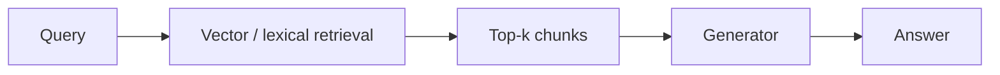

### GraphRAG

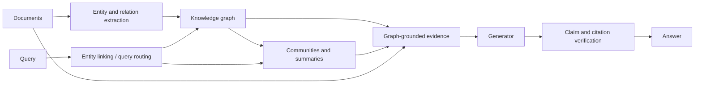

---

## 2. Production index-time architecture

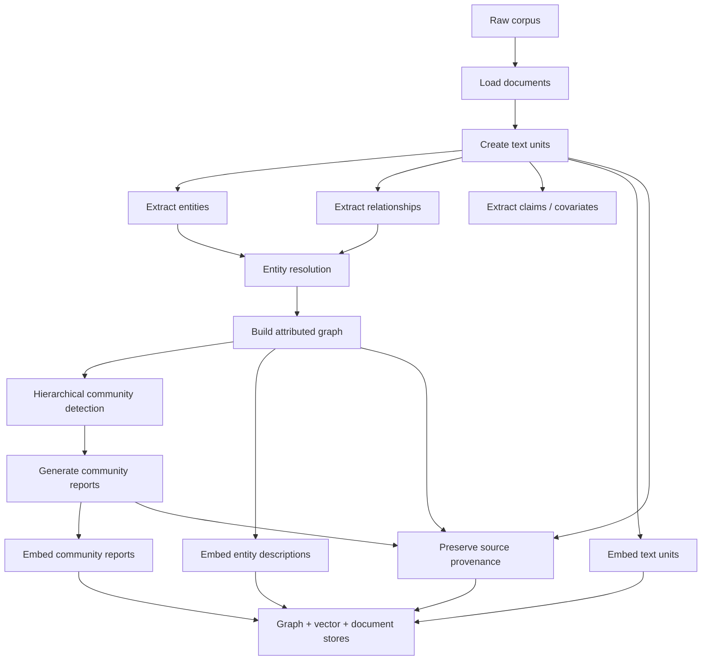

Microsoft’s documented indexing pipeline includes loading documents, chunking, graph extraction, optional claim extraction, text-unit embeddings, community detection, entity embeddings, community reports, and report embeddings.

---

## 3. Current standalone graph construction

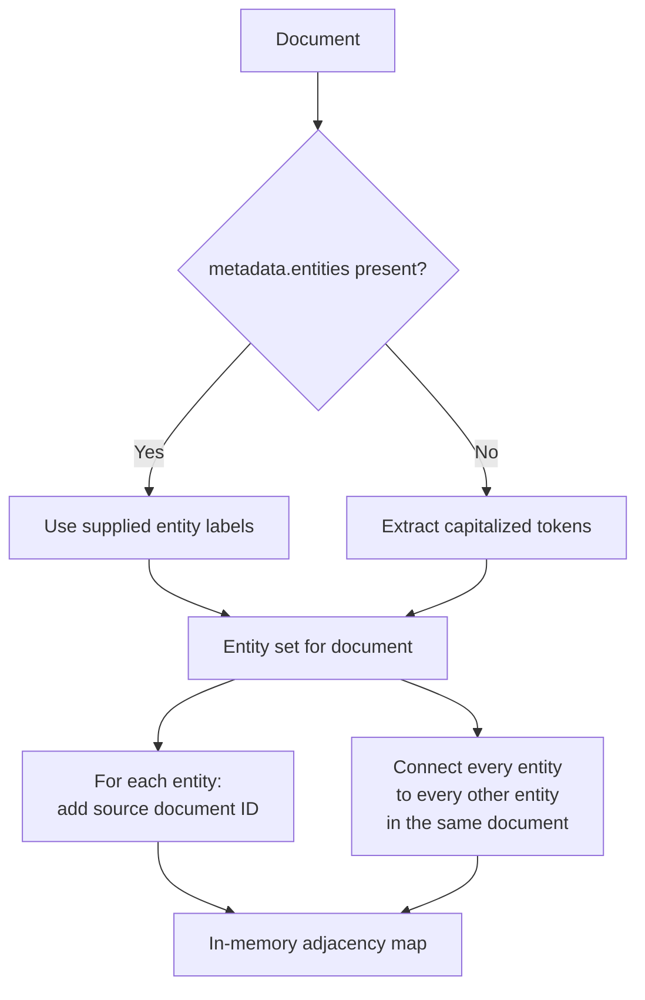

---

## 4. Current standalone query flow

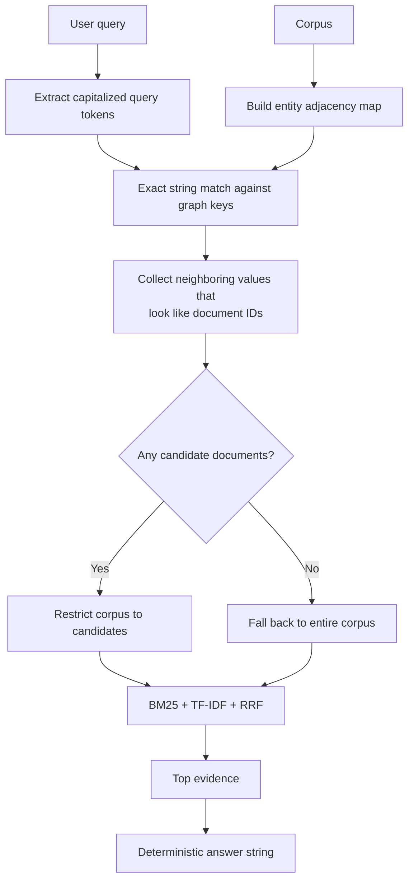

---

## 5. Current numbered-tutorial flow

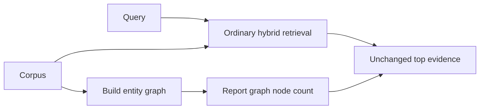

The numbered path builds the graph but does not use it to alter retrieval.

---

## 6. Production local search

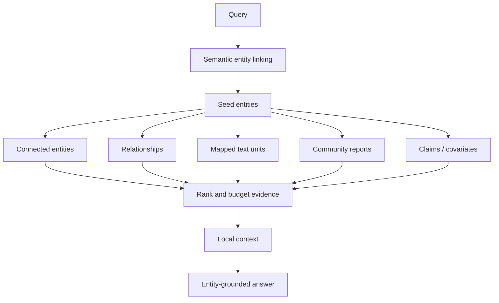

---

## 7. Production global search

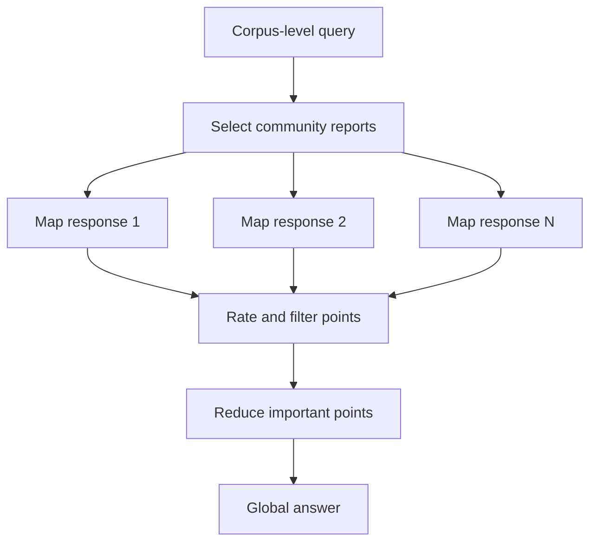

Global search operates over pre-generated community reports rather than starting from a few nearest chunks.

---

## 8. DRIFT-style search

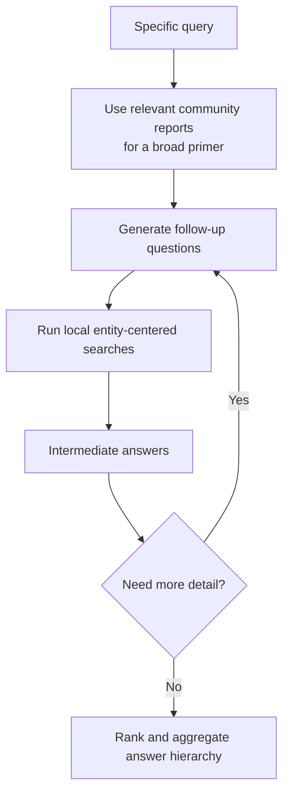

DRIFT combines broad community context with iterative local exploration.

---

# What this subrepository actually implements

This folder contains two related teaching paths.

## A. Numbered cookbook path

```text
1-explore-data.py
2-build-index.py
3-retrieve.py
4-run-method.py
5-evaluate.py
```

It uses:

```text
data/corpus.jsonl
data/queries.jsonl
data/qrels.jsonl
utils/cookbook_core.py
```

For `METHOD_KEY = "05-graphrag"` it:

1. performs ordinary hybrid retrieval;
2. builds an entity graph;
3. records the graph’s entity-node count;
4. returns the original hybrid evidence unchanged.

Its effective method is:

```text
hybrid retrieval
+
graph construction for trace output
```

It does **not** perform graph-based candidate selection.

---

## B. Standalone path

```text
graphrag.py
examples/sample_corpus.json
```

It:

1. builds the entity adjacency map;
2. extracts capitalized query tokens;
3. matches those tokens exactly against graph keys;
4. collects connected document IDs;
5. restricts retrieval to those documents;
6. falls back to the entire corpus when no graph match is found;
7. runs hybrid retrieval inside the selected set;
8. returns a deterministic evidence-based answer string.

Its effective method is:

```text
entity metadata
→ co-occurrence graph
→ exact entity anchor
→ source-neighborhood restriction
→ hybrid retrieval
```

---

# The graph data structure used here

The graph is stored as:

```python
dict[str, set[str]]
```

Conceptually:

```text
entity label
→ source document IDs
→ co-occurring entity labels
```

For a document with:

```json
"entities": [
  "Vendor",
  "Security Review",
  "Risk Committee"
]
```

the graph contains adjacency resembling:

```text
Vendor
├── doc_policy_parent
├── doc_policy_child_security
├── Security Review
└── Risk Committee

Security Review
├── doc_policy_parent
├── doc_policy_child_security
├── Vendor
└── Risk Committee

Risk Committee
├── doc_policy_parent
├── doc_policy_child_security
├── Vendor
└── Security Review
```

## Important structural properties

### Entity keys only

Entities are graph keys.

Document IDs appear as neighbor values but are not themselves adjacency keys.

Therefore the structure is not a fully navigable entity-document graph.

### Co-occurrence edges

Every pair of entities in one document is connected.

For \(n\) entities in a document, the code creates a directed adjacency entry for every ordered pair:

\[
n(n-1)
\]

Because values are stored in sets, the resulting conceptual relationship is an undirected clique.

### Untyped relationships

The graph does not encode:

```text
Vendor --REQUIRES--> Security Review
Risk Committee --REVIEWS_EXCEPTION_FOR--> Vendor
```

It only encodes:

```text
Vendor co-occurs with Security Review
Vendor co-occurs with Risk Committee
Security Review co-occurs with Risk Committee
```

### No weights

Repeated co-occurrence does not increase edge weight.

### No edge provenance object

The graph points to documents, but a relationship edge does not independently store:

- source passage;
- page;
- extraction confidence;
- timestamp;
- predicate;
- direction.

### Mixed node values

One adjacency set contains both:

- entity labels;
- document IDs.

The code distinguishes likely documents using string shape:

```python
node.startswith("doc_") or "_" in node
```

This is a teaching shortcut, not a robust node-type system.

---

# Exact standalone execution

The GraphRAG branch performs:

```python
graph = build_entity_graph(docs)
q_entities = capitalized_entities(query)

candidate_ids = set()

for entity in q_entities:
    candidate_ids.update(
        node
        for node in graph.get(entity, set())
        if node.startswith("doc_") or "_" in node
    )

candidates = [
    document
    for document in docs
    if document["id"] in candidate_ids
] or docs

evidence = hybrid_retrieve(query, candidates, top_k)
```

## Meaning of each stage

### `build_entity_graph(docs)`

Builds an adjacency map from document entity metadata.

### `capitalized_entities(query)`

Uses a regular expression to extract capitalized tokens.

### `graph.get(entity, set())`

Requires exact string equality between the extracted query token and graph key.

### document-ID heuristic

Keeps neighbors that:

```text
start with doc_
or contain an underscore
```

### fallback

When no candidate document IDs are found:

```python
candidates = docs
```

The method silently becomes ordinary hybrid RAG.

### final retrieval

The graph does not produce the final ordering.

BM25, TF-IDF cosine, and Reciprocal Rank Fusion rank the graph-selected source documents.

---

# Exact numbered-tutorial execution

The numbered method first executes:

```python
retrieved = hybrid_retrieve(
    query,
    top_k=top_k,
    candidate_k=max(10, top_k * 2),
)

evidence = retrieved["hybrid"]
```

Then the GraphRAG branch executes:

```python
graph = build_entity_graph()

steps.append(
    f"Built an entity graph with {len(graph)} entity nodes "
    "and retrieved source neighborhoods."
)
```

However, it does not assign a new value to `evidence`.

Therefore:

```text
graph construction changes the steps trace
but does not change top_evidence
```

The phrase “retrieved source neighborhoods” in the trace is broader than what the numbered code actually does.

The numbered path is useful for:

- showing where a graph construction hook belongs;
- exposing graph-node count;
- preserving a common five-script tutorial structure.

It does not yet demonstrate graph-conditioned retrieval.

---

# The two runnable paths

| Capability | Numbered tutorial | Standalone demo |
|---|---:|---:|
| Build entity adjacency map | Yes | Yes |
| Use metadata entities | Yes | Yes |
| Regex fallback for missing entity metadata | No | Yes |
| Extract entities from query | No | Yes |
| Restrict candidate corpus by graph | No | Yes |
| Fall back to flat retrieval | Always effectively flat | Yes, when no match |
| Hybrid retrieval | Yes | Yes |
| Typed relationships | No | No |
| Multi-hop traversal | No | No |
| Entity descriptions | No | No |
| Entity embeddings | No | No |
| Community detection | No | No |
| Community reports | No | No |
| Global search | No | No |
| DRIFT search | No | No |
| LLM generation | No | No |
| Graph-specific evaluation | No | No |

---

# Repository structure

```text
05-graphrag/
├── assets/
│   ├── architecture.mmd
│   └── paper_diagram.svg
├── data/
│   ├── corpus.jsonl
│   ├── queries.jsonl
│   ├── qrels.jsonl
│   └── local_index.json          # generated locally
├── docs/
├── examples/
│   ├── run_example.py
│   ├── sample_corpus.json
│   ├── sample_policy.pdf
│   ├── scanned_page_ocr.txt
│   ├── sample_webpage.html
│   ├── sample_table.csv
│   └── tool_response.json
├── utils/
│   ├── __init__.py
│   └── cookbook_core.py
├── .env.example
├── .gitignore
├── 1-explore-data.py
├── 2-build-index.py
├── 3-retrieve.py
├── 4-run-method.py
├── 5-evaluate.py
├── graphrag.py
├── architecture.mmd
├── ARCHITECTURE.md
├── COMPLETE_UNDERSTAND.md
├── implementation_notes.md
├── sources.md
└── README.md
```

## File responsibilities

| File | Responsibility |
|---|---|
| `1-explore-data.py` | Inspect the corpus and example fixtures |
| `2-build-index.py` | Build the local BM25/TF-IDF teaching index |
| `3-retrieve.py` | Show flat retrieval before GraphRAG logic |
| `4-run-method.py` | Execute the numbered GraphRAG branch |
| `5-evaluate.py` | Compute document Recall@k and MRR |
| `utils/cookbook_core.py` | Shared numbered-path utilities |
| `graphrag.py` | Self-contained graph-conditioned retrieval demo |
| `data/corpus.jsonl` | Numbered-path corpus |
| `examples/sample_corpus.json` | Standalone payload |
| `architecture.mmd` | Reusable Mermaid architecture |
| `assets/paper_diagram.svg` | Paper-informed local illustration |
| `sources.md` | Research and framework sources |

---

# Quick start

## Requirements

- Python 3.10 or newer is recommended.
- No API key is required.
- No third-party package is required.
- No graph database is required.

## Run the numbered tutorial

```bash
python 1-explore-data.py
python 2-build-index.py
python 3-retrieve.py
python 4-run-method.py \
  --query "Where does vendor onboarding require security review?" \
  --top-k 5
python 5-evaluate.py
```

## Explain the standalone method

```bash
python graphrag.py --explain
```

## Run the standalone default query

```bash
python graphrag.py
```

The default query is:

```text
How are Vendor, Security Review, and Risk Committee connected?
```

## Run an explicit entity query

```bash
python graphrag.py \
  --query "How are Vendor, Security Review, and Risk Committee connected?" \
  --top-k 5
```

## Run a query that exposes the multiword-linking limitation

```bash
python graphrag.py \
  --query "How are Security Review and Risk Committee connected?" \
  --top-k 5
```

Because the current query extractor separates multiword names into individual capitalized words, this query will not directly match the graph keys `Security Review` or `Risk Committee`. It falls back to the full corpus unless another exact entity anchor is present.

## Use another payload

```bash
python graphrag.py \
  --corpus path/to/sample_corpus.json \
  --query "Your entity-centered question" \
  --top-k 5
```

---

# Step-by-step tutorial

## Stage 1 — Explore the corpus

Run:

```bash
python 1-explore-data.py
```

The numbered corpus contains explicit entities:

| Document | Entities |
|---|---|
| Vendor policy | Vendor, Security Review, Risk Committee |
| Scanned invoice | Invoice, Vendor, Security Review |
| API docs | API, Rollback |
| Warranty table | SKU-B, Gateway |
| Order status | Order, A100 |
| Latency figure | Figure 3, Latency, API |

The numbered graph therefore has 12 unique entity keys.

---

## Stage 2 — Build the flat retrieval index

Run:

```bash
python 2-build-index.py
```

This creates:

```text
data/local_index.json
```

It contains:

- normalized documents;
- tokenized document representations;
- inverse-document-frequency values;
- average document length.

The graph is not stored in this file.

It is rebuilt from corpus metadata when the method runs.

---

## Stage 3 — Inspect the flat baseline

Run:

```bash
python 3-retrieve.py
```

This demonstrates:

```text
BM25
+
TF-IDF cosine
+
Reciprocal Rank Fusion
```

The baseline matters because the standalone GraphRAG method still relies on this retriever after selecting a graph neighborhood.

---

## Stage 4 — Run the method

### Numbered path

```bash
python 4-run-method.py \
  --query "Where does vendor onboarding require security review?" \
  --top-k 5
```

Inspect:

```text
steps
top_evidence
answer
```

The graph changes only the `steps` message in this path.

### Standalone path

```bash
python graphrag.py \
  --query "How are Vendor, Security Review, and Risk Committee connected?" \
  --top-k 5
```

The graph restricts the source corpus before retrieval.

---

## Stage 5 — Evaluate

Run:

```bash
python 5-evaluate.py
```

The current evaluation uses four ordinary document queries and qrels.

It evaluates the numbered method, whose evidence remains ordinary hybrid retrieval.

Therefore the evaluation measures:

```text
flat document retrieval quality
```

not:

```text
graph construction quality
entity linking quality
relationship quality
neighborhood recall
global GraphRAG quality
```

---

# How graph construction works

## Metadata-first extraction

For each standalone document:

```python
entities = (
    set(document["metadata"].get("entities", []))
    or capitalized_entities(document_text(document))
)
```

This means:

1. use manually supplied metadata entities when present;
2. otherwise use regex-extracted capitalized tokens.

## Entity-to-document links

For each entity \(e\) in document \(d\):

\[
e \rightarrow d
\]

The implementation stores:

```python
graph[entity].add(document["id"])
```

## Entity co-occurrence links

For every two different entities in the same document:

\[
e_i \leftrightarrow e_j
\]

The implementation uses nested loops:

```python
for left in entities:
    for right in entities:
        if left != right:
            graph[left].add(right)
```

## Example

Input:

```json
{
  "id": "doc_policy_child_security",
  "metadata": {
    "entities": [
      "Vendor",
      "Security Review",
      "Risk Committee"
    ]
  }
}
```

Generated conceptual edges:

```text
Vendor → doc_policy_child_security
Security Review → doc_policy_child_security
Risk Committee → doc_policy_child_security

Vendor ↔ Security Review
Vendor ↔ Risk Committee
Security Review ↔ Risk Committee
```

## Complexity

For a document with \(n\) entities, graph construction performs:

\[
O(n^2)
\]

co-occurrence pair operations.

This is acceptable for tiny fixtures but can be expensive and noisy when a document contains many extracted entities.

---

# How query entity extraction works

The standalone demo uses:

```python
re.findall(
    r"\b[A-Z][A-Za-z0-9_-]{2,}\b",
    query
)
```

It extracts tokens that:

- begin with an uppercase letter;
- contain at least three characters;
- continue with letters, digits, underscores, or hyphens.

## Example

Query:

```text
How are Vendor, Security Review, and Risk Committee connected?
```

Extracted set:

```text
How
Vendor
Security
Review
Risk
Committee
```

Graph keys include:

```text
Vendor
Security Review
Risk Committee
```

Only `Vendor` is an exact match.

## False positives

The extractor may treat sentence-initial words as entities:

```text
How
What
Which
Explain
Compare
```

## False negatives

It misses or fragments:

- lowercase entities;
- multiword names;
- aliases;
- abbreviations with punctuation;
- pronouns;
- translated names;
- semantic descriptions;
- misspellings.

## Why production systems use entity linking

A production linker should map:

```text
the committee
the Risk Committee
Risk Cmte.
RC
```

to the same canonical entity ID.

String extraction alone is not sufficient.

---

# How graph neighborhood selection works

For every extracted query entity:

```python
graph.get(entity, set())
```

returns its neighbors.

The code retains neighbor values that look like document IDs:

```python
node.startswith("doc_") or "_" in node
```

## Why this works in the fixture

Standalone document IDs use names such as:

```text
doc_policy_parent
doc_policy_child_security
```

## Why this is fragile

An entity label could contain an underscore:

```text
SKU_B
Project_Apollo
API_v3
```

and be mistaken for a document ID.

A document ID without an underscore could be missed.

## Better design

Use typed nodes:

```python
Node(
    id="doc_policy_child_security",
    node_type="document"
)

Node(
    id="entity:risk_committee",
    node_type="entity"
)
```

and typed edges:

```python
Edge(
    source="entity:risk_committee",
    target="doc_policy_child_security",
    edge_type="MENTIONED_IN"
)
```

Then candidate selection becomes:

```python
if neighbor.node_type == "document":
    ...
```

---

# How hybrid retrieval works inside the neighborhood

After graph filtering, the method runs:

```text
BM25
+
TF-IDF cosine
+
Reciprocal Rank Fusion
```

## BM25

\[
\operatorname{BM25}(q,d)
=
\sum_{t \in q}
\operatorname{IDF}(t)
\frac{
f(t,d)(k_1+1)
}{
f(t,d)+k_1
\left(
1-b+b\frac{|d|}{\operatorname{avgdl}}
\right)
}
\]

The implementation uses:

```text
k1 = 1.5
b  = 0.75
```

## TF-IDF cosine

\[
\cos(q,d)
=
\frac{
\vec q \cdot \vec d
}{
\|\vec q\|\|\vec d\|
}
\]

This is called dense-style retrieval in the teaching code, but it is not a neural embedding model.

## Reciprocal Rank Fusion

\[
s_{\mathrm{RRF}}(d)
=
\sum_r
\frac{1}{60+\operatorname{rank}_r(d)}
\]

The graph controls **which documents may be ranked**.

The hybrid retriever controls **their final ordering**.

---

# Default-query walkthrough

The standalone default query is:

```text
How are Vendor, Security Review, and Risk Committee connected?
```

## 1. Build the graph

The standalone fixture produces 12 entity keys:

```text
API
Columns
Figure 3
Latency
Order
Refund
Risk Committee
Rollback
SKU-B
Security Review
Vendor
Warranty
```

`Columns` and `Warranty` are regex-derived from the warranty-table document because that document does not provide an explicit `entities` list.

## 2. Extract query tokens

The query extractor produces:

```text
How
Vendor
Security
Review
Risk
Committee
```

## 3. Match graph anchors

Only:

```text
Vendor
```

matches a graph key exactly.

## 4. Read Vendor’s neighborhood

The `Vendor` adjacency set contains:

```text
doc_policy_parent
doc_policy_child_security
Security Review
Risk Committee
```

## 5. Retain document-like neighbors

The candidate document IDs become:

```text
doc_policy_parent
doc_policy_child_security
```

## 6. Retrieve inside the neighborhood

Hybrid retrieval ranks:

| Rank | Document | RRF score |
|---:|---|---:|
| 1 | `doc_policy_child_security` | approximately `0.0328` |
| 2 | `doc_policy_parent` | approximately `0.0323` |

The child passage is more directly responsive because it explicitly states that vendors must complete a security review and that the Risk Committee reviews exceptions.

## 7. Build the answer string

The demo cites the selected source IDs and uses the highest-ranked passage text.

It does not call an LLM and does not explicitly verbalize the relationship graph.

---

# Understanding the output

The standalone output resembles:

```json
{
  "method_key": "graphrag",
  "query": "How are Vendor, Security Review, and Risk Committee connected?",
  "steps": [
    "Built an entity graph with 12 nodes and retrieved related source neighborhoods."
  ],
  "top_evidence": [
    {
      "id": "doc_policy_child_security",
      "title": "Vendor onboarding security review",
      "score": 0.0328,
      "reason": "hybrid reciprocal-rank fusion",
      "source_type": "pdf",
      "page": 12,
      "version": "2026.04",
      "snippet": "Every new vendor must complete..."
    }
  ],
  "answer": "Demo answer for graphrag: based on ..."
}
```

Read the result in this order:

1. `steps` — broad method description;
2. `top_evidence` — source documents selected after graph restriction;
3. `reason` — the ranking stage;
4. provenance fields — page, URL, version;
5. `answer` — deterministic evidence text, not LLM generation.

## What the output does not expose

It does not currently return:

- extracted query entities;
- matched graph entities;
- unmatched tokens;
- complete neighborhood;
- selected candidate IDs before ranking;
- entity-to-entity edges;
- graph paths;
- relationship predicates;
- source evidence for each edge;
- fallback status;
- community information.

Adding these fields would make the demo much more pedagogical.

---

# Current evaluation and its limits

## Metrics implemented

The numbered evaluation computes:

### Hit-based Recall@k

\[
\operatorname{Recall@k}
=
\frac{
\text{queries with at least one relevant document in top-k}
}{
|Q|
}
\]

### Mean Reciprocal Rank

\[
\operatorname{MRR}
=
\frac{1}{|Q|}
\sum_{q\in Q}
\frac{1}{\operatorname{rank}_q}
\]

With the current tiny fixture and `top_k=3`, the numbered implementation returns:

```text
Recall@3 = 1.0000
MRR      = 1.0000
```

However, the graph does not affect evidence in the numbered path.

These results therefore validate the shared flat retrieval fixture, not GraphRAG.

---

## Missing graph-specific evaluation

A meaningful GraphRAG evaluation should measure at least four layers.

### 1. Extraction quality

- entity precision;
- entity recall;
- entity type accuracy;
- relation precision;
- relation recall;
- claim extraction accuracy;
- extraction confidence calibration.

### 2. Entity resolution quality

- alias linking accuracy;
- duplicate-entity rate;
- erroneous-merge rate;
- canonical-ID accuracy;
- cross-document linking accuracy.

### 3. Graph retrieval quality

- seed-entity recall;
- neighborhood source recall;
- path recall;
- relationship relevance;
- community-report recall;
- graph-versus-flat retrieval lift.

### 4. Answer quality

- correctness;
- comprehensiveness;
- diversity;
- faithfulness;
- citation precision;
- citation recall;
- path-grounding accuracy;
- contradiction handling.

---

## Recommended test types

### Local entity test

```text
What role does the Risk Committee play in vendor onboarding?
```

Expected:

- link `Risk Committee`;
- retrieve policy sources;
- include relationship evidence.

### Multi-hop test

```text
Which approval process connects vendors, security reviews, and contract exceptions?
```

Expected:

- recover the complete relationship path;
- cite every edge-supporting passage.

### Global test

```text
What are the main operational themes across the corpus?
```

Expected:

- use community reports;
- not rely on nearest text chunks only.

### Entity-resolution test

```text
How is RC involved in vendor exceptions?
```

Expected:

- map `RC` to `Risk Committee`.

### No-match test

```text
How is the Audit Board involved?
```

Expected:

- identify no supported graph entity;
- abstain or use an explicit flat-retrieval fallback;
- report the fallback.

---

# Teaching graph versus a semantic knowledge graph

| Property | Current teaching graph | Production knowledge graph |
|---|---|---|
| Entity source | Metadata or capitalized regex | NER/LLM/domain extractors |
| Entity identity | Raw label string | Canonical stable ID |
| Relation | Co-occurrence | Typed semantic predicate |
| Direction | Not represented | Directed where appropriate |
| Weight | None | Confidence, frequency, importance |
| Provenance | Source IDs mixed into adjacency | Edge-level source spans |
| Temporal scope | None | Valid-from/valid-to timestamps |
| Entity type | None | Person, organization, policy, etc. |
| Document nodes | Neighbor strings only | Explicit typed nodes |
| Multi-hop traversal | No | Yes |
| Community detection | No | Often yes |
| Community reports | No | Often yes |
| Entity descriptions | No | Usually yes |
| Graph embeddings | No | Optional |
| ACL semantics | Not applied to graph | Required |
| Incremental updates | Rebuild in memory | Versioned update pipeline |
| Evaluation | Document recall | Extraction + graph + answer metrics |

---

# Microsoft GraphRAG architecture

The Microsoft GraphRAG project describes a structured, hierarchical alternative to baseline semantic-search RAG.

As documented in the official project:

1. raw documents are divided into **TextUnits**;
2. entities, relationships, and claims are extracted;
3. the graph is clustered hierarchically, using Leiden community detection in the documented default process;
4. community reports are generated bottom-up;
5. text units, entities, and reports can be embedded;
6. query modes use different parts of the graph and report hierarchy.

The official query engine currently documents:

- Local Search;
- Global Search;
- DRIFT Search;
- Basic Search;
- Question Generation.

As of July 10, 2026, the Microsoft GitHub repository shows release `v3.1.0`, dated May 28, 2026. The project documentation warns that indexing can be expensive and recommends starting small and tuning prompts for the target corpus.

---

# Local, Global, DRIFT, and Basic search

## Local Search

Best for:

- named entities;
- specific people or organizations;
- relationships near one entity;
- source-grounded detail.

It starts from semantically matched entities and gathers:

- connected entities;
- relationships;
- mapped text units;
- community reports;
- claims or covariates.

### Relation to this repository

The standalone demo is a minimal approximation of Local Search:

```text
exact entity token
→ source documents adjacent to entity
→ hybrid retrieval
```

It lacks most of the production local-search context types.

---

## Global Search

Best for:

- themes;
- trends;
- corpus-wide patterns;
- broad summaries.

It searches over community reports using a map-reduce process:

```text
community reports
→ intermediate responses
→ score and filter points
→ aggregate final response
```

### Relation to this repository

Not implemented.

There are no:

- communities;
- hierarchy levels;
- community reports;
- map responses;
- reduce stage.

---

## DRIFT Search

DRIFT stands for:

```text
Dynamic Reasoning and Inference with Flexible Traversal
```

It combines:

- global community context;
- a broad primer;
- follow-up question generation;
- local searches;
- hierarchical answer aggregation.

### Relation to this repository

Not implemented.

The local demo performs one fixed graph-neighborhood selection and one retrieval pass.

---

## Basic Search

Basic Search is standard top-k vector RAG used as a baseline or fallback.

### Relation to this repository

The numbered GraphRAG path is effectively Basic Search plus graph-count logging.

The standalone path also becomes Basic Search when no exact graph anchor is found.

---

# Production graph schema

Use explicit node and edge types.

## Entity node

```json
{
  "id": "entity:risk_committee",
  "node_type": "entity",
  "entity_type": "organization",
  "name": "Risk Committee",
  "aliases": [
    "RC",
    "Risk Review Committee"
  ],
  "description": "Committee responsible for reviewing vendor security exceptions.",
  "description_embedding_id": "emb:entity:risk_committee",
  "confidence": 0.97,
  "first_seen": "2026-04-01",
  "last_seen": "2026-06-01"
}
```

## Document node

```json
{
  "id": "document:vendor-policy-2026-04",
  "node_type": "document",
  "title": "Vendor Onboarding Policy",
  "version": "2026.04",
  "source_type": "pdf",
  "canonical_url": null,
  "acl": ["group:legal"]
}
```

## Text-unit node

```json
{
  "id": "textunit:vendor-policy:p12:c03",
  "node_type": "text_unit",
  "document_id": "document:vendor-policy-2026-04",
  "page": 12,
  "section": "Vendor onboarding",
  "text": "Every new vendor must complete...",
  "start_offset": 8240,
  "end_offset": 8489
}
```

## Typed relationship edge

```json
{
  "id": "edge:risk-committee-reviews-vendor-exception",
  "source": "entity:risk_committee",
  "target": "entity:vendor",
  "edge_type": "REVIEWS_EXCEPTION_FOR",
  "description": "The Risk Committee reviews exceptions to vendor security requirements.",
  "directed": true,
  "confidence": 0.94,
  "source_text_units": [
    "textunit:vendor-policy:p12:c03"
  ],
  "valid_from": "2026-04-01",
  "valid_to": null
}
```

## Community node

```json
{
  "id": "community:vendor-governance:level-1",
  "node_type": "community",
  "level": 1,
  "member_entities": [
    "entity:vendor",
    "entity:security_review",
    "entity:risk_committee"
  ],
  "title": "Vendor Governance and Security",
  "report_id": "report:vendor-governance:level-1"
}
```

---

# Entity and relation extraction

## Entity extraction

Possible approaches:

- rule-based named-entity recognition;
- statistical NER;
- domain-specific models;
- LLM structured extraction;
- dictionary and ontology matching;
- combinations of the above.

## Relation extraction

A relation extractor should return:

```text
subject
predicate
object
qualifiers
confidence
source span
```

Example:

```json
{
  "subject": "Vendor",
  "predicate": "REQUIRES",
  "object": "Security Review",
  "confidence": 0.98,
  "source_span": {
    "document_id": "vendor-policy",
    "page": 12,
    "start": 102,
    "end": 173
  }
}
```

## Claim extraction

A claim may contain:

```text
entity
claim text
status
time period
source
confidence
```

Claims are useful when the graph must represent assertions, allegations, findings, or temporal facts.

## Extraction constraints

Prompts or models should define:

- allowed entity types;
- allowed relation types;
- temporal normalization;
- coreference handling;
- uncertainty representation;
- source-span requirements;
- output schema.

---

# Entity resolution

Entity resolution determines whether mentions refer to the same real-world entity.

## Examples

```text
Risk Committee
Risk Review Committee
RC
the committee
```

may refer to one entity.

But:

```text
API
API team
API version 3.0
```

should probably not be collapsed into one node.

## Resolution signals

- exact normalized name;
- aliases;
- entity type;
- surrounding context;
- shared relationships;
- identifiers;
- domain ontology;
- embedding similarity;
- temporal overlap;
- source authority.

## Error types

### Over-merging

Different entities become one node.

Consequence:

- false paths;
- misleading communities;
- contaminated summaries.

### Under-merging

One entity becomes several nodes.

Consequence:

- fragmented evidence;
- missed cross-document links;
- reduced graph recall.

## Evaluation

Use labeled entity pairs:

```text
same entity
different entity
uncertain
```

and measure precision and recall separately.

---

# Community detection and reports

Community detection groups densely connected entities.

The documented Microsoft GraphRAG process uses hierarchical clustering based on the Leiden technique.

## Why communities help

A large graph can be difficult to query directly.

Communities provide:

- topic organization;
- corpus-level structure;
- precomputed summaries;
- hierarchical navigation;
- global-query context.

## Community report

A report may include:

```text
community title
summary
key entities
key relationships
major claims
source references
importance rating
time scope
```

## Hierarchy

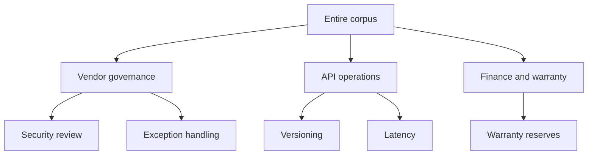

Higher levels are broad and compact.

Lower levels are detailed but more expensive to process.

---

# Graph-aware retrieval and ranking

A production graph retriever can combine multiple signals.

## Candidate score

\[
S(d\mid q)
=
\alpha S_{\text{text}}
+
\beta S_{\text{entity}}
+
\gamma S_{\text{path}}
+
\delta S_{\text{community}}
+
\epsilon S_{\text{authority}}
+
\zeta S_{\text{freshness}}
\]

where:

- \(S_{\text{text}}\): lexical or embedding similarity;
- \(S_{\text{entity}}\): query-to-entity match;
- \(S_{\text{path}}\): graph-path relevance;
- \(S_{\text{community}}\): community-report relevance;
- \(S_{\text{authority}}\): source quality;
- \(S_{\text{freshness}}\): temporal correctness.

## Path score

For path:

\[
p=(e_0,r_1,e_1,\dots,r_h,e_h)
\]

a simple score could be:

\[
S_{\text{path}}(p)
=
\prod_{i=1}^{h}
c(r_i)
\cdot
\lambda^{h-1}
\]

where:

- \(c(r_i)\) is edge confidence;
- \(\lambda<1\) penalizes long paths.

## Avoid uncontrolled expansion

High-degree graph nodes can produce huge neighborhoods.

Controls include:

- hop limits;
- edge-type allowlists;
- degree caps;
- relation confidence thresholds;
- time filters;
- source authority;
- diversity;
- token budgets.

## Query routing

Classify the question:

```text
local entity question
global corpus question
hybrid / DRIFT question
basic retrieval question
```

Do not run expensive global search for every query.

---

# Provenance and citations

Every entity, edge, community claim, and generated answer should link back to source text.

## Provenance chain

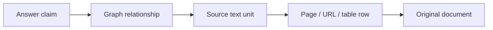

## Edge provenance

```json
{
  "edge_id": "edge-17",
  "source_entity": "entity:risk_committee",
  "relationship": "REVIEWS_EXCEPTION_FOR",
  "target_entity": "entity:vendor",
  "evidence": [
    {
      "text_unit_id": "textunit:policy:p12:c03",
      "document_id": "document:policy",
      "page": 12,
      "start_offset": 102,
      "end_offset": 241
    }
  ]
}
```

## Citation rule

Do not cite a community report as though it were an original source.

A community report should preserve references to the text units that support each statement.

---

# Incremental updates and graph lifecycle

A graph index must respond to:

```text
new document
updated document
deleted document
changed permissions
new entity alias
corrected extraction
new model version
new ontology
```

## Update pipeline

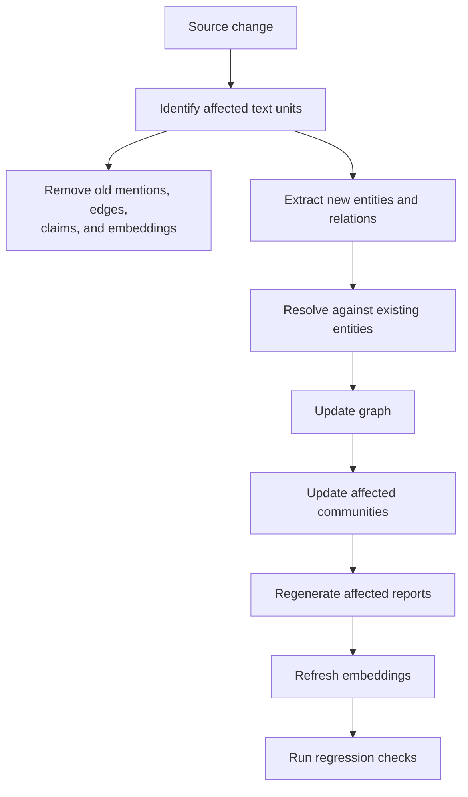

## Difficult update cases

- one entity splits into two;
- two entities merge;
- relationship becomes invalid;
- source is deleted;
- community boundaries change;
- report text becomes stale;
- permissions change after summaries were generated.

## Community-report invalidation

A changed edge can affect:

- one entity;
- one community;
- parent communities;
- global summaries.

Track report dependencies so updates do not require unnecessary full rebuilds.

---

# Security and access control

GraphRAG creates additional leakage risks.

Even when the source text is restricted, graph structure can reveal:

- that an entity exists;
- that two entities are connected;
- relationship type;
- community membership;
- sensitive counts;
- hidden topics;
- confidential source names.

## Security-aware graph construction

Possible designs:

### 1. Separate graphs by security domain

```text
public graph
legal graph
finance graph
tenant-specific graphs
```

### 2. ACL-bearing nodes and edges

Each graph item includes effective permissions.

### 3. Query-time security subgraph

Construct:

\[
G_u = G[V_u,E_u]
\]

where \(V_u\) and \(E_u\) are visible to user \(u\).

### 4. Security-aware community reports

Do not generate one unrestricted report and show it to lower-privilege users.

Community summaries must be:

- generated per security scope;
- dynamically assembled from visible evidence;
- or strictly protected at the highest source classification.

## Secure ordering

```text
authenticate
→ authorize graph nodes, edges, and reports
→ link query entities
→ traverse visible graph
→ retrieve visible sources
→ generate
```

Do not traverse a confidential graph and merely remove source passages afterward.

---

# Where GraphRAG is used most

## 1. Investigations and intelligence analysis

Typical questions:

- Which entities repeatedly co-occur?
- Which events connect two organizations?
- What communities appear in the records?
- Which claims are supported by multiple sources?

Graph provenance is essential.

---

## 2. Enterprise organizational knowledge

Entities may include:

- teams;
- systems;
- projects;
- policies;
- owners;
- dependencies;
- incidents.

GraphRAG can connect documentation spread across departments.

---

## 3. Scientific literature

Possible graph elements:

- materials;
- proteins;
- genes;
- methods;
- datasets;
- measurements;
- authors;
- citations;
- findings.

It can support cross-paper synthesis, but extraction errors must be visible.

---

## 4. Biomedical and pharmaceutical research

Possible relationships:

```text
drug → targets → protein
gene → associated with → disease
trial → evaluates → treatment
```

This is high stakes and requires domain validation.

---

## 5. Legal discovery and compliance

Entities:

- parties;
- contracts;
- clauses;
- obligations;
- events;
- regulators;
- dates.

GraphRAG can organize relationships but does not replace legal analysis.

---

## 6. Cybersecurity and incident response

Entities:

- hosts;
- users;
- processes;
- indicators;
- vulnerabilities;
- alerts;
- incidents.

Temporal and directional relationships matter strongly.

---

## 7. Supply-chain analysis

Entities:

- suppliers;
- components;
- certifications;
- facilities;
- shipments;
- incidents.

Graph queries can reveal shared dependencies and concentration risk.

---

## 8. Customer and product knowledge

Entities:

- products;
- features;
- issues;
- versions;
- accounts;
- support cases.

GraphRAG can connect product behavior with documentation and incident histories.

---

## 9. News and event analysis

Entities:

- people;
- organizations;
- places;
- events;
- claims;
- sources.

Versioning, publication date, source authority, and contradiction handling are necessary.

---

# When to use it—and when not to

## Use GraphRAG when

- relationships are central to the task;
- evidence spans many documents;
- entity-centric questions are common;
- global corpus summaries matter;
- multi-hop reasoning is required;
- users need exploratory navigation;
- graph structure has independent value;
- extraction quality can be evaluated;
- indexing cost is justified.

## Prefer standard or reranked RAG when

- questions are answered by one passage;
- the corpus is small;
- relationships add little value;
- entity extraction is unreliable;
- documents change extremely frequently;
- low latency is essential;
- indexing budget is limited;
- global questions are rare.

## Prefer a curated knowledge graph when

- ontology and relationship correctness are critical;
- authoritative identifiers exist;
- domain experts can validate edges;
- automatic extraction risk is unacceptable.

## Prefer database queries when

- data is already structured;
- joins are explicit;
- exact numerical answers are required;
- graph extraction would recreate an existing schema poorly.

---

# How to adapt this repository

## Step 1 — Expose graph traces

Add output fields:

```json
{
  "query_entities": [],
  "matched_entities": [],
  "unmatched_entities": [],
  "candidate_document_ids": [],
  "graph_edges": [],
  "fallback_to_full_corpus": false
}
```

This makes the method observable.

---

## Step 2 — Fix multiword entity matching

Instead of capitalized-token extraction, match known entity labels.

A simple teaching improvement:

```python
def match_query_entities(query: str, graph: dict[str, set[str]]) -> set[str]:
    normalized_query = query.casefold()

    return {
        entity
        for entity in graph
        if entity.casefold() in normalized_query
    }
```

This would match:

```text
Security Review
Risk Committee
```

as complete labels.

For production, use semantic entity linking.

---

## Step 3 — Use typed graph records

Replace string heuristics with:

```python
@dataclass
class Node:
    id: str
    node_type: Literal[
        "entity",
        "document",
        "text_unit",
        "community"
    ]
    attributes: dict
```

and:

```python
@dataclass
class Edge:
    source: str
    target: str
    edge_type: str
    confidence: float
    evidence_ids: list[str]
```

---

## Step 4 — Add typed relationships

Replace co-occurrence-only edges with extracted predicates:

```text
REQUIRES
REVIEWS
BELONGS_TO
DEPENDS_ON
AFFECTS
MENTIONS
SUPPORTED_BY
```

Keep co-occurrence as a separate edge type when useful.

---

## Step 5 — Make the numbered path use the graph

Conceptual refactor:

```python
graph = build_entity_graph()
query_entities = match_query_entities(query, graph)
candidate_ids = graph_document_neighborhood(
    graph,
    query_entities,
)

candidate_docs = [
    doc
    for doc in load_corpus()
    if doc["id"] in candidate_ids
]

evidence = hybrid_retrieve_documents(
    query,
    candidate_docs or load_corpus(),
    top_k=top_k,
)
```

---

## Step 6 — Add graph-specific fixtures

Create documents where:

- no single passage contains the complete answer;
- two documents share an entity;
- aliases must be resolved;
- a false co-occurrence edge would cause an incorrect answer;
- a global question requires community aggregation;
- restricted graph edges must remain hidden.

---

## Step 7 — Add a real graph store when needed

Options include:

- NetworkX for in-memory prototypes;
- Neo4j;
- Memgraph;
- ArangoDB;
- Amazon Neptune;
- Azure Cosmos DB graph-compatible approaches;
- relational graph tables;
- custom adjacency stores.

The store choice depends on:

- graph size;
- traversal patterns;
- update rate;
- tenancy;
- security model;
- analytics needs;
- operational environment.

---

## Step 8 — Add community detection

For a production-style pipeline:

```text
entity graph
→ weighted graph cleanup
→ community detection
→ hierarchical communities
→ community reports
```

Evaluate whether communities are coherent before relying on reports.

---

## Step 9 — Add query routing

```python
route = classify_query(query)

if route == "local":
    return local_search(query)
elif route == "global":
    return global_search(query)
elif route == "drift":
    return drift_search(query)
else:
    return basic_search(query)
```

Routing itself needs a test set.

---

## Step 10 — Add verification

For every answer relationship:

```text
Does a source passage directly support this edge?
```

Do not let a graph path become evidence merely because it exists in the index.

---

# Production evaluation strategy

## 1. Entity extraction

Measure:

\[
P_{\text{entity}}
=
\frac{\text{correct extracted entities}}
{\text{all extracted entities}}
\]

\[
R_{\text{entity}}
=
\frac{\text{correct extracted entities}}
{\text{all gold entities}}
\]

Break results down by entity type.

---

## 2. Relation extraction

Measure:

- exact triple precision/recall;
- relaxed predicate matching;
- direction accuracy;
- source-span accuracy;
- confidence calibration.

---

## 3. Entity resolution

Measure:

- pairwise precision/recall;
- cluster B-cubed precision/recall;
- over-merge rate;
- under-merge rate.

---

## 4. Community quality

Measure:

- modularity or graph metrics where meaningful;
- expert coherence rating;
- community stability across updates;
- report factuality;
- report source coverage;
- hierarchy usefulness.

---

## 5. Local retrieval

Measure:

- seed-entity recall;
- relevant-neighbor recall;
- source Recall@k;
- path recall;
- graph expansion precision;
- context relevance;
- GraphRAG lift over flat RAG.

---

## 6. Global retrieval

Measure:

- comprehensiveness;
- diversity;
- coverage of known themes;
- unsupported-theme rate;
- community-report contribution;
- map-reduce consistency.

---

## 7. Answer grounding

Measure:

- claim correctness;
- edge support;
- citation precision;
- citation recall;
- path-grounding accuracy;
- contradiction disclosure;
- abstention quality.

---

## 8. Cost and latency

Measure separately:

```text
extraction cost
entity-resolution cost
community-detection cost
report-generation cost
embedding cost
local-query cost
global-query cost
DRIFT-query cost
update cost
```

---

# Cost, latency, and scaling

## Indexing cost

GraphRAG can require multiple expensive stages:

\[
C_{\text{index}}
=
C_{\text{parse}}
+
C_{\text{extract}}
+
C_{\text{resolve}}
+
C_{\text{cluster}}
+
C_{\text{report}}
+
C_{\text{embed}}
+
C_{\text{store}}
\]

LLM-based extraction and community-report generation may dominate.

The official Microsoft repository explicitly warns that indexing can be expensive and recommends starting with a small corpus.

## Query cost

### Local search

Usually bounded by:

- entity linking;
- neighborhood expansion;
- context ranking;
- one generation call.

### Global search

May require:

- many report batches;
- multiple map calls;
- ranking;
- one reduce call.

### DRIFT

May require:

- community primer;
- follow-up question generation;
- multiple local searches;
- answer aggregation.

## Scaling controls

- batch extraction;
- cache identical LLM calls;
- incremental processing;
- limit entity types;
- relation allowlists;
- graph pruning;
- community-level selection;
- asynchronous report generation;
- vector index sharding;
- query routing;
- token budgets;
- concurrency limits.

---

# Common failure modes

## 1. Graph built but not used

**Symptom:** graph statistics appear in logs, but retrieval results are unchanged.

**Present in:** the numbered tutorial.

**Fix:** use graph matches to alter candidate selection and test against the flat baseline.

---

## 2. Multiword entities are fragmented

**Symptom:** `Risk Committee` becomes `Risk` and `Committee`.

**Present in:** standalone query extraction.

**Fix:** longest-label matching, NER, aliases, or semantic entity linking.

---

## 3. Sentence-initial words become entities

**Symptom:** `How` or `Which` appears as an entity candidate.

**Fix:** stopword filtering and a real entity linker.

---

## 4. Co-occurrence is mistaken for causation

**Symptom:** entities mentioned in one passage are assumed to have a meaningful relationship.

**Fix:** typed relation extraction and source-span verification.

---

## 5. String shape is used as node type

**Symptom:** entities containing underscores are mistaken for documents.

**Present in:** standalone document-neighbor filtering.

**Fix:** explicit typed nodes.

---

## 6. Silent fallback hides graph failure

**Symptom:** no entity matches, but the system returns plausible flat-RAG results.

**Present in:** standalone fallback.

**Fix:** expose `fallback_to_full_corpus`, evaluate fallback rate, and optionally abstain.

---

## 7. Entity over-merging

**Symptom:** different organizations with similar names become one node.

**Fix:** identifiers, types, context, and conservative resolution.

---

## 8. Entity under-merging

**Symptom:** aliases remain disconnected.

**Fix:** alias dictionaries, semantic resolution, and manual correction workflows.

---

## 9. High-degree hubs dominate

**Symptom:** common entities connect nearly the entire corpus.

**Fix:** degree-aware ranking, hub penalties, edge-type filters, and stop-entity lists.

---

## 10. Community reports hallucinate

**Symptom:** a generated report introduces unsupported themes.

**Fix:** source-aware report generation and claim-level verification.

---

## 11. Stale graph after source update

**Symptom:** deleted or corrected facts remain in edges and reports.

**Fix:** dependency tracking and incremental invalidation.

---

## 12. Restricted relationships leak

**Symptom:** users infer confidential links from graph structure.

**Fix:** ACL-aware graph construction, traversal, and summaries.

---

## 13. Global search used for local questions

**Symptom:** high cost and broad answers for a simple entity lookup.

**Fix:** query routing and Basic/Local fallback.

---

## 14. Flat retrieval used for global questions

**Symptom:** answer covers only a few semantically similar chunks.

**Fix:** community reports and global map-reduce.

---

## 15. Evaluation measures only document recall

**Symptom:** perfect Recall@k is reported despite broken entity linking.

**Present in:** current numbered evaluation.

**Fix:** add extraction, resolution, graph-retrieval, and graph-answer metrics.

---

# Debugging checklist

## Source ingestion

- [ ] Are page numbers and source spans preserved?
- [ ] Are tables and figures represented correctly?
- [ ] Are document versions and timestamps stored?
- [ ] Are access controls attached?
- [ ] Are duplicate sources removed?

## Entity extraction

- [ ] Are relevant entity types defined?
- [ ] Are multiword entities preserved?
- [ ] Are false sentence-initial entities filtered?
- [ ] Are extraction confidence scores stored?
- [ ] Does every entity mention retain provenance?

## Entity resolution

- [ ] Are aliases merged correctly?
- [ ] Are same-name entities separated?
- [ ] Are canonical IDs stable?
- [ ] Are merges and splits auditable?
- [ ] Is temporal context considered?

## Relationships

- [ ] Are edges typed?
- [ ] Is direction correct?
- [ ] Is every edge source-grounded?
- [ ] Are co-occurrence and semantic relations separated?
- [ ] Are contradictions represented?

## Graph construction

- [ ] Are node types explicit?
- [ ] Are document nodes traversable?
- [ ] Are edge weights meaningful?
- [ ] Are hubs controlled?
- [ ] Are isolated entities handled?
- [ ] Is graph versioning implemented?

## Query linking

- [ ] Which query entities were extracted?
- [ ] Which entities matched?
- [ ] Which tokens failed to match?
- [ ] Were aliases considered?
- [ ] Was a fallback used?
- [ ] Is fallback visible in the trace?

## Retrieval

- [ ] Did graph filtering improve relevant-source rank?
- [ ] Did graph expansion introduce noise?
- [ ] Is the hop limit appropriate?
- [ ] Are candidate paths stored?
- [ ] Are graph and text scores separated?
- [ ] Is context within budget?

## Communities

- [ ] Are communities coherent?
- [ ] Are reports faithful?
- [ ] Are hierarchy levels useful?
- [ ] Are reports refreshed after updates?
- [ ] Are restricted entities excluded?

## Answer

- [ ] Is every relationship claim supported?
- [ ] Are citations mapped to original passages?
- [ ] Are graph-inferred statements labeled?
- [ ] Are contradictions disclosed?
- [ ] Can the system abstain?

## Operations

- [ ] Is extraction cost monitored?
- [ ] Is index version recorded?
- [ ] Are model and prompt versions stored?
- [ ] Can an answer be reproduced?
- [ ] Are incremental updates tested?
- [ ] Are security boundaries enforced?

---

# Related methods in this repository

- [`../01-hybrid-rag/`](../01-hybrid-rag/) — lexical and dense candidate retrieval.
- [`../02-reranked-rag/`](../02-reranked-rag/) — final evidence ordering.
- [`../03-agentic-rag/`](../03-agentic-rag/) — iterative retrieval and tools.
- [`../06-raptor-rag/`](../06-raptor-rag/) — hierarchical summaries.
- [`../11-decomposition-rag/`](../11-decomposition-rag/) — subquestion decomposition.
- [`../13-small-to-big-parent-child/`](../13-small-to-big-parent-child/) — chunk-to-parent expansion.
- [`../20-claim-level-verification-rag/`](../20-claim-level-verification-rag/) — answer support verification.

A production system may combine:

```text
entity and relation extraction
+
graph communities
+
local graph traversal
+
hybrid chunk retrieval
+
reranking
+
global community search
+
claim-level verification
```

---

# References

## Primary research

1. **Edge, D. et al. — “From Local to Global: A Graph RAG Approach to Query-Focused Summarization.”**  
   Introduces the community-summary approach for answering global questions over large private corpora.  
   <https://arxiv.org/abs/2404.16130>

2. **Traag, V. A., Waltman, L., and van Eck, N. J. — “From Louvain to Leiden: guaranteeing well-connected communities.”**  
   Introduces the Leiden community-detection algorithm used in the documented Microsoft GraphRAG process.  
   <https://doi.org/10.1038/s41598-019-41695-z>

## Official Microsoft GraphRAG resources

- [Microsoft GraphRAG documentation](https://microsoft.github.io/graphrag/)
- [Microsoft GraphRAG GitHub repository](https://github.com/microsoft/graphrag)
- [Indexing architecture](https://microsoft.github.io/graphrag/index/architecture/)
- [Query-engine overview](https://microsoft.github.io/graphrag/query/overview/)
- [Local Search](https://microsoft.github.io/graphrag/query/local_search/)
- [Global Search](https://microsoft.github.io/graphrag/query/global_search/)
- [DRIFT Search](https://microsoft.github.io/graphrag/query/drift_search/)
- [Prompt-tuning documentation](https://microsoft.github.io/graphrag/prompt_tuning/overview/)

## Graph and retrieval tools

- [NetworkX documentation](https://networkx.org/documentation/stable/)
- [Neo4j documentation](https://neo4j.com/docs/)
- [LlamaIndex property graph documentation](https://docs.llamaindex.ai/)
- [Qdrant documentation](https://qdrant.tech/documentation/)

## Repository-local documentation

- [`sources.md`](sources.md)
- [`ARCHITECTURE.md`](ARCHITECTURE.md)
- [`COMPLETE_UNDERSTAND.md`](COMPLETE_UNDERSTAND.md)
- [`implementation_notes.md`](implementation_notes.md)
- [`architecture.mmd`](architecture.mmd)
- [`assets/paper_diagram.svg`](assets/paper_diagram.svg)

---

# Final mental model

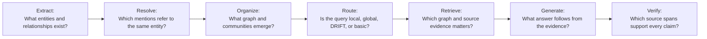

GraphRAG is not simply:

```text
add a graph object beside a vector index
```

The graph must affect retrieval, retain provenance, survive updates, respect permissions, and improve a measurable class of questions.

This repository provides a clear first step:

```text
entity labels
→ co-occurrence graph
→ entity-anchored source neighborhood
→ hybrid retrieval
```

Its limitations are equally instructive:

- the numbered path builds but does not use the graph;
- the standalone graph stores co-occurrence rather than semantic predicates;
- query linking fragments multiword entities;
- fallback can silently become flat RAG;
- there are no communities or global summaries;
- the evaluation is document-retrieval-only.

Those gaps define the roadmap from a transparent teaching example to a production GraphRAG system.
