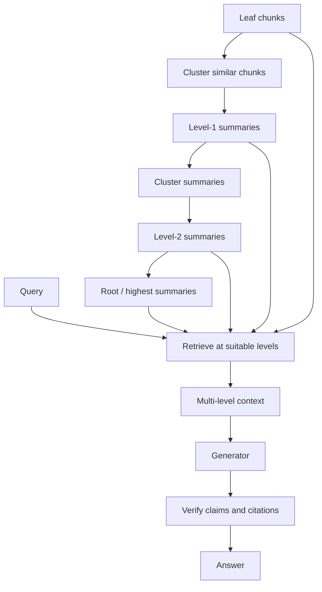
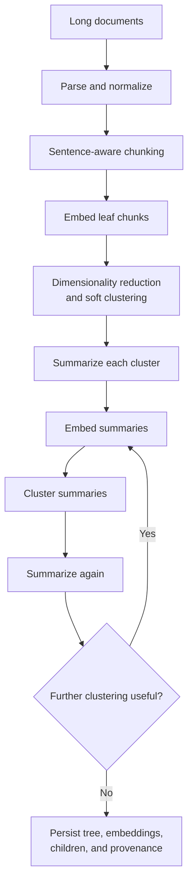
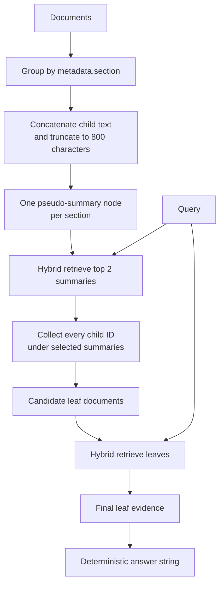
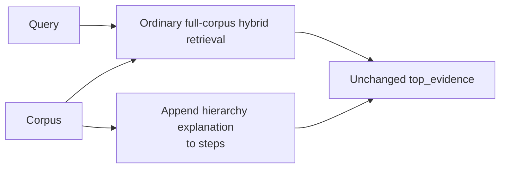
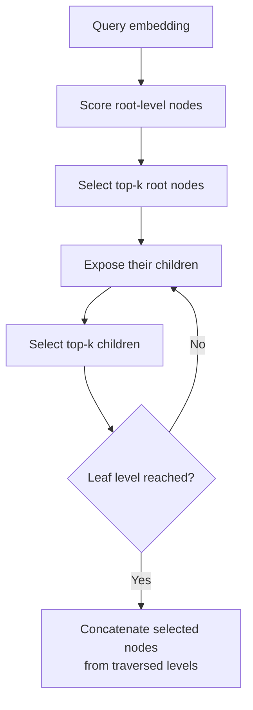
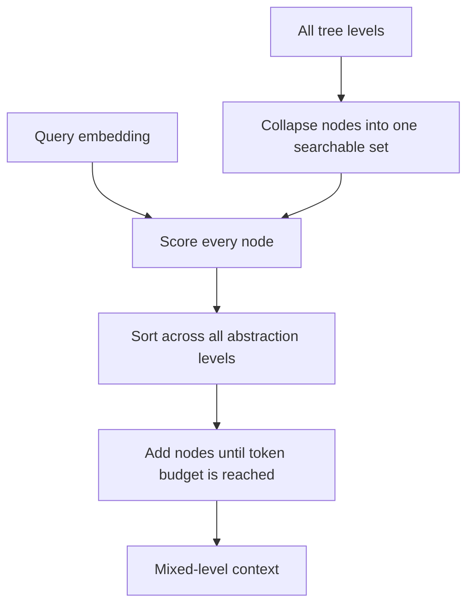
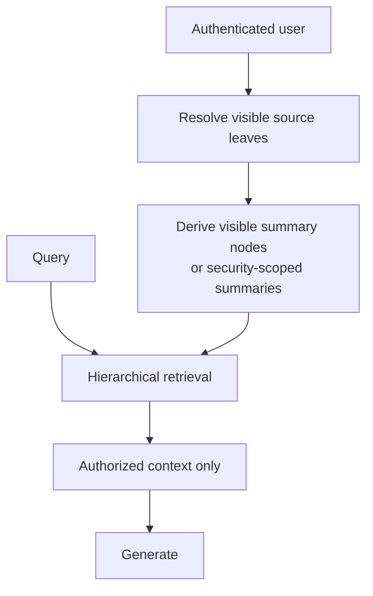
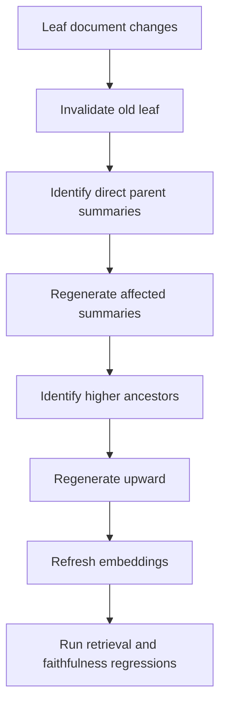

# RAPTOR Hierarchical RAG — Recursive Summaries, Multi-Level Retrieval, and Long-Document Reasoning

> A local, standard-library teaching implementation for understanding the central idea behind RAPTOR:
>
> **organize detailed passages under broader summaries → retrieve the most relevant summaries → expand them back to source passages → answer with grounded evidence**

This subrepository explains **RAPTOR**—Recursive Abstractive Processing for Tree-Organized Retrieval—and provides a small, inspectable hierarchy-based retrieval demo.

The local code includes:

- a mixed-source corpus;
- document sections;
- one pseudo-summary node per section;
- summary-first retrieval;
- child-document expansion;
- local BM25 retrieval;
- TF-IDF cosine retrieval;
- Reciprocal Rank Fusion;
- numbered tutorial scripts;
- a standalone hierarchical retrieval demo;
- a small retrieval evaluation fixture;
- architecture and implementation notes.

No API key, hosted language model, vector database, clustering package, or third-party Python package is required for the teaching path.

---

## Table of contents

1. [What is RAPTOR?](#what-is-raptor)
2. [Why flat chunk retrieval can fail](#why-flat-chunk-retrieval-can-fail)
3. [The central hierarchical idea](#the-central-hierarchical-idea)
4. [Architecture](#architecture)
5. [What this subrepository actually implements](#what-this-subrepository-actually-implements)
6. [The two runnable paths](#the-two-runnable-paths)
7. [Exact standalone algorithm](#exact-standalone-algorithm)
8. [Exact numbered-tutorial algorithm](#exact-numbered-tutorial-algorithm)
9. [Current hierarchy in the fixture](#current-hierarchy-in-the-fixture)
10. [Default-query walkthrough](#default-query-walkthrough)
11. [Repository structure](#repository-structure)
12. [Quick start](#quick-start)
13. [Step-by-step tutorial](#step-by-step-tutorial)
14. [How section grouping works](#how-section-grouping-works)
15. [How pseudo-summary construction works](#how-pseudo-summary-construction-works)
16. [How summary retrieval works](#how-summary-retrieval-works)
17. [How leaf expansion works](#how-leaf-expansion-works)
18. [How final leaf retrieval works](#how-final-leaf-retrieval-works)
19. [Understanding the output](#understanding-the-output)
20. [Current evaluation and its limits](#current-evaluation-and-its-limits)
21. [Toy hierarchy versus full RAPTOR](#toy-hierarchy-versus-full-raptor)
22. [How the original RAPTOR algorithm works](#how-the-original-raptor-algorithm-works)
23. [Tree traversal versus collapsed-tree retrieval](#tree-traversal-versus-collapsed-tree-retrieval)
24. [A production RAPTOR node schema](#a-production-raptor-node-schema)
25. [Chunking long documents](#chunking-long-documents)
26. [Embedding and clustering](#embedding-and-clustering)
27. [Recursive summarization](#recursive-summarization)
28. [Retrieval across levels of abstraction](#retrieval-across-levels-of-abstraction)
29. [Provenance and citations](#provenance-and-citations)
30. [Summary verification and hallucination control](#summary-verification-and-hallucination-control)
31. [PDF, OCR, tables, figures, and webpages](#pdf-ocr-tables-figures-and-webpages)
32. [Incremental updates and tree maintenance](#incremental-updates-and-tree-maintenance)
33. [Security and access control](#security-and-access-control)
34. [Where RAPTOR is used most](#where-raptor-is-used-most)
35. [When to use it—and when not to](#when-to-use-itand-when-not-to)
36. [How to adapt this repository](#how-to-adapt-this-repository)
37. [Production evaluation strategy](#production-evaluation-strategy)
38. [Cost, latency, and scaling](#cost-latency-and-scaling)
39. [Common failure modes](#common-failure-modes)
40. [Debugging checklist](#debugging-checklist)
41. [References](#references)

---

# What is RAPTOR?

Most RAG pipelines retrieve only short, flat passages:

```text
query
→ compare against leaf chunks
→ retrieve top-k chunks
→ generate answer
```

RAPTOR builds a hierarchy:

```text
fine-grained chunks
→ semantically related clusters
→ summaries of those clusters
→ clusters of summaries
→ higher-level summaries
→ repeat until a root-level representation exists
```

At query time, retrieval can select information from different levels:

- detailed leaf passages;
- local topic summaries;
- broader chapter-like summaries;
- high-level thematic summaries.

This helps when the answer requires more context than one short chunk can provide.

---

# Why flat chunk retrieval can fail

## 1. The answer spans several passages

Example:

```text
How does the onboarding policy connect eligibility,
security review, exceptions, and final approval?
```

No single passage may contain the complete answer.

---

## 2. The question is thematic

Example:

```text
What is the overall purpose of the vendor-onboarding section?
```

A summary node may represent the answer better than one leaf chunk.

---

## 3. The relevant evidence is distributed

Long reports often explain:

- a concept in one section;
- an exception later;
- a result in a table;
- a limitation in an appendix.

Flat top-k retrieval may retrieve only one part.

---

## 4. The exact wording differs

A high-level summary can use broader concepts that are closer to the user’s query than the original technical details.

---

## 5. Sending the whole document is expensive

Long-context generation can be:

- slow;
- expensive;
- noisy;
- vulnerable to “lost in the middle” behavior;
- difficult to cite precisely.

Hierarchical retrieval attempts to select the right level of abstraction.

---

# The central hierarchical idea

Let the leaf chunks be:

\[
L_0 = \{x_1,x_2,\dots,x_n\}
\]

Embed each node:

\[
z_i = f_{\mathrm{embed}}(x_i)
\]

Cluster similar nodes:

\[
\mathcal{C}_0 = \operatorname{Cluster}(z_1,\dots,z_n)
\]

Summarize each cluster:

\[
s_j = f_{\mathrm{summary}}
\left(
\{x_i : x_i \in C_j\}
\right)
\]

The summaries become the next level:

\[
L_1 = \{s_1,s_2,\dots,s_m\}
\]

Repeat:

\[
L_{\ell+1}
=
\operatorname{Summarize}
\left(
\operatorname{Cluster}
\left(
\operatorname{Embed}(L_\ell)
\right)
\right)
\]

until no useful further clustering is possible.

The result is a tree or hierarchy:

\[
T = \bigcup_{\ell=0}^{h} L_\ell
\]

At query time, retrieval can compare the query with nodes across one or several levels.

---

# Architecture

## 1. Flat RAG versus hierarchical RAG

### Flat RAG


### RAPTOR-style hierarchical RAG



---

## 2. Full index-time RAPTOR pipeline



---

## 3. Current standalone implementation



---

## 4. Current numbered tutorial



The numbered path does not construct or query summary nodes.

---

## 5. Tree traversal retrieval



---

## 6. Collapsed-tree retrieval



---

## 7. Secure hierarchical retrieval



A summary must not leak facts from inaccessible children.

---

## 8. Update propagation



---

# What this subrepository actually implements

This folder contains two related teaching paths.

## A. Numbered cookbook path

```text
1-explore-data.py
2-build-index.py
3-retrieve.py
4-run-method.py
5-evaluate.py
```

It uses:

```text
data/corpus.jsonl
data/queries.jsonl
data/qrels.jsonl
utils/cookbook_core.py
```

For:

```python
METHOD_KEY = "06-raptor-hierarchical-rag"
```

the utility:

1. runs ordinary hybrid retrieval over the full corpus;
2. leaves the resulting evidence unchanged;
3. appends a sentence saying documents were grouped by section and expanded.

The numbered path therefore behaves as:

```text
flat hybrid retrieval
+
RAPTOR-oriented trace text
```

It does not implement hierarchical retrieval.

---

## B. Standalone path

```text
raptor_hierarchical_rag.py
examples/sample_corpus.json
```

The standalone path:

1. groups documents by `metadata.section`;
2. creates one synthetic summary per section;
3. concatenates all child texts;
4. truncates the result to 800 characters;
5. retrieves the top two summary nodes;
6. collects every child document under those summaries;
7. retrieves again over those leaf documents;
8. returns leaf evidence only.

This is a useful **two-stage hierarchical router**.

It is not a full recursive RAPTOR tree.

---

# The two runnable paths

| Capability | Numbered tutorial | Standalone demo |
|---|---:|---:|
| BM25 retrieval | Yes | Yes |
| TF-IDF cosine retrieval | Yes | Yes |
| Reciprocal Rank Fusion | Yes | Yes |
| Group documents by section | Trace only | Yes |
| Construct summary nodes | No | Yes |
| Retrieve summaries | No | Yes |
| Expand summary children | No | Yes |
| Re-retrieve leaf nodes | No | Yes |
| Recursive levels | No | No |
| Semantic clustering | No | No |
| Soft cluster membership | No | No |
| Neural embeddings | No | No |
| Abstractive summarization | No | No |
| Tree traversal | No | No |
| Collapsed-tree retrieval | No | No |
| Mixed summary-and-leaf output | No | No |
| Summary verification | No | No |
| LLM generation | No | No |

---

# Exact standalone algorithm

The RAPTOR branch is equivalent to:

```python
groups = defaultdict(list)

for document in documents:
    section = document["metadata"].get("section", "General")
    groups[section].append(document)

summaries = []

for section, children in groups.items():
    summaries.append(
        {
            "id": f"summary_{section}",
            "title": f"Summary: {section}",
            "text": " ".join(
                child["text"]
                for child in children
            )[:800],
            "metadata": {
                "source_type": "summary",
                "section": section,
                "children": [
                    child["id"]
                    for child in children
                ],
            },
        }
    )

summary_hits = hybrid_retrieve(
    query,
    summaries,
    min(2, len(summaries)),
)

child_ids = {
    child
    for summary in summary_hits
    for child in summary["metadata"]["children"]
}

candidate_leaves = [
    document
    for document in documents
    if document["id"] in child_ids
] or documents

evidence = hybrid_retrieve(
    query,
    candidate_leaves,
    top_k,
)
```

## Important constants

```text
summary text limit   = 800 characters
summary retrieval k = 2, unless fewer summaries exist
leaf retrieval k    = --top-k
```

## Fallback

When no child IDs are available:

```python
candidate_leaves or documents
```

causes retrieval to fall back to the full corpus.

In the current fixture, summary hits always contain children.

---

# Exact numbered-tutorial algorithm

The numbered utility first runs:

```python
retrieved = hybrid_retrieve(
    query,
    top_k=top_k,
    candidate_k=max(10, top_k * 2),
)

evidence = retrieved["hybrid"]
```

The RAPTOR branch then does only:

```python
steps.append(
    "Grouped documents by section to simulate summary nodes, "
    "then expanded relevant summaries to leaf chunks."
)
```

It does not:

- group documents;
- create summaries;
- retrieve summary nodes;
- collect children;
- replace `evidence`.

Therefore:

```text
the hierarchy changes the steps field,
but not the retrieval result
```

This distinction is critical when interpreting `5-evaluate.py`.

---

# Current hierarchy in the fixture

The standalone payload contains seven leaf documents and five unique sections.

```text
Root-like collection
├── Vendor onboarding
│   ├── doc_policy_parent
│   └── doc_policy_child_security
├── API versioning
│   ├── doc_api_v3_current
│   └── doc_api_v2_stale
├── Warranty reserves
│   └── doc_warranty_table
├── Performance
│   └── doc_figure_latency
└── Refund eligibility
    └── doc_refund_policy
```

## Synthetic summary nodes

The code creates:

```text
summary_Vendor onboarding
summary_API versioning
summary_Warranty reserves
summary_Performance
summary_Refund eligibility
```

The IDs include raw spaces from the section names.

A production ID system should normalize or hash section identifiers.

---

## Summary contents

### Vendor onboarding

Concatenates:

```text
The onboarding section defines vendor eligibility,
security review, approval, and evidence retention requirements for 2026.

Every new vendor must complete a security review before contract approval.
The Risk Committee reviews exceptions and records the decision on page 12.
```

### API versioning

Concatenates both:

- current version 3.0;
- stale version 2.0.

The summary does not distinguish current from historical content except through words in the text.

### Warranty reserves

Contains one leaf only.

### Performance

Contains one leaf only.

### Refund eligibility

Contains one leaf only.

A one-child “summary” is effectively a copy of the child text.

---

# Default-query walkthrough

The standalone default query is:

```text
What does the onboarding section say about security review and approval?
```

## Stage 1 — Build five pseudo-summaries

The section grouping produces five summary nodes.

## Stage 2 — Retrieve top two summaries

The exact local teaching scorer ranks:

| Rank | Summary | RRF score |
|---:|---|---:|
| 1 | `summary_Vendor onboarding` | approximately `0.0328` |
| 2 | `summary_Refund eligibility` | approximately `0.0323` |

The second hit is broader and less directly relevant.

It appears partly because the refund passage contains policy-like language and the local corpus is extremely small.

## Stage 3 — Expand selected summaries

The selected child IDs are:

```text
doc_policy_parent
doc_policy_child_security
doc_refund_policy
```

## Stage 4 — Retrieve leaves

Hybrid leaf retrieval ranks:

| Rank | Leaf | RRF score |
|---:|---|---:|
| 1 | `doc_policy_parent` | approximately `0.0328` |
| 2 | `doc_policy_child_security` | approximately `0.0323` |
| 3 | `doc_refund_policy` | approximately `0.0317` |

## Interpretation

The hierarchy successfully routes the query toward the onboarding section.

However, selecting two summaries also introduces the unrelated refund-policy leaf.

This illustrates a core hierarchical-retrieval tradeoff:

```text
broader summary recall
versus
leaf-level precision
```

---

# Repository structure

```text
06-raptor-hierarchical-rag/
├── assets/
│   ├── architecture.mmd
│   └── paper_diagram.svg
├── data/
│   ├── corpus.jsonl
│   ├── queries.jsonl
│   ├── qrels.jsonl
│   └── local_index.json          # generated locally
├── docs/
├── examples/
│   ├── run_example.py
│   ├── sample_corpus.json
│   ├── sample_policy.pdf
│   ├── scanned_page_ocr.txt
│   ├── sample_webpage.html
│   ├── sample_table.csv
│   └── tool_response.json
├── utils/
│   ├── __init__.py
│   └── cookbook_core.py
├── .env.example
├── .gitignore
├── 1-explore-data.py
├── 2-build-index.py
├── 3-retrieve.py
├── 4-run-method.py
├── 5-evaluate.py
├── raptor_hierarchical_rag.py
├── architecture.mmd
├── ARCHITECTURE.md
├── COMPLETE_UNDERSTAND.md
├── implementation_notes.md
├── sources.md
└── README.md
```

## File responsibilities

| File | Responsibility |
|---|---|
| `1-explore-data.py` | Inspect the mixed-source corpus |
| `2-build-index.py` | Build a local token and TF-IDF index |
| `3-retrieve.py` | Show the flat retrieval baseline |
| `4-run-method.py` | Run the numbered RAPTOR scaffold |
| `5-evaluate.py` | Compute small Recall@k and MRR metrics |
| `utils/cookbook_core.py` | Shared numbered-path utilities |
| `raptor_hierarchical_rag.py` | Self-contained two-stage hierarchy demo |
| `data/corpus.jsonl` | Numbered-path corpus |
| `examples/sample_corpus.json` | Standalone hierarchy payload |
| `architecture.mmd` | Reusable Mermaid architecture |
| `assets/paper_diagram.svg` | Paper-informed local illustration |
| `sources.md` | Research and implementation references |

---

# Quick start

## Requirements

- Python 3.10 or newer is recommended.
- No third-party package is required.
- No API key is required.
- No model server is required.

## Run the numbered tutorial

```bash
python 1-explore-data.py
python 2-build-index.py
python 3-retrieve.py
python 4-run-method.py \
  --query "Where does vendor onboarding require security review?" \
  --top-k 5
python 5-evaluate.py
```

## Explain the standalone method

```bash
python raptor_hierarchical_rag.py --explain
```

## Run the default standalone query

```bash
python raptor_hierarchical_rag.py
```

## Run an explicit hierarchical query

```bash
python raptor_hierarchical_rag.py \
  --query "What does the onboarding section say about security review and approval?" \
  --top-k 5
```

## Test a broader question

```bash
python raptor_hierarchical_rag.py \
  --query "What major policy and operational topics appear in this corpus?" \
  --top-k 5
```

The current implementation still retrieves only two section summaries and then returns leaf documents. It does not generate a true corpus-level summary.

## Use another payload

```bash
python raptor_hierarchical_rag.py \
  --corpus path/to/sample_corpus.json \
  --query "Your long-document question" \
  --top-k 5
```

---

# Step-by-step tutorial

## Stage 1 — Explore the data

Run:

```bash
python 1-explore-data.py
```

Inspect:

- source types;
- document count;
- section metadata;
- pages and URLs;
- versions;
- parent identifiers;
- fixture files.

Hierarchy quality depends on metadata quality.

---

## Stage 2 — Build the flat index

Run:

```bash
python 2-build-index.py
```

The generated local index stores:

- documents;
- tokenized text;
- IDF values;
- average document length.

It does not store the section summaries or a tree.

The standalone demo creates summaries in memory on every execution.

---

## Stage 3 — Inspect flat retrieval

Run:

```bash
python 3-retrieve.py
```

This baseline performs:

```text
BM25
+
TF-IDF cosine
+
Reciprocal Rank Fusion
```

Compare the hierarchy against this baseline rather than assuming hierarchical retrieval is automatically better.

---

## Stage 4 — Run the method

### Numbered path

```bash
python 4-run-method.py \
  --query "Where does vendor onboarding require security review?" \
  --top-k 5
```

The hierarchy affects only the trace text.

### Standalone path

```bash
python raptor_hierarchical_rag.py \
  --query "What does the onboarding section say about security review and approval?" \
  --top-k 5
```

The hierarchy affects the candidate leaf set.

---

## Stage 5 — Evaluate

Run:

```bash
python 5-evaluate.py
```

The current evaluation invokes the numbered method.

Because the numbered RAPTOR branch leaves evidence unchanged, the reported metrics evaluate ordinary hybrid retrieval.

---

# How section grouping works

The standalone implementation uses:

```python
section = document.get(
    "metadata",
    {},
).get(
    "section",
    "General",
)
```

Documents with identical section strings are grouped together.

## Advantages

- easy to inspect;
- deterministic;
- no clustering dependency;
- respects existing document structure;
- useful when headings are reliable.

## Limitations

- depends on perfect metadata;
- identical section names across unrelated documents can merge;
- semantically related content in different sections remains separated;
- semantically unrelated content under one section remains grouped;
- no soft membership;
- no recursive levels;
- no data-driven hierarchy.

## Section-key collision

Two documents might both contain:

```text
Introduction
Methods
Results
```

Grouping globally by raw section name could merge unrelated sources.

Use composite keys:

```text
document_id + section_path
```

or hierarchy-aware IDs.

---

# How pseudo-summary construction works

The code uses:

```python
summary_text = " ".join(
    document["text"]
    for document in group
)[:800]
```

This is not abstractive summarization.

It is:

```text
concatenate child text
→ keep first 800 characters
```

## Consequences

### 1. Later children can be truncated away

If the combined text exceeds 800 characters, later evidence may not appear in the summary.

### 2. No compression reasoning occurs

The method does not identify:

- central ideas;
- contradictions;
- exceptions;
- causal links;
- temporal differences.

### 3. Ordering matters

The summary depends on document insertion order.

### 4. Current and stale evidence may be mixed

The `API versioning` summary includes both version 3.0 and legacy version 2.0.

### 5. One-child summaries add little abstraction

A summary with one child is just a truncated copy.

---

## Better deterministic teaching summary

A slightly stronger non-LLM version could select representative sentences:

```python
def summarize_group(documents, max_sentences=4):
    sentences = []

    for document in documents:
        sentences.extend(split_sentences(document["text"]))

    ranked = rank_sentences_by_centroid_similarity(sentences)

    return " ".join(ranked[:max_sentences])
```

This remains extractive but is less dependent on child ordering.

---

# How summary retrieval works

The summary nodes are passed to:

```python
hybrid_retrieve(
    query,
    summaries,
    min(2, len(summaries)),
)
```

The retriever performs:

1. BM25 scoring;
2. TF-IDF cosine scoring;
3. Reciprocal Rank Fusion.

## Summary node representation

Each node contains:

```json
{
  "id": "summary_Vendor onboarding",
  "title": "Summary: Vendor onboarding",
  "text": "...",
  "metadata": {
    "source_type": "summary",
    "section": "Vendor onboarding",
    "children": [
      "doc_policy_parent",
      "doc_policy_child_security"
    ]
  }
}
```

## Fixed top-two selection

The summary breadth is fixed:

\[
k_{\text{summary}} = 2
\]

unless the corpus contains fewer than two sections.

This is not tuned to:

- query complexity;
- score margin;
- token budget;
- summary size;
- uncertainty;
- desired recall.

---

# How leaf expansion works

For selected summaries:

```python
child_ids = {
    child
    for summary in summary_hits
    for child in summary["metadata"]["children"]
}
```

All children are included equally.

There is no child-level pruning before final retrieval.

## Expansion size

If selected summaries contain child counts:

\[
n_1,n_2,\dots,n_k
\]

then the leaf candidate count is:

\[
|C_{\text{leaf}}|
=
\left|
\bigcup_{j=1}^{k}
\operatorname{Children}(s_j)
\right|
\]

Large summaries can produce large leaf candidate pools.

## Production controls

- maximum children per summary;
- child score threshold;
- descendant token budget;
- summary confidence;
- branch diversity;
- parent-child score combination;
- per-document caps.

---

# How final leaf retrieval works

The expanded leaves are passed to the same hybrid retriever:

```python
evidence = hybrid_retrieve(
    query,
    candidate_leaves,
    top_k,
)
```

The final output contains leaf documents only.

The selected summary nodes are discarded from returned evidence.

## Consequence

The final answer loses the higher-level context that motivated the routing.

A fuller hierarchical system may return:

```text
one or more high-level summaries
+
supporting leaf chunks
```

under a shared token budget.

---

# Understanding the output

The standalone output resembles:

```json
{
  "method_key": "raptor",
  "query": "What does the onboarding section say about security review and approval?",
  "steps": [
    "Retrieved hierarchy summaries first, then expanded to leaf chunks."
  ],
  "top_evidence": [
    {
      "id": "doc_policy_parent",
      "title": "Vendor onboarding policy parent section",
      "score": 0.0328,
      "reason": "hybrid reciprocal-rank fusion",
      "source_type": "pdf",
      "page": 12,
      "version": "2026.04",
      "snippet": "The onboarding section defines..."
    }
  ],
  "answer": "Demo answer for raptor: based on ..."
}
```

## Read the fields in this order

1. `steps` — the broad method action;
2. `top_evidence` — final leaf passages;
3. `reason` — the final retrieval stage;
4. source metadata — page, URL, version;
5. `answer` — deterministic text, not an LLM response.

## Missing trace fields

For pedagogical completeness, add:

```json
{
  "summary_nodes_built": [],
  "summary_hits": [],
  "expanded_child_ids": [],
  "leaf_candidates": [],
  "fallback_to_full_corpus": false,
  "hierarchy_depth": 1
}
```

Without these fields, the user cannot inspect the actual routing path.

---

# Current evaluation and its limits

## Implemented metrics

The numbered evaluation computes:

### Hit-based Recall@k

\[
\operatorname{Recall@k}
=
\frac{
\text{queries with a relevant leaf in top-k}
}{
|Q|
}
\]

### Mean Reciprocal Rank

\[
\operatorname{MRR}
=
\frac{1}{|Q|}
\sum_{q \in Q}
\frac{1}{\operatorname{rank}_q}
\]

With the tiny current fixture and `top_k=3`, the shared numbered path produces:

```text
Recall@3 = 1.0000
MRR      = 1.0000
```

These values do not validate RAPTOR because the numbered hierarchy does not affect retrieval.

---

## Missing hierarchy-specific evaluation

A meaningful RAPTOR benchmark should measure:

### Summary routing

- relevant-summary Recall@k;
- section-routing accuracy;
- branch precision;
- branch recall;
- descendant coverage;
- irrelevant-branch expansion rate.

### Summary quality

- factual consistency;
- source coverage;
- compression ratio;
- omission rate;
- contradiction preservation;
- version correctness;
- citation traceability.

### Multi-level retrieval

- leaf Recall@k;
- summary Recall@k;
- mixed-level nDCG;
- abstraction-level appropriateness;
- context coverage;
- token efficiency.

### Answer quality

- correctness;
- comprehensiveness;
- faithfulness;
- citation precision;
- citation recall;
- global-question performance;
- multi-hop performance.

### Baseline comparison

Compare against:

- flat BM25;
- flat dense retrieval;
- flat hybrid retrieval;
- parent-child retrieval;
- long-context baseline;
- extractive section summaries;
- true recursive hierarchy.

---

# Toy hierarchy versus full RAPTOR

| Property | Current standalone demo | Original RAPTOR design |
|---|---|---|
| Leaf units | Existing documents | Sentence-aware short chunks |
| Grouping | Exact section string | Embedding-based semantic clustering |
| Dimensionality reduction | None | UMAP in the paper setup |
| Clustering | None | GMM-based soft clustering |
| Cluster count | Number of sections | Selected algorithmically |
| Multi-cluster membership | No | Yes |
| Summary method | Concatenate + truncate | Abstractive LLM summary |
| Recursion | One summary level | Repeated until root-like level |
| Tree nodes | Summary + children metadata | All leaves and recursive summaries |
| Node embeddings | TF-IDF computed at query time | Dense embeddings |
| Retrieval strategy | Summary route then leaf search | Tree traversal or collapsed tree |
| Retrieval across all levels | No | Yes |
| Summary nodes in final context | No | Yes, depending on strategy |
| Token-budget selection | No | Yes |
| Provenance depth | Child IDs only | Tree relationships and source nodes |
| Summary verification | No | Required in production |
| Update handling | Rebuild per run | Persisted tree requiring maintenance |

---

# How the original RAPTOR algorithm works

The RAPTOR paper describes a bottom-up recursive hierarchy.

## 1. Create leaf chunks

In the paper’s experimental setup, the corpus is divided into short contiguous units with a 100-token target while preserving whole sentences rather than splitting a sentence in the middle.

That value is an experimental choice, not a universal rule.

## 2. Embed the leaves

The paper uses an SBERT model in its main setup.

A production implementation may use another embedding model validated for the domain.

## 3. Reduce dimensionality

The paper uses UMAP to make clustering high-dimensional text embeddings more tractable.

## 4. Perform soft clustering

The paper uses Gaussian Mixture Models.

Soft clustering allows one node to belong to more than one cluster.

This matters because one passage can discuss several topics.

## 5. Select cluster count

The paper uses Bayesian Information Criterion to select the number of GMM components.

## 6. Summarize each cluster

Cluster text is sent to a summarization model.

The resulting summary becomes a parent node.

## 7. Re-embed summaries

Parent summaries receive embeddings.

## 8. Repeat

The system clusters and summarizes again until further clustering is no longer useful or feasible.

## 9. Retrieve from the tree

The paper evaluates:

- tree traversal;
- collapsed-tree retrieval.

The collapsed-tree strategy is used for the main reported results.

---

# Tree traversal versus collapsed-tree retrieval

## Tree traversal

At each level:

1. score available nodes against the query;
2. select top-k;
3. expose only children of selected nodes;
4. repeat until leaves;
5. combine selected nodes.

### Advantages

- fewer nodes scored at lower levels;
- interpretable search path;
- natural coarse-to-fine behavior.

### Risks

- early routing errors cannot recover;
- fixed top-k can eliminate the correct branch;
- abstraction-level proportions are constrained by the traversal.

---

## Collapsed tree

1. place nodes from all levels into one searchable set;
2. score every node against the query;
3. rank all abstraction levels together;
4. add nodes until a token budget is reached.

### Advantages

- can retrieve the most appropriate level for each query;
- can mix summaries and leaves;
- can recover detailed and global evidence together.

### Risks

- larger retrieval index;
- duplicate information across levels;
- summary nodes can crowd out leaves;
- requires level-aware deduplication and budgeting.

The RAPTOR paper reports that collapsed-tree retrieval performed better than tree traversal in its tested comparison and uses a 2,000-token collapsed-tree context in its main experiments.

---

# A production RAPTOR node schema

## Leaf node

```json
{
  "node_id": "node:leaf:policy:p12:c03",
  "node_type": "leaf",
  "level": 0,
  "text": "Every new vendor must complete...",
  "embedding_id": "emb:leaf:policy:p12:c03",
  "document_id": "document:policy-2026-04",
  "page_start": 12,
  "page_end": 12,
  "section_path": [
    "Vendor onboarding",
    "Security review"
  ],
  "children": [],
  "parents": [
    "node:summary:cluster-17"
  ],
  "token_count": 42,
  "source_spans": [
    {
      "page": 12,
      "start_offset": 8120,
      "end_offset": 8350
    }
  ],
  "acl": [
    "group:legal"
  ],
  "content_hash": "sha256:..."
}
```

## Summary node

```json
{
  "node_id": "node:summary:cluster-17",
  "node_type": "summary",
  "level": 1,
  "text": "Vendor onboarding requires...",
  "embedding_id": "emb:summary:cluster-17",
  "children": [
    "node:leaf:policy:p12:c03",
    "node:leaf:policy:p12:c04"
  ],
  "parents": [
    "node:summary:cluster-5"
  ],
  "cluster_id": "cluster-17",
  "token_count": 95,
  "summary_model": "model-name",
  "summary_prompt_version": "summary-v4",
  "summary_confidence": 0.91,
  "source_coverage": 0.96,
  "acl_scope": "group:legal",
  "tree_version": "tree-2026-07-10"
}
```

## Edge record

```json
{
  "parent": "node:summary:cluster-17",
  "child": "node:leaf:policy:p12:c03",
  "membership_probability": 0.83,
  "cluster_level": 1,
  "tree_version": "tree-2026-07-10"
}
```

Soft clustering means a child may have several parents.

---

# Chunking long documents

## Sentence-aware chunking

Avoid cutting a sentence arbitrarily.

A useful chunker should respect:

- sentence boundaries;
- headings;
- paragraphs;
- lists;
- tables;
- captions;
- equations;
- page boundaries;
- document structure.

## Chunk-size tradeoff

Small chunks:

- improve exact retrieval;
- preserve precise citations;
- lose broader context;
- increase node count.

Large chunks:

- preserve context;
- reduce tree size;
- can blur multiple topics;
- consume more tokens.

## Overlap

Overlap can preserve boundary context but creates duplicates.

A hierarchy already introduces redundancy, so overlap should be evaluated carefully.

## Document boundaries

Do not cluster unrelated documents indiscriminately unless cross-document hierarchy is intentional.

Possible hierarchy scopes:

```text
per document
per document collection
per tenant
per topic
global corpus
```

Each scope changes retrieval behavior and security requirements.

---

# Embedding and clustering

## Embedding requirements

The embedding model should preserve similarity for:

- local details;
- thematic relations;
- domain terminology;
- multilingual content;
- summaries and original passages.

Evaluate summary-to-leaf alignment, not only query-to-leaf retrieval.

## Soft clustering

Let cluster membership be:

\[
p(c_j \mid x_i)
\]

A node may belong to every cluster whose probability exceeds threshold \(\tau\):

\[
x_i \in C_j
\quad\text{when}\quad
p(c_j \mid x_i) \ge \tau
\]

This creates a directed acyclic hierarchy rather than a strict single-parent tree when nodes have multiple parents.

## Cluster-size controls

Clusters must fit the summarizer’s context budget.

If:

\[
\sum_{x_i \in C_j}
\operatorname{tokens}(x_i)
>
B_{\text{summary}}
\]

then:

- recluster the group;
- split it;
- summarize in stages;
- or use a larger validated context window.

## Cluster-quality diagnostics

Measure:

- within-cluster similarity;
- between-cluster separation;
- cluster size distribution;
- orphan-node rate;
- multi-membership rate;
- semantic coherence;
- summary coverage.

---

# Recursive summarization

## Summarization objective

A parent summary should preserve:

- central claims;
- key entities;
- exceptions;
- causal links;
- temporal qualifiers;
- uncertainty;
- disagreements;
- important numerical facts;
- references to child evidence.

## Example prompt

```text
Summarize the supplied child nodes.

Requirements:
1. Preserve all important facts needed for question answering.
2. Preserve exceptions, negations, dates, quantities, and version distinctions.
3. Do not add facts not supported by the children.
4. When children conflict, report the conflict rather than resolving it.
5. Return a concise summary plus source-child identifiers for each statement.
```

## Structured summary output

```json
{
  "summary": "The current API version is 3.0...",
  "claims": [
    {
      "text": "Version 3.0 is current.",
      "child_ids": ["node:leaf:api-v3"],
      "status": "supported"
    },
    {
      "text": "Legacy version 2.0 required support-ticket rollback.",
      "child_ids": ["node:leaf:api-v2"],
      "status": "historical"
    }
  ],
  "conflicts": [],
  "omissions": []
}
```

Structured summaries improve verification and citation reconstruction.

---

# Retrieval across levels of abstraction

## Multi-level scoring

A node score can combine:

\[
S(q,n)
=
\alpha \cdot \operatorname{sim}(q,n)
+
\beta \cdot \operatorname{level\_prior}(n)
+
\gamma \cdot \operatorname{source\_authority}(n)
+
\delta \cdot \operatorname{freshness}(n)
-
\lambda \cdot \operatorname{redundancy}(n)
\]

## Level prior

Different queries favor different levels.

### Detail query

```text
What exact deadline applies?
```

Favor leaves.

### Section question

```text
What does the onboarding section require?
```

Favor intermediate summaries plus leaves.

### Global question

```text
What are the report’s main themes?
```

Favor higher summaries.

## Adaptive level routing

A classifier can predict:

```text
leaf
intermediate
global
mixed
```

and tune retrieval accordingly.

## Redundancy control

A parent summary and its child may repeat the same fact.

Use:

- maximal marginal relevance;
- ancestor-descendant deduplication;
- claim coverage;
- token-aware selection;
- level diversity constraints.

---

# Provenance and citations

Abstractive summaries are not original sources.

A final claim should trace:

```text
answer claim
→ retrieved summary statement
→ child nodes
→ original text spans
→ page or URL
```

## Provenance chain


## Citation rule

Cite the original leaf source whenever possible.

A summary node can explain routing or context, but it should not erase leaf provenance.

## Summary claim record

```json
{
  "summary_node_id": "node:summary:cluster-17",
  "claim_id": "summary-claim-4",
  "text": "The Risk Committee reviews exceptions.",
  "supporting_children": [
    "node:leaf:policy:p12:c03"
  ],
  "verification": "supported"
}
```

---

# Summary verification and hallucination control

The RAPTOR paper reports a focused annotation study in which about 4% of generated summaries contained minor hallucinations in that experimental setup.

This should not be interpreted as a universal production hallucination rate.

## Risks

- invented facts;
- dropped exceptions;
- merged timelines;
- changed numerical values;
- lost negation;
- false consensus;
- stale summary after update;
- unsupported parent-level generalization.

## Verification methods

### 1. Entailment check

For each summary sentence:

```text
Do the child nodes entail this sentence?
```

### 2. Source coverage

Measure whether important child claims appear in the summary.

### 3. Numerical consistency

Extract and compare:

- dates;
- quantities;
- percentages;
- version numbers;
- names.

### 4. Contradiction preservation

When children disagree, the summary should report disagreement.

### 5. Human review

Use expert review for high-impact corpora.

### 6. Leaf fallback

When a summary claim cannot be verified, exclude it and retrieve leaves directly.

---

# PDF, OCR, tables, figures, and webpages

## Text PDFs

Preserve:

- document ID;
- page number;
- page label;
- section hierarchy;
- text offsets;
- captions;
- references;
- headers and footers;
- version.

## Scanned PDFs

Store:

- OCR confidence;
- page-image reference;
- bounding boxes;
- detected language;
- table regions;
- figure regions;
- parser version.

Low-confidence OCR should not silently become a high-level summary fact.

## Tables

Do not summarize only flattened table prose.

Represent:

- headers;
- rows;
- units;
- footnotes;
- merged cells;
- page;
- table ID.

Use structured calculations for exact values.

## Figures

Preserve:

- figure number;
- caption;
- page;
- nearby discussion;
- image reference;
- extraction confidence.

## Webpages

Use:

- canonical URLs;
- crawl timestamps;
- content hashes;
- version history;
- boilerplate removal;
- duplicate detection.

Rebuild affected summaries when a page changes.

---

# Incremental updates and tree maintenance

Recursive trees are expensive to update because one leaf can influence several ancestors.

## Leaf insertion

A new node may:

- join one existing cluster;
- join several clusters;
- create a new cluster;
- change the optimal cluster count;
- alter parent summaries;
- alter higher-level grouping.

## Leaf deletion

Deletion requires:

- removing the leaf;
- removing memberships;
- regenerating parents;
- deleting empty clusters;
- updating ancestors;
- refreshing embeddings.

## Update strategies

### Full rebuild

Best when:

- corpus is small;
- updates are rare;
- reproducibility matters more than latency.

### Local subtree rebuild

Best when:

- changed-node dependencies are known;
- clusters are stable;
- summary provenance is stored.

### Buffered updates

Accumulate changes and rebuild periodically.

### Dynamic hierarchical methods

Use algorithms designed for mutable corpora.

The original RAPTOR design is primarily presented as an offline tree-building method; dynamic maintenance requires additional engineering.

---

# Security and access control

A summary can leak restricted child content even when the leaf is hidden.

## Unsafe design

```text
legal-only leaf
+
public leaf
→ shared summary
→ summary shown publicly
```

## Safe strategies

### 1. Build separate trees per security scope

```text
public tree
legal tree
finance tree
tenant-specific tree
```

### 2. Require uniform ACL within a cluster

Only summarize nodes with compatible permissions.

### 3. Compute summary ACL as strict intersection

A parent is visible only to users who can see every child.

### 4. Generate user-scoped summaries dynamically

More expensive but can preserve permissions.

### 5. Retrieve visible leaves before summarizing

Useful for query-time hierarchical synthesis.

## Secure order

```text
authenticate
→ authorize leaves
→ authorize or derive summaries
→ retrieve hierarchy
→ construct context
→ generate
```

Security filters must apply to every level.

---

# Where RAPTOR is used most

## 1. Books and narrative documents

Questions often require:

- themes;
- character development;
- events across chapters;
- long-range causality.

This matches the long-document motivation in the RAPTOR paper.

---

## 2. Scientific papers

Useful for:

- methods summaries;
- assumptions;
- experiment relationships;
- findings across sections;
- appendix details.

Leaves preserve exact evidence while summaries preserve structure.

---

## 3. Technical manuals

A hierarchy can represent:

```text
manual
→ subsystem
→ procedure
→ step
```

Useful for broad troubleshooting and exact instruction retrieval.

---

## 4. Policies and compliance manuals

A hierarchy can represent:

```text
policy family
→ policy
→ section
→ clause
→ exception
```

Versioning and legal verification are essential.

---

## 5. Financial and annual reports

Questions may require:

- overall trends;
- business-segment summaries;
- detailed tables;
- risk disclosures;
- footnotes.

Do not replace structured table retrieval with summaries.

---

## 6. Legal documents

Useful for:

- document-level structure;
- section summaries;
- clause retrieval;
- cross-reference navigation.

High-stakes use requires source-faithful summaries and expert review.

---

## 7. Research archives

Hierarchical clustering can organize:

- papers;
- experiment notes;
- topic groups;
- project histories.

Cross-document trees need careful source and permission boundaries.

---

## 8. Enterprise knowledge bases

Useful for long:

- runbooks;
- architecture documents;
- product manuals;
- policy collections;
- incident reports.

---

# When to use it—and when not to

## Use RAPTOR when

- documents are long;
- questions vary between detail and theme;
- evidence spans several sections;
- full-context prompting is too expensive;
- summary nodes improve retrieval;
- the corpus changes slowly enough to maintain a tree;
- summarization quality can be evaluated;
- provenance can be preserved.

## Prefer flat RAG when

- documents are short;
- answers are usually in one passage;
- latency must be minimal;
- indexing budget is small;
- content changes constantly;
- section metadata already solves routing;
- summary abstraction adds little value.

## Prefer parent-child retrieval when

- existing document hierarchy is reliable;
- semantic clustering is unnecessary;
- exact section expansion is enough.

## Prefer long-context prompting when

- corpus is one moderate-size document;
- the model handles it reliably;
- citations and cost are acceptable;
- retrieval errors are more harmful than context size.

## Prefer structured databases when

- answers require exact rows, joins, or calculations.

---

# How to adapt this repository

## Step 1 — Expose hierarchy traces

Return:

```json
{
  "summary_nodes": [],
  "summary_hits": [],
  "expanded_child_ids": [],
  "leaf_hits": [],
  "hierarchy_depth": 1,
  "summary_k": 2
}
```

---

## Step 2 — Make the numbered path actually hierarchical

Move the standalone logic into reusable utilities:

```python
summaries = build_section_summaries(corpus)
summary_hits = retrieve_summaries(query, summaries)
leaves = expand_children(summary_hits, corpus)
evidence = retrieve_leaves(query, leaves, top_k)
```

Then evaluate this evidence rather than flat retrieval.

---

## Step 3 — Replace character truncation

Use:

- extractive sentence selection;
- a local summarizer;
- an API summarizer;
- a domain model;
- structured claim-preserving summarization.

Track the model and prompt version.

---

## Step 4 — Add recursion

```python
level = leaf_nodes
levels = [level]

while can_cluster(level):
    clusters = cluster(level)
    parents = summarize_clusters(clusters)
    levels.append(parents)
    level = parents
```

Persist every level.

---

## Step 5 — Add embeddings

Use one embedding model consistently for:

- leaves;
- summaries;
- queries.

Test whether summary embeddings align with the query distribution.

---

## Step 6 — Add soft clustering

A passage can support multiple topics.

Preserve:

```text
node
cluster
membership probability
```

---

## Step 7 — Implement both retrieval strategies

### Tree traversal

Useful for:

- interpretable coarse-to-fine search;
- reducing the search set.

### Collapsed tree

Useful for:

- flexible mixed-granularity context;
- choosing levels per query.

Benchmark both.

---

## Step 8 — Add token budgeting

```python
selected = []

for node in ranked_nodes:
    if token_count(selected) + node.token_count > budget:
        continue

    if is_redundant(node, selected):
        continue

    selected.append(node)
```

---

## Step 9 — Add summary verification

Store child-level support for every summary claim.

Reject or repair unsupported summary statements.

---

## Step 10 — Add hierarchical evaluation fixtures

Create:

- a detail question answered by one leaf;
- a section question requiring two leaves;
- a thematic question best answered by a summary;
- a multi-hop question spanning branches;
- a stale-version test;
- a summary-hallucination test;
- an ACL-leak test;
- an update-invalidation test.

---

# Production evaluation strategy

## 1. Leaf retrieval

Measure:

- Recall@k;
- MRR;
- nDCG;
- citation precision;
- source diversity.

## 2. Summary retrieval

Measure:

- relevant-summary Recall@k;
- routing accuracy;
- branch coverage;
- false-branch rate;
- abstraction-level accuracy.

## 3. Summary faithfulness

Measure:

\[
\operatorname{SummaryFaithfulness}
=
\frac{
\text{summary claims supported by children}
}{
\text{all summary claims}
}
\]

Also measure:

- omission rate;
- numerical consistency;
- contradiction preservation;
- source coverage;
- compression ratio.

## 4. Tree quality

Measure:

- depth;
- branching factor;
- cluster coherence;
- soft-membership rate;
- orphan nodes;
- duplicate ancestors;
- level-size distribution.

## 5. Retrieval strategy

Compare:

- traversal;
- collapsed tree;
- section routing;
- flat hybrid;
- parent-child;
- long context.

## 6. Answer quality

Measure:

- correctness;
- comprehensiveness;
- faithfulness;
- citation precision;
- citation recall;
- global-question score;
- detail-question score;
- multi-hop score.

## 7. Efficiency

Measure:

- index build time;
- summarization tokens;
- embedding cost;
- tree size;
- query latency;
- retrieved context tokens;
- cost per answer;
- update cost.

---

# Cost, latency, and scaling

## Indexing cost

\[
C_{\text{build}}
=
C_{\text{parse}}
+
C_{\text{chunk}}
+
C_{\text{embed}}
+
C_{\text{cluster}}
+
C_{\text{summary}}
+
C_{\text{store}}
\]

Recursive summary generation is often the dominant cost.

## Number of nodes

If level \(\ell\) has \(N_\ell\) nodes:

\[
N_{\text{tree}}
=
\sum_{\ell=0}^{h}
N_\ell
\]

A tree can contain substantially more searchable nodes than the leaf corpus alone.

## Query cost

### Tree traversal

Scores a subset at each level.

### Collapsed tree

Searches all nodes, usually through an ANN index.

### Current demo

Per request:

1. rebuilds five summaries;
2. indexes them in memory;
3. runs summary retrieval;
4. indexes selected leaves in memory;
5. runs leaf retrieval.

## Scaling controls

- persist summaries;
- persist embeddings;
- batch summarization;
- cache cluster outputs;
- incremental subtree updates;
- ANN indexes;
- limit hierarchy depth;
- cap cluster size;
- route simple queries to flat retrieval;
- use extractive summaries where appropriate;
- deduplicate ancestor and child evidence.

---

# Common failure modes

## 1. Hierarchy described but not executed

**Symptom:** trace mentions summaries, but evidence is ordinary flat retrieval.

**Present in:** the numbered tutorial.

**Fix:** replace evidence with hierarchy-selected leaves.

---

## 2. Concatenation called summarization

**Symptom:** a summary node is merely the first 800 characters of child text.

**Present in:** the standalone demo.

**Fix:** label it as a pseudo-summary or implement real summarization.

---

## 3. Relevant later child is truncated

**Symptom:** child ordering determines what appears in the summary.

**Fix:** sentence selection, larger budget, or actual summarization.

---

## 4. Current and stale content are merged

**Symptom:** one summary combines superseded and current versions.

**Present in:** the API-versioning group.

**Fix:** version-aware clustering and explicit historical summaries.

---

## 5. Fixed top-two summary routing

**Symptom:** simple and complex queries retrieve the same number of branches.

**Fix:** score thresholds, token budgets, or adaptive breadth.

---

## 6. Irrelevant branch expansion

**Symptom:** a broad second summary introduces unrelated leaves.

**Visible in:** the default onboarding query, which also expands refund policy.

**Fix:** rerank summaries, lower summary k, score-margin threshold, or joint parent-child scoring.

---

## 7. One-child summary nodes

**Symptom:** hierarchy adds overhead without abstraction.

**Fix:** omit trivial parents or combine at a more useful level.

---

## 8. Summary context discarded

**Symptom:** the router uses summaries but final evidence contains only leaves.

**Present in:** the standalone demo.

**Fix:** return a balanced mixture of summaries and source leaves.

---

## 9. Early tree-traversal error

**Symptom:** the correct branch is pruned at the top.

**Fix:** soft traversal, beam search, larger k, collapsed retrieval, or fallback.

---

## 10. Summary hallucination propagates

**Symptom:** an unsupported statement appears in parent summaries.

**Fix:** claim-level summary verification and leaf-grounded citations.

---

## 11. Stale ancestor summaries

**Symptom:** leaf updates do not regenerate parents.

**Fix:** dependency tracking and upward invalidation.

---

## 12. Security leakage through summaries

**Symptom:** a visible summary contains facts from restricted children.

**Fix:** ACL-compatible clustering and security-scoped summaries.

---

## 13. Duplicate evidence across levels

**Symptom:** a summary and its child repeat the same claim.

**Fix:** ancestor-descendant deduplication and token-aware diversity.

---

## 14. Cluster incoherence

**Symptom:** semantically unrelated nodes are summarized together.

**Fix:** cluster diagnostics, prompt tuning, and domain-aware embeddings.

---

## 15. Evaluation measures only flat retrieval

**Symptom:** perfect Recall@k is reported despite hierarchy not affecting results.

**Present in:** the current numbered evaluation.

**Fix:** evaluate summary routing and standalone hierarchical evidence directly.

---

# Debugging checklist

## Source preparation

- [ ] Are page, section, and document IDs stable?
- [ ] Are source versions preserved?
- [ ] Are tables and figures represented separately?
- [ ] Are OCR confidence values available?
- [ ] Are document boundaries respected?
- [ ] Are ACLs attached?

## Leaves

- [ ] Are chunks sentence-aware?
- [ ] Are chunks too short or too large?
- [ ] Is overlap creating duplicates?
- [ ] Can every leaf be cited precisely?
- [ ] Are numerical facts intact?

## Grouping and clustering

- [ ] Are section keys globally unique?
- [ ] Are clusters semantically coherent?
- [ ] Can nodes belong to multiple clusters?
- [ ] Are cluster sizes within summary budgets?
- [ ] Are current and stale versions separated?
- [ ] Are restricted nodes separated?

## Summaries

- [ ] Is this a real summary or concatenation?
- [ ] Are later children represented?
- [ ] Are exceptions and negations preserved?
- [ ] Are dates and numbers correct?
- [ ] Are contradictions reported?
- [ ] Does every summary claim map to children?
- [ ] Is the prompt and model version stored?

## Hierarchy

- [ ] How many levels exist?
- [ ] Are parent-child links valid?
- [ ] Are there orphan nodes?
- [ ] Are there trivial one-child parents?
- [ ] Are ancestor embeddings current?
- [ ] Is the tree version recorded?

## Retrieval

- [ ] Which summary nodes were selected?
- [ ] Why were they selected?
- [ ] Which leaves were expanded?
- [ ] Did an irrelevant branch enter?
- [ ] Was a fallback used?
- [ ] Are summary and leaf scores distinguishable?
- [ ] Is token budgeting enforced?

## Evaluation

- [ ] Does hierarchy outperform flat retrieval?
- [ ] Is summary routing labeled?
- [ ] Are global and detail questions separated?
- [ ] Is summary faithfulness measured?
- [ ] Are update regressions tested?
- [ ] Are ACL leaks tested?

## Answer

- [ ] Does the answer use the appropriate abstraction level?
- [ ] Are original sources cited?
- [ ] Are summary-only claims verified?
- [ ] Are conflicts disclosed?
- [ ] Can the system abstain?

## Operations

- [ ] Is build cost tracked?
- [ ] Is query latency tracked by stage?
- [ ] Can affected subtrees be rebuilt?
- [ ] Are index and prompt versions stored?
- [ ] Can an answer be reproduced?

---

# Related methods in this repository

- [`../01-hybrid-rag/`](../01-hybrid-rag/) — lexical and dense retrieval fusion.
- [`../02-reranked-rag/`](../02-reranked-rag/) — precision-oriented reranking.
- [`../05-graphrag/`](../05-graphrag/) — relationship and community organization.
- [`../11-decomposition-rag/`](../11-decomposition-rag/) — multi-part queries.
- [`../13-small-to-big-parent-child-rag/`](../13-small-to-big-parent-child-rag/) — retrieve children and expand parents.
- [`../14-contextual-compression-rag/`](../14-contextual-compression-rag/) — reduce retrieved context.
- [`../20-claim-level-verification-rag/`](../20-claim-level-verification-rag/) — verify answer claims.

A production hierarchical system may combine:

```text
recursive summaries
+
hybrid multi-level retrieval
+
reranking
+
parent-child expansion
+
context compression
+
claim verification
```

---

# References

## Primary paper

1. **Sarthi, P., Abdullah, S., Tuli, A., Khanna, S., Goldie, A., and Manning, C. D. — “RAPTOR: Recursive Abstractive Processing for Tree-Organized Retrieval.”**  
   Published at ICLR 2024.  
   <https://arxiv.org/abs/2401.18059>

The paper reports recursive embedding, clustering, and summarization; tree-traversal and collapsed-tree retrieval; and strong results on NarrativeQA, QASPER, and QuALITY. The reported GPT-4 configuration improved the previous best QuALITY result by 20 percentage points in absolute accuracy.

## Official implementation

- [Official RAPTOR repository](https://github.com/parthsarthi03/raptor)

The repository exposes configurable summarization, QA, and embedding model interfaces, document insertion, question answering, and tree save/load operations.

## Supporting tools and concepts

- [Sentence Transformers](https://www.sbert.net/)
- [UMAP documentation](https://umap-learn.readthedocs.io/)
- [scikit-learn Gaussian mixture models](https://scikit-learn.org/stable/modules/mixture.html)
- [FAISS](https://github.com/facebookresearch/faiss)
- [LlamaIndex](https://docs.llamaindex.ai/)

## Related research

- **Lewis et al. — “Retrieval-Augmented Generation for Knowledge-Intensive NLP Tasks.”**  
  <https://arxiv.org/abs/2005.11401>

- **Chucri, Azouz, and Ott — “Recursive Abstractive Processing for Retrieval in Dynamic Datasets.”**  
  Studies maintenance and post-retrieval recursive abstractive processing for changing corpora.  
  <https://arxiv.org/abs/2410.01736>

## Repository-local documentation

- [`sources.md`](sources.md)
- [`ARCHITECTURE.md`](ARCHITECTURE.md)
- [`COMPLETE_UNDERSTAND.md`](COMPLETE_UNDERSTAND.md)
- [`implementation_notes.md`](implementation_notes.md)
- [`architecture.mmd`](architecture.mmd)
- [`assets/paper_diagram.svg`](assets/paper_diagram.svg)

---

# Final mental model


RAPTOR is not simply:

```text
group documents by heading
→ concatenate text
→ retrieve two groups
```

A full RAPTOR system requires:

```text
sentence-aware leaves
semantic embeddings
soft clustering
abstractive summaries
recursive levels
multi-level retrieval
token budgeting
source provenance
summary verification
tree maintenance
```

This repository provides a transparent first approximation of the routing idea:

```text
section groups
→ pseudo-summary retrieval
→ child expansion
→ leaf retrieval
```

Its limitations define the roadmap:

- the numbered path does not execute the hierarchy;
- the standalone hierarchy has only one summary level;
- summaries are concatenated and truncated rather than generated;
- grouping is metadata-based rather than semantic;
- the summary breadth is fixed at two;
- summary nodes are discarded before final context;
- the evaluation measures flat retrieval rather than hierarchy quality.

Those distinctions should remain explicit when using this folder for teaching, benchmarking, or production planning.
