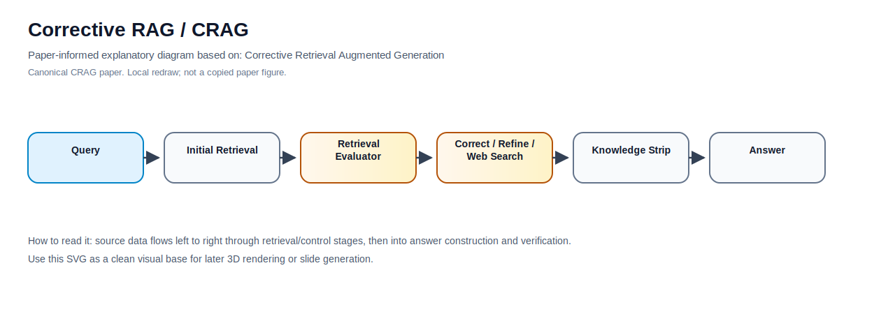

# Building Corrective RAG / CRAG From Scratch

This folder is presented as a cookbook-style, runnable tutorial inspired by the organization of [`daveebbelaar/ai-cookbook` hybrid retrieval](https://github.com/daveebbelaar/ai-cookbook/tree/main/knowledge/hybrid-retrieval): local data, local docs, local utils, numbered walkthrough scripts, and a README that explains why each stage exists.

Corrective RAG evaluates retrieved evidence before generation and triggers fallback retrieval, filtering, or web search when evidence is weak.

## The stack


## Folder layout

```text
08-corrective-rag-crag/
|-- assets/
|-- data/
|-- docs/
|-- examples/
|-- utils/
|-- .env.example
|-- .gitignore
|-- 1-explore-data.py
|-- 2-build-index.py
|-- 3-retrieve.py
|-- 4-run-method.py
|-- 5-evaluate.py
|-- README.md
|-- ARCHITECTURE.md
|-- COMPLETE_UNDERSTAND.md
|-- implementation_notes.md
`-- sources.md
```

## Table of contents

1. [`1-explore-data.py`](1-explore-data.py): inspect the mixed corpus and example files.
2. [`2-build-index.py`](2-build-index.py): build a tiny local BM25 plus dense-style teaching index.
3. [`3-retrieve.py`](3-retrieve.py): compare BM25, dense-style retrieval, and RRF hybrid retrieval.
4. [`4-run-method.py`](4-run-method.py): run the method-specific control flow for this folder.
5. [`5-evaluate.py`](5-evaluate.py): compute small recall and MRR metrics over local qrels.

The [`utils/`](utils/) folder holds local helpers copied into this method folder. The numbered files import only from this local `utils` package, so the method can be copied and run on its own.

## Paper-Informed Method Diagram



Source: [Corrective Retrieval Augmented Generation](https://arxiv.org/abs/2401.15884). This local SVG is a redraw/synthesis of the important method architecture from the canonical paper or source, not a copied paper figure.

## Mermaid architecture file

This method includes [`architecture.mmd`](architecture.mmd), a left-to-right `flowchart LR` Mermaid architecture designed for later rendering or conversion into a 3D visual. A duplicate copy is also stored at [`assets/architecture.mmd`](assets/architecture.mmd).

## Included example data

- [`examples/sample_policy.pdf`](examples/sample_policy.pdf): small generated PDF fixture.
- [`examples/scanned_page_ocr.txt`](examples/scanned_page_ocr.txt): OCR text representing a scanned PDF page.
- [`examples/sample_webpage.html`](examples/sample_webpage.html): cleaned webpage/documentation fixture.
- [`examples/sample_table.csv`](examples/sample_table.csv): tabular data for table-aware retrieval.
- [`examples/tool_response.json`](examples/tool_response.json): simulated API/tool response.
- [`data/corpus.jsonl`](data/corpus.jsonl): normalized mixed-source corpus.
- [`data/queries.jsonl`](data/queries.jsonl) and [`data/qrels.jsonl`](data/qrels.jsonl): small evaluation set.

## Setup

No package installation or API key is required for the local teaching path.

```bash
python 1-explore-data.py
python 2-build-index.py
python 3-retrieve.py
python 4-run-method.py --query "Where does vendor onboarding require security review?"
python 5-evaluate.py
```

You can also run the examples entrypoint:

```bash
python examples/run_example.py
```

## Why each piece earns its place

- Data exploration catches parser and metadata problems before retrieval tuning starts.
- A local index makes BM25, dense-style scoring, and fusion inspectable.
- A separate retrieval script shows the baseline before the method-specific logic is added.
- The method runner isolates the specific idea for this RAG method.
- The evaluation script gives a small feedback loop instead of judging by vibes.

## Apply this to your own project

Replace the fixtures in `examples/` and rows in `data/corpus.jsonl` with your real PDFs, scanned OCR output, webpages, tables, and tool results. Keep stable IDs, source type, page or URL metadata, content hashes, versions, and access-control fields. Then swap the local utilities for production components one at a time: PDF parser, crawler, BM25 engine, vector store, reranker, verifier, and evaluation harness.

---

## Method reference

# Corrective RAG / CRAG

        ## Summary
        Corrective RAG evaluates retrieved evidence before generation and triggers fallback retrieval, filtering, or web search when evidence is weak.

        ## Problem it solves
        Standard RAG often generates from irrelevant or incomplete retrieved chunks without noticing retrieval failure.

        ## When to use this method
        Use it for domains where retrieved evidence may be stale, sparse, or noisy, such as web QA, support search, and open-domain factual questions.

        ## When not to use this method
        Avoid it when external fallback search is prohibited, when latency must be one pass, or when the evaluator is less reliable than the retriever.

        ## Core components
        Retriever, retrieval evaluator, document grader, decomposition/filtering step, fallback web search or alternate retriever, generator, verifier.

        ## Input and output
        Input is a query and retrieved passages. Output is a corrected evidence set and an answer or abstention.

        ## PDF use
        For PDFs, CRAG can reject OCR-noisy chunks, table fragments without headers, or pages that mention terms but do not answer the question. For text PDFs, preserve page numbers, section headings, captions, reading order, and chunk offsets. For scanned PDFs, run OCR before chunking and store OCR confidence, page image references, and detected tables. Use Unstructured, Docling, Marker, PyMuPDF, pdfplumber, Apache Tika, or Tesseract depending on document quality. Long scientific papers usually need section-aware chunking, parent-child links, equation/caption retention, and table extraction.

        ## Webpage use
        CRAG is valuable for webpages because it can detect stale or irrelevant pages and trigger fresh crawl/search under domain and security constraints. For webpages, crawl with robots.txt awareness, sitemap support, canonical URL normalization, crawl timestamps, content hashing, boilerplate removal, and duplicate detection. Use Trafilatura, BeautifulSoup, Scrapy, Playwright, readability extraction, and URL canonicalization. Treat retrieved web text as untrusted because prompt injection can be embedded in pages.

        ## Production stack
        HuskyInSalt/CRAG, LangGraph branch workflows, retriever graders, Tavily or approved search APIs, OpenSearch/Qdrant, verifier prompts.

        ## Minimal example
        A query about a 2026 pricing change retrieves a 2024 page; the grader marks it stale and branches to a fresh crawl before answering.

        ## Pros
        - Improves robustness to bad retrieval
- Supports fallback and abstention
- Makes retrieval failure explicit

        ## Cons
        - Depends on evaluator quality
- Adds branching latency
- Fallback web search can introduce untrusted content

        ## Related methods
        - [07-self-rag](../07-self-rag/)
- [09-query-rewriting-rag](../09-query-rewriting-rag/)
- [17-webpage-rag-freshness](../17-webpage-rag-freshness/)

        ## Sources
        See [sources.md](sources.md).

## Runnable demo
This folder includes a runnable Python demo for this method:

```bash
python corrective_rag_crag.py --explain
python examples/run_example.py
```

The demo is self-contained in this method folder, uses only the Python standard library, and reads local data in `examples/sample_corpus.json`.
