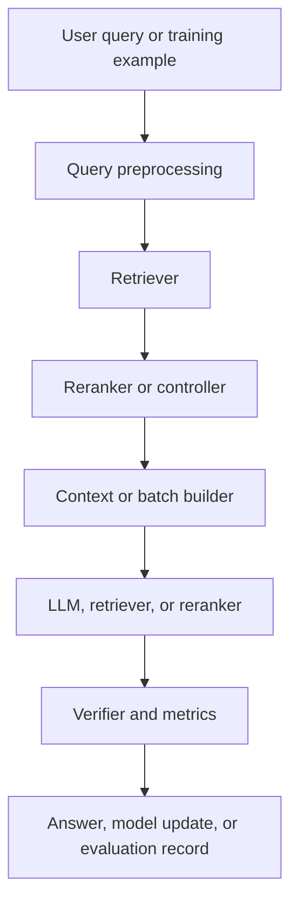

# Architecture: Contextual compression RAG

## High-level architecture
Contextual compression RAG uses Post-retrieval compression after sparse, dense, hybrid, or hierarchical retrieval. to address the specific failure mode: Retrievers often return chunks that contain the answer plus unrelated text, exceeding context limits and distracting the generator. The system should expose evidence, scores, metadata, and citations rather than treating generation as a black box.

## Index-time pipeline
Ingest PDFs, webpages, tables, and other files; parse text and layout; split into chunks or structured elements; attach metadata; embed and index into sparse, dense, graph, table, or tool-aware stores as required. For this method, the important implementation point is: Retrieve; split into sentences/spans; score spans against query; keep relevant spans under budget; preserve source offsets; generate with citations.

## Query-time pipeline
Normalize the query, apply filters or planning, retrieve candidates, rerank or compress evidence, construct context, generate an answer, and verify citations.

## Mermaid architecture diagram

## Data flow
Parsed source records carry text, document IDs, page numbers, URLs, chunk offsets, version fields, and access-control metadata. Query records carry user intent, filters, identity, and trace IDs. Evidence records move from retrieval to reranking/compression and finally to generation or training.

## Control flow
The main decision points are whether retrieval is sufficient, whether filters should be relaxed, whether a fallback retriever/tool is needed, whether evidence fits the context budget, and whether final claims are supported.

## Scaling considerations
Scale ingestion with batch parsing, asynchronous OCR, embedding queues, sharded vector indexes, and separate sparse indexes. Large corpora need deterministic document IDs, idempotent updates, and index versioning. For training methods, cache retrieved evidence and refresh indexes only when the retriever changes.

## Latency considerations
Latency comes from query planning, multiple retrieval calls, reranking, LLM compression, tool calls, and verification. Reduce it with parallel retrieval, ANN indexes, reranker batching, cached rewrites, smaller candidate pools after calibration, and streaming generation.

## Cost considerations
Main costs are parsing/OCR, embeddings, vector storage, sparse index storage, reranker calls, LLM generation, verifier calls, and training compute. Track cost per ingested page, cost per query, and cost per accepted training example.

## Failure modes
Common failures include missing pages, broken reading order, stale webpages, weak metadata, false negatives, duplicated chunks, bad reranker calibration, unsupported generated claims, prompt injection, and leakage between training and evaluation sets.

## Monitoring signals
Track retrieval recall on labeled examples, empty-result rate, score distributions, reranker agreement, citation coverage, freshness age, OCR confidence, table extraction errors, tool-call errors, latency percentiles, cost per query, and user feedback.

## Evaluation metrics
Use retrieval recall@k, MRR, nDCG, answer faithfulness, citation precision, citation recall, context relevance, abstention precision/recall, freshness accuracy, table-cell accuracy, tool-call validity, and regression pass rate.
