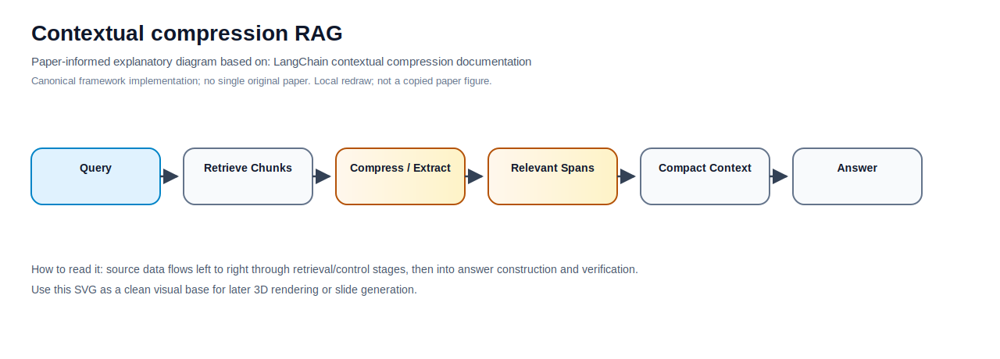

# Building Contextual compression RAG From Scratch

This folder is presented as a cookbook-style, runnable tutorial inspired by the organization of [`daveebbelaar/ai-cookbook` hybrid retrieval](https://github.com/daveebbelaar/ai-cookbook/tree/main/knowledge/hybrid-retrieval): local data, local docs, local utils, numbered walkthrough scripts, and a README that explains why each stage exists.

Contextual compression filters, extracts, or summarizes retrieved passages so only query-relevant evidence enters the generation context.

## The stack


## Folder layout

```text
14-contextual-compression-rag/
|-- assets/
|-- data/
|-- docs/
|-- examples/
|-- utils/
|-- .env.example
|-- .gitignore
|-- 1-explore-data.py
|-- 2-build-index.py
|-- 3-retrieve.py
|-- 4-run-method.py
|-- 5-evaluate.py
|-- README.md
|-- ARCHITECTURE.md
|-- COMPLETE_UNDERSTAND.md
|-- implementation_notes.md
`-- sources.md
```

## Table of contents

1. [`1-explore-data.py`](1-explore-data.py): inspect the mixed corpus and example files.
2. [`2-build-index.py`](2-build-index.py): build a tiny local BM25 plus dense-style teaching index.
3. [`3-retrieve.py`](3-retrieve.py): compare BM25, dense-style retrieval, and RRF hybrid retrieval.
4. [`4-run-method.py`](4-run-method.py): run the method-specific control flow for this folder.
5. [`5-evaluate.py`](5-evaluate.py): compute small recall and MRR metrics over local qrels.

The [`utils/`](utils/) folder holds local helpers copied into this method folder. The numbered files import only from this local `utils` package, so the method can be copied and run on its own.

## Paper-Informed Method Diagram



Source: [LangChain contextual compression documentation](https://python.langchain.com/docs/how_to/contextual_compression/). This local SVG is a redraw/synthesis of the important method architecture from the canonical paper or source, not a copied paper figure.

## Mermaid architecture file

This method includes [`architecture.mmd`](architecture.mmd), a left-to-right `flowchart LR` Mermaid architecture designed for later rendering or conversion into a 3D visual. A duplicate copy is also stored at [`assets/architecture.mmd`](assets/architecture.mmd).

## Included example data

- [`examples/sample_policy.pdf`](examples/sample_policy.pdf): small generated PDF fixture.
- [`examples/scanned_page_ocr.txt`](examples/scanned_page_ocr.txt): OCR text representing a scanned PDF page.
- [`examples/sample_webpage.html`](examples/sample_webpage.html): cleaned webpage/documentation fixture.
- [`examples/sample_table.csv`](examples/sample_table.csv): tabular data for table-aware retrieval.
- [`examples/tool_response.json`](examples/tool_response.json): simulated API/tool response.
- [`data/corpus.jsonl`](data/corpus.jsonl): normalized mixed-source corpus.
- [`data/queries.jsonl`](data/queries.jsonl) and [`data/qrels.jsonl`](data/qrels.jsonl): small evaluation set.

## Setup

No package installation or API key is required for the local teaching path.

```bash
python 1-explore-data.py
python 2-build-index.py
python 3-retrieve.py
python 4-run-method.py --query "Where does vendor onboarding require security review?"
python 5-evaluate.py
```

You can also run the examples entrypoint:

```bash
python examples/run_example.py
```

## Why each piece earns its place

- Data exploration catches parser and metadata problems before retrieval tuning starts.
- A local index makes BM25, dense-style scoring, and fusion inspectable.
- A separate retrieval script shows the baseline before the method-specific logic is added.
- The method runner isolates the specific idea for this RAG method.
- The evaluation script gives a small feedback loop instead of judging by vibes.

## Apply this to your own project

Replace the fixtures in `examples/` and rows in `data/corpus.jsonl` with your real PDFs, scanned OCR output, webpages, tables, and tool results. Keep stable IDs, source type, page or URL metadata, content hashes, versions, and access-control fields. Then swap the local utilities for production components one at a time: PDF parser, crawler, BM25 engine, vector store, reranker, verifier, and evaluation harness.

---

## Method reference

# Contextual compression RAG

        ## Summary
        Contextual compression filters, extracts, or summarizes retrieved passages so only query-relevant evidence enters the generation context.

        ## Problem it solves
        Retrievers often return chunks that contain the answer plus unrelated text, exceeding context limits and distracting the generator.

        ## When to use this method
        Use it when retrieved chunks are long, pages contain boilerplate, PDFs include dense sections, or citation budgets are strict.

        ## When not to use this method
        Avoid it when exact wording must be preserved and extractive compression cannot guarantee no loss of legally important context.

        ## Core components
        Retriever, compressor, extractive span selector, optional summarizer, citation span tracker, generator.

        ## Input and output
        Input is retrieved passages. Output is compressed evidence snippets with provenance to original spans.

        ## PDF use
        Compression should preserve page, table headers, captions, equation labels, and adjacent definitions so snippets remain auditable. For text PDFs, preserve page numbers, section headings, captions, reading order, and chunk offsets. For scanned PDFs, run OCR before chunking and store OCR confidence, page image references, and detected tables. Use Unstructured, Docling, Marker, PyMuPDF, pdfplumber, Apache Tika, or Tesseract depending on document quality. Long scientific papers usually need section-aware chunking, parent-child links, equation/caption retention, and table extraction.

        ## Webpage use
        For webpages, compression removes nav/footer boilerplate and repeated templates but must retain canonical URL and crawl timestamp. For webpages, crawl with robots.txt awareness, sitemap support, canonical URL normalization, crawl timestamps, content hashing, boilerplate removal, and duplicate detection. Use Trafilatura, BeautifulSoup, Scrapy, Playwright, readability extraction, and URL canonicalization. Treat retrieved web text as untrusted because prompt injection can be embedded in pages.

        ## Production stack
        LangChain contextual compression, LlamaIndex node postprocessors, rerankers, extractive QA models, sentence splitters, token budgeters.

        ## Minimal example
        Retrieve a 2,000-token policy section, extract only the sentences defining eligibility, exceptions, and effective date, then cite original page spans.

        ## Pros
        - Reduces token cost
- Improves focus
- Pairs well with parent-child retrieval

        ## Cons
        - Can remove necessary context
- Summarization may hallucinate
- Requires span provenance

        ## Related methods
        - [02-reranked-rag](../02-reranked-rag/)
- [13-small-to-big-parent-child-rag](../13-small-to-big-parent-child-rag/)
- [20-claim-level-verification-rag](../20-claim-level-verification-rag/)

        ## Sources
        See [sources.md](sources.md).

## Runnable demo
This folder includes a runnable Python demo for this method:

```bash
python contextual_compression_rag.py --explain
python examples/run_example.py
```

The demo is self-contained in this method folder, uses only the Python standard library, and reads local data in `examples/sample_corpus.json`.
